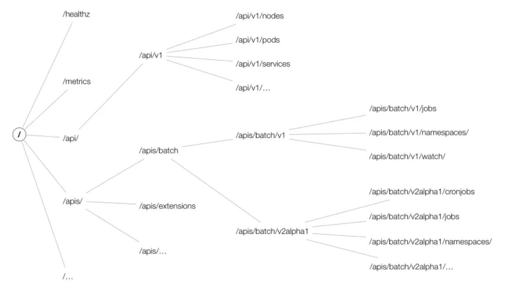
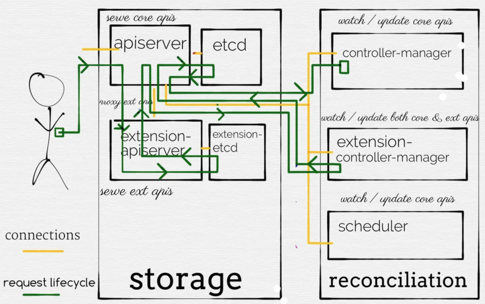

# k8s api-server


## 整体组件

kube-apiserver作为整个Kubernetes集群操作etcd的唯一入口，负责Kubernetes各资源的认证&鉴权，校验以及CRUD等操作，提供RESTful APIs，供其它组件调用


kube-apiserver包含三种APIServer：

- **aggregatorServer**：负责处理 `apiregistration.k8s.io` 组下的APIService资源请求，同时将来自用户的请求拦截转发给aggregated server(AA)
- **kubeAPIServer**：负责对请求的一些通用处理，包括：认证、鉴权以及各个内建资源(pod, deployment，service and etc)的REST服务等
- **apiExtensionsServer**：负责CustomResourceDefinition（CRD）apiResources以及apiVersions的注册，同时处理CRD以及相应CustomResource（CR）的REST请求(如果对应CR不能被处理的话则会返回404)，也是apiserver Delegation的最后一环

apiserver的服务暴露是通过bootstrap-controller来完成的


## apiserver 流程

本质上，APIServer是使用golang中[net/http](https://golang.org/pkg/net/http/)库中的Server构建起来的。Handler是一个非常重要的概念，它是最终处理HTTP请求的实体，在golang中，定义了Handler的接口：

```go
type Handler interface {
    ServeHTTP(ResponseWriter, *Request)
}
```

凡是实现了ServeHTTP()方法的结构体，那么它就是一个Handler了，可以用来处理HTTP请求。这就是Kubernetes APIServer的骨架，只不过它有非常复杂的Handler。


1. init()是在main()函数启动之前，就进行的一些初始化操作，主要做的事情就是注册各种API对象类型到APIServer中，这个后续会讲到。

2. 随后就是进行命令行参数的解析，以及设置默认值，还有校验了，APIServer使用[cobra](https://github.com/spf13/cobra)来构建它的CLI，各种参数通过POSIX风格的参数传给APIServer，比如下面的参数示例：

   ```
   "--bind-address=0.0.0.0",
   "--secure-port=6444",
   "--tls-cert-file=/var/run/kubernetes/serving-kube-apiserver.crt",
   "--tls-private-key-file=/var/run/kubernetes/serving-kube-apiserver.key",
   ```

   这些显示指定的参数，以及没有指定，而使用默认值的参数，最终都被解析，然后集成到了一个叫做`ServerRunOptions`的结构体中，而这个结构体又包含了很多`xxxOptions`的结构体，比如`EtcdOptions`, `SecureServingOptions`等，供后面使用。

3. 随后就到了CreateServerChain阶段，这个是整个APIServer启动过程中，最重要的也是最复杂的阶段了，整个APIServer的核心功能就包含在这个里面，这里面最主要的其实干了两件事：

   - 一个是构建起各个API对象的Handler处理函数，即针对REST的每一个资源的增删查改方法的注册，比如`/pod`，对应的会有`CREATE/DELETE/GET/LIST/UPDATE/WATCH`等Handler去处理，这些处理方法其实主要是对数据库的操作。
   - 第二个就是通过Chain的方式，或者叫Delegation的方式，实现了APIServer的扩展机制，如上图所示，`KubeAPIServer`是主APIServer，这里面包含了Kubernetes的所有内置的核心API对象，`APIExtensions`其实就是我们常说的CRD扩展，这里面包含了所有自定义的CRD，而`Aggretgator`则是另外一种高级扩展机制，可以扩展外部的APIServer，三者通过 `Aggregator` –> `KubeAPIServer` –> `APIExtensions` 这样的方式顺序串联起来，当API对象在`Aggregator`中找不到时，会去`KubeAPIServer`中找，再找不到则会去`APIExtensions`中找，这就是所谓的delegation，通过这样的方式，实现了APIServer的扩展功能。
   - 此外，还有认证，授权，Admission等都在这个阶段实现。

4. 然后是PrepareRun阶段，这个阶段主要是注册一些健康检查的API，比如Healthz, Livez, Readyz等。

5. 最后就是Run阶段，经过前面的步骤，已经生成了让Server Run起来的所有东西

   - 最重要的就是Handler
   - 然后将其通过NonBlocking的方式run起来，即将http.Server在一个goroutine中运行起来
   - 随后启动PostStartHook，PostStartHook是在CreateServerChain阶段注册的hook函数，用来周期性执行一些任务，每一个Hook起在一个单独的goroutine中
   - 之后就是通过channel的方式将关闭API Server的方法阻塞住，当channel收到os.Interrup或者syscall.SIGTERM signal时，就会将APIServer关闭。


### handler 的构建

这里说的Handler指的是最终`net/http Server`要运行的Handler，它在GenericAPIServer中被构建出来，首先我们来看下GenericAPIServer的结构：

```go
# apiserver/pkg/server/genericapiserver.go

type GenericAPIServer struct {
    // SecureServingInfo holds configuration of the TLS server.
    SecureServingInfo *SecureServingInfo
    // "Outputs"
    // Handler holds the handlers being used by this API server
    Handler *APIServerHandler
    // delegationTarget is the next delegate in the chain. This is never nil.
    delegationTarget DelegationTarget
    ......
}
```

一个GenericAPIServer包含的信息非常的多，上面结构体并没有列出全部属性，在这里我们只关注几个重点信息就行：

- `SecureServingInfo *SecureServingInfo`: 这里面包含的是运行APIServer需要的TLS相关的信息
- `Handler *APIServerHandler`: 这个就是要运行APIServer需要使用到的Handler，各个API对象向APIServer中注册，说的就是向Handler注册，它是最重要的信息
- `delegationTarget DelegationTarget`: 这个是扩展机制中用到的，指定该GenericAPIServer的delegation是谁

再来看下`Handler *APIServerHandler`的结构体信息：

```go
# apiserver/pkg/server/handler.go

type APIServerHandler struct {
	// FullHandlerChain is the one that is eventually served with.  It should include the full filter
	// chain and then call the Director.
	FullHandlerChain http.Handler
	// The registered APIs.  InstallAPIs uses this.  Other servers probably shouldn't access this directly.
	GoRestfulContainer *restful.Container
	// NonGoRestfulMux is the final HTTP handler in the chain.
	// It comes after all filters and the API handling
	// This is where other servers can attach handler to various parts of the chain.
	NonGoRestfulMux *mux.PathRecorderMux

	// Director is here so that we can properly handle fall through and proxy cases.
	// This looks a bit bonkers, but here's what's happening.  We need to have /apis handling registered in gorestful in order to have
	// swagger generated for compatibility.  Doing that with `/apis` as a webservice, means that it forcibly 404s (no defaulting allowed)
	// all requests which are not /apis or /apis/.  We need those calls to fall through behind goresful for proper delegation.  Trying to
	// register for a pattern which includes everything behind it doesn't work because gorestful negotiates for verbs and content encoding
	// and all those things go crazy when gorestful really just needs to pass through.  In addition, openapi enforces unique verb constraints
	// which we don't fit into and it still muddies up swagger.  Trying to switch the webservices into a route doesn't work because the
	//  containing webservice faces all the same problems listed above.
	// This leads to the crazy thing done here.  Our mux does what we need, so we'll place it in front of gorestful.  It will introspect to
	// decide if the route is likely to be handled by goresful and route there if needed.  Otherwise, it goes to PostGoRestful mux in
	// order to handle "normal" paths and delegation. Hopefully no API consumers will ever have to deal with this level of detail.  I think
	// we should consider completely removing gorestful.
	// Other servers should only use this opaquely to delegate to an API server.
	Director http.Handler
}

func NewAPIServerHandler(name string, s runtime.NegotiatedSerializer, handlerChainBuilder HandlerChainBuilderFn, notFoundHandler http.Handler) *APIServerHandler {
	nonGoRestfulMux := mux.NewPathRecorderMux(name)
	if notFoundHandler != nil {
		nonGoRestfulMux.NotFoundHandler(notFoundHandler)
	}

	gorestfulContainer := restful.NewContainer()
	gorestfulContainer.ServeMux = http.NewServeMux()
	gorestfulContainer.Router(restful.CurlyRouter{}) // e.g. for proxy/{kind}/{name}/{*}
	gorestfulContainer.RecoverHandler(func(panicReason interface{}, httpWriter http.ResponseWriter) {
		logStackOnRecover(s, panicReason, httpWriter)
	})
	gorestfulContainer.ServiceErrorHandler(func(serviceErr restful.ServiceError, request *restful.Request, response *restful.Response) {
		serviceErrorHandler(s, serviceErr, request, response)
	})

	director := director{
		name:               name,
		goRestfulContainer: gorestfulContainer,
		nonGoRestfulMux:    nonGoRestfulMux,
	}

	return &APIServerHandler{
		FullHandlerChain:   handlerChainBuilder(director),
		GoRestfulContainer: gorestfulContainer,
		NonGoRestfulMux:    nonGoRestfulMux,
		Director:           director,
	}
}
```

APIServerHandler中包含一个go-restful构建出来的Container，`GoRestfulContainer`，以及一个PathRecorderMux构建出来的`NonGoRestfulMux`，注意，他们都是指针类型的，此外还有一个`FullHandlerChain`以及`Director`，都是对一个director结构体的引用，来看看这个结构体：

```go
# apiserver/pkg/server/handler.go

type director struct {
	name               string
	goRestfulContainer *restful.Container
	nonGoRestfulMux    *mux.PathRecorderMux
}

func (d director) ServeHTTP(w http.ResponseWriter, req *http.Request) {
    ......
}
```

它里面又包含了`goRestfulContainer`和`nonGoRestfulMux`，但是注意他们也是以指针的形式作为成员变量的，并且该director还实现了ServeHTTP()方法，即director还是一个Handler。上面的APIServerHandler中也包含了`GoRestfulContainer`, `NonGoRestfulMux`的指针类型的成员变量，他们指针指向的其实是同一个实体，即在NewAPIServerHandler()方法中New出来的实体。

为什么在APIServerHandler中已经有这两个变量了，还要再单独生成一个director结构体来引用这两个变量，其实这跟他们的用法有关。

现在先来说下`FullHandlerChain`和`Director`的区别，他们两个都是对director的引用，区别是FullHandlerChain在director外面还包围了一层Chain，我们来看看这个Chain是什么：

```go
# apiserver/pkg/server/config.go

handlerChainBuilder := func(handler http.Handler) http.Handler {
    return c.BuildHandlerChainFunc(handler, c.Config)
}

apiServerHandler := NewAPIServerHandler(name, c.Serializer, handlerChainBuilder, delegationTarget.UnprotectedHandler()

func DefaultBuildHandlerChain(apiHandler http.Handler, c *Config) http.Handler {
    handler := genericapifilters.WithAuthorization(apiHandler, c.Authorization.Authorizer, c.Serializer)
    if c.FlowControl != nil {
    	handler = genericfilters.WithPriorityAndFairness(handler, c.LongRunningFunc, c.FlowControl)
    } else {
    	handler = genericfilters.WithMaxInFlightLimit(handler, c.MaxRequestsInFlight, c.MaxMutatingRequestsInFlight, c.LongRunningFunc)
    }
    handler = genericapifilters.WithImpersonation(handler, c.Authorization.Authorizer, c.Serializer)
    handler = genericapifilters.WithAudit(handler, c.AuditBackend, c.AuditPolicyChecker, c.LongRunningFunc)
    failedHandler := genericapifilters.Unauthorized(c.Serializer)
    failedHandler = genericapifilters.WithFailedAuthenticationAudit(failedHandler, c.AuditBackend, c.AuditPolicyChecker)
    handler = genericapifilters.WithAuthentication(handler, c.Authentication.Authenticator, failedHandler, c.Authentication.APIAudiences)
    handler = genericfilters.WithCORS(handler, c.CorsAllowedOriginList, nil, nil, nil, "true")
    handler = genericfilters.WithTimeoutForNonLongRunningRequests(handler, c.LongRunningFunc, c.RequestTimeout)
    handler = genericfilters.WithWaitGroup(handler, c.LongRunningFunc, c.HandlerChainWaitGroup)
    handler = genericapifilters.WithRequestInfo(handler, c.RequestInfoResolver)
    if c.SecureServing != nil && !c.SecureServing.DisableHTTP2 && c.GoawayChance > 0 {
    	handler = genericfilters.WithProbabilisticGoaway(handler, c.GoawayChance)
    }
    handler = genericapifilters.WithAuditAnnotations(handler, c.AuditBackend, c.AuditPolicyChecker)
    handler = genericapifilters.WithCacheControl(handler)
    handler = genericfilters.WithPanicRecovery(handler)
    return handler
}
```

上面的`BuildHandlerChainFunc`默认为`DefaultBuildHandlerChain()`，看到该方法中传入一个Handler，然后在该Handler外面像包洋葱一样，包了一层又一层的filter，这些filter的作用其实就是在请求到来时，在Handler真正处理之前，先要经过的一系列认证，授权，审计等等检查，如果通过了，才会由最终的Handler来处理该请求，没通过，则会报相应的错误，可见，认证授权等操作，就是在这个阶段生效的，经过一系列filter的包装，最终构建出来的Handler，就是`FullHandlerChain`，而director就是这个被层层包装的Handler。而Director这个成员变量，没有被filter包装，这样通过Director就可以绕过认证授权这些filter，直接由Handler进行处理。

那么问题来了，难道还有请求不需要认证授权的？这个Director存在的意义是什么？的确是有请求不需要认证授权，这就涉及到APIServer的扩展机制了，后面会介绍到。

小结一下，APIServerHandler中包含4个成员变量，FullHandlerChain和Director其实是两个Handler，一个是带认证授权这些filter的，一个是不带的，都是对director的引用，而GoRestfulContainer和NonGoRestfulMux则分别是指针类型的引用，指向真正的goRestfulContainer和nonGoRestfulMux实体，同时这两个实体，又被director所引用。

从这里就大概可以看出GoRestfulContainer和NonGoRestfulMux这两个变量在这里的作用了，在上层向goRestfulContainer和nonGoRestfulMux实体中注册API对象时，就是通过调用这两个变量来对真正的实体进行操作的，如下面的示例：

```go
apiGroupVersion.InstallREST(s.Handler.GoRestfulContainer)
```

因为是指针，都指向同一个实体，这样director作为Handler也就能用到注册进来的API对象了。


### API 对象的注册

所谓API对象的注册，其实就是向GenericAPIServer的Handler中添加各个API对象的WebService和Route，GenericAPIServer提供了`InstallLegacyAPIGroup(), InstallAPIGroups(), InstallAPIGroup()`这三个方法，供外部调用，向其中注册APIGroupInfo，APIGroupInfo在上面基础知识中介绍过，里面存储了这个APIGroup的version, resource以及对应的REST storage实体，上面的三个方法，最后都会调用到同一个内部函数：

```go
# apiserver/pkg/server/genericapiserver.go

func (s *GenericAPIServer) installAPIResources(apiPrefix string, apiGroupInfo *APIGroupInfo, openAPIModels openapiproto.Models) error {
    for _, groupVersion := range apiGroupInfo.PrioritizedVersions {
        if len(apiGroupInfo.VersionedResourcesStorageMap[groupVersion.Version]) == 0 {
            klog.Warningf("Skipping API %v because it has no resources.", groupVersion)
            continue
        }

        apiGroupVersion := s.getAPIGroupVersion(apiGroupInfo, groupVersion, apiPrefix)
        if apiGroupInfo.OptionsExternalVersion != nil {
            apiGroupVersion.OptionsExternalVersion = apiGroupInfo.OptionsExternalVersion
        }
        apiGroupVersion.OpenAPIModels = openAPIModels
        apiGroupVersion.MaxRequestBodyBytes = s.maxRequestBodyBytes

        if err := apiGroupVersion.InstallREST(s.Handler.GoRestfulContainer); err != nil {
            return fmt.Errorf("unable to setup API %v: %v", apiGroupInfo, err)
        }
    }

    return nil
}
```

这个函数的逻辑，就是遍历APIGroupInfo中的version，按照version的维度来进行安装API对象，即构建出来一个APIGroupVersion，将该版本的resource和REST storage存储到该结构体中，然后执行安装操作: `apiGroupVersion.InstallREST(s.Handler.GoRestfulContainer)`，可以看到这里传的就是`APIServerHandler`中的`GoRestfulContainer`。

```go
# apiserver/pkg/endpoints/groupversion.go

func (g *APIGroupVersion) InstallREST(container *restful.Container) error {
	prefix := path.Join(g.Root, g.GroupVersion.Group, g.GroupVersion.Version)
	installer := &APIInstaller{
		group:             g,
		prefix:            prefix,
		minRequestTimeout: g.MinRequestTimeout,
	}

	apiResources, ws, registrationErrors := installer.Install()
	versionDiscoveryHandler := discovery.NewAPIVersionHandler(g.Serializer, g.GroupVersion, staticLister{apiResources})
	versionDiscoveryHandler.AddToWebService(ws)
	container.Add(ws)
	return utilerrors.NewAggregate(registrationErrors)
}
```

在该方法中，又构造了一个APIInstaller结构体，将APIGroupVersion的指针传给它，由它去执行安装操作：

```go
# apiserver/pkg/endpoints/installer.go

func (a *APIInstaller) Install() ([]metav1.APIResource, *restful.WebService, []error) {
	var apiResources []metav1.APIResource
	var errors []error
	ws := a.newWebService()

	// Register the paths in a deterministic (sorted) order to get a deterministic swagger spec.
	paths := make([]string, len(a.group.Storage))
	var i int = 0
	for path := range a.group.Storage {
		paths[i] = path
		i++
	}
	sort.Strings(paths)
	for _, path := range paths {
		apiResource, err := a.registerResourceHandlers(path, a.group.Storage[path], ws)
		if err != nil {
			errors = append(errors, fmt.Errorf("error in registering resource: %s, %v", path, err))
		}
		if apiResource != nil {
			apiResources = append(apiResources, *apiResource)
		}
	}
	return apiResources, ws, errors
}
```

在这里面New了一个WebService，然后遍历group中的REST storage，将storage中的path取出来，进行排序，然后再遍历这个path数组，针对每一个`path: storage`向WebService中执行注册操作，即`registerResourceHandlers()`，这就来到了最关键的地方，这是一个非常长的函数，这里面，对Storage进行类型转换，因为Storage实现了rest store的各种接口，所以首先将其转换成getter, creater, lister, updater等类型，分别对应该API对象在数据库层面的增删查改等操作，然后构造对应的Handler，然后再创建WebService的Route，最后将其添加到WebService中，我们以getter为例，简单看下这个过程：

```go
# apiserver/pkg/endpoints/installer.go

func (a *APIInstaller) registerResourceHandlers(path string, storage rest.Storage, ws *restful.WebService) {
    ......
    getter, isGetter := storage.(rest.Getter)
    handler = restfulGetResource(getter, exporter, reqScope)
    route := ws.GET(action.Path).To(handler)
    for _, route := range routes {
        ws.Route(route)
    }
    ......
}

func restfulGetResource(r rest.Getter, e rest.Exporter, scope handlers.RequestScope) restful.RouteFunction {
	return func(req *restful.Request, res *restful.Response) {
		handlers.GetResource(r, e, &scope)(res.ResponseWriter, req.Request)
	}
}

# apiserver/pkg/endpoints/handlers/get.go

func GetResource(r rest.Getter, e rest.Exporter, scope *RequestScope) http.HandlerFunc {
    return getResourceHandler(scope,
        func(ctx context.Context, name string, req *http.Request, trace *utiltrace.Trace) (runtime.Object, error) {
            return r.Get(ctx, name, &options)
        }
}

func getResourceHandler(scope *RequestScope, getter getterFunc) http.HandlerFunc {
    return func(w http.ResponseWriter, req *http.Request) {
        namespace, name, err := scope.Namer.Name(req)
        result, err := getter(ctx, name, req, trace)
    }
}
```

可以看到，在Handler方法中，去调用rest.Getter的Get方法，调用rest storage去数据库中获取对应的name的资源进行返回。


### handler 的处理

Handler构建出来，并且向其中注册了API对象，最后我们来看下，Handler是如何处理请求的，核心的逻辑，其实在上面已经介绍过，即在director的ServeHTTP()方法中：

```go
# apiserver/pkg/server/handler.go

func (d director) ServeHTTP(w http.ResponseWriter, req *http.Request) {
	path := req.URL.Path

	// check to see if our webservices want to claim this path
	for _, ws := range d.goRestfulContainer.RegisteredWebServices() {
		switch {
		case ws.RootPath() == "/apis":
			// if we are exactly /apis or /apis/, then we need special handling in loop.
			// normally these are passed to the nonGoRestfulMux, but if discovery is enabled, it will go directly.
			// We can't rely on a prefix match since /apis matches everything (see the big comment on Director above)
			if path == "/apis" || path == "/apis/" {
				klog.V(5).Infof("%v: %v %q satisfied by gorestful with webservice %v", d.name, req.Method, path, ws.RootPath())
				// don't use servemux here because gorestful servemuxes get messed up when removing webservices
				// TODO fix gorestful, remove TPRs, or stop using gorestful
				d.goRestfulContainer.Dispatch(w, req)
				return
			}

		case strings.HasPrefix(path, ws.RootPath()):
			// ensure an exact match or a path boundary match
			if len(path) == len(ws.RootPath()) || path[len(ws.RootPath())] == '/' {
				klog.V(5).Infof("%v: %v %q satisfied by gorestful with webservice %v", d.name, req.Method, path, ws.RootPath())
				// don't use servemux here because gorestful servemuxes get messed up when removing webservices
				// TODO fix gorestful, remove TPRs, or stop using gorestful
				d.goRestfulContainer.Dispatch(w, req)
				return
			}
		}
	}

	// if we didn't find a match, then we just skip gorestful altogether
	klog.V(5).Infof("%v: %v %q satisfied by nonGoRestful", d.name, req.Method, path)
	d.nonGoRestfulMux.ServeHTTP(w, req)
}

func (a *APIServerHandler) ServeHTTP(w http.ResponseWriter, r *http.Request) {
	a.FullHandlerChain.ServeHTTP(w, r)
}
```

首先是APIServerHandler的ServeHTTP()方法，调用了FullHandlerChain的ServeHTTP()方法，经过了层层的filter，最终到了director的ServeHTTP()方法，在该方法中，首先遍历goRestfulContainer中注册的WebService，看path跟哪个WebService中的路径匹配，如果匹配，则调用`goRestfulContainer.Dispatch()`处理该请求，如果都没有匹配上，则最终调用nonGoRestfulMux来处理该请求。


### PostStartHook

在GenericAPIServer中还有一个重要的机制，就是这个PostStartHook，它是在APIServer启动之后，执行的一些Hook函数，这些Hook函数是在APIServer创建的过程中，注册进去的，在APIServer启动之后，做一些初始化或者周期性循环的任务。

通过AddPostStartHook()方法向GenericAPIServer中添加Hook，然后在APIServer启动时，调用RunPostStartHooks()，遍历postStartHooks列表，使用goroutine运行每一个hook，来看一个添加PostStartHook的例子：

```go
# kubernetes/cmd/kube-apiserver/app/aggregator.go

err = aggregatorServer.GenericAPIServer.AddPostStartHook("kube-apiserver-autoregistration", func(context genericapiserver.PostStartHookContext) error {
		go crdRegistrationController.Run(5, context.StopCh)
		go func() {
			// let the CRD controller process the initial set of CRDs before starting the autoregistration controller.
			// this prevents the autoregistration controller's initial sync from deleting APIServices for CRDs that still exist.
			// we only need to do this if CRDs are enabled on this server.  We can't use discovery because we are the source for discovery.
			if aggregatorConfig.GenericConfig.MergedResourceConfig.AnyVersionForGroupEnabled("apiextensions.k8s.io") {
				crdRegistrationController.WaitForInitialSync()
			}
			autoRegistrationController.Run(5, context.StopCh)
		}()
		return nil
	})
```

上面就是一个周期循环的Hook，用来将crd对象，不断轮询，转换成aggregator中的apiservices对象。


## apiserver 机制

APIServer通过在Aggregator, APIExtensions以及KubeAPIServer这三者之间通过Delegation的方式实现扩展

```
                    |--> CreateNodeDialer
                    |
                    |--> CreateKubeAPIServerConfig
                    |
CreateServerChain --|--> createAPIExtensionsConfig
                    |
                    |                                                                       |--> c.GenericConfig.New
                    |--> createAPIExtensionsServer --> apiextensionsConfig.Complete().New --|
                    |                                                                       |--> s.GenericAPIServer.InstallAPIGroup
                    |
                    |                                                                 |--> c.GenericConfig.New
                    |                                                                 |
                    |--> CreateKubeAPIServer --> kubeAPIServerConfig.Complete().New --|--> m.InstallLegacyAPI --> legacyRESTStorageProvider.NewLegacyRESTStorage --> m.GenericAPIServer.InstallLegacyAPIGroup
                    |                                                                 |
                    |                                                                 |--> m.InstallAPIs --> restStorageBuilder.NewRESTStorage --> m.GenericAPIServer.InstallAPIGroups
                    |
                    |
                    |--> createAggregatorConfig
                    |
                    |                                                                             |--> c.GenericConfig.New
                    |                                                                             |
                    |--> createAggregatorServer --> aggregatorConfig.Complete().NewWithDelegate --|--> apiservicerest.NewRESTStorage
                                                                                                  |
                                                                                                  |--> s.GenericAPIServer.InstallAPIGroup
```


```go
# kubernetes/pkg/master/master.go

// KubeAPIServer
type Master struct {
	GenericAPIServer *genericapiserver.GenericAPIServer

	ClusterAuthenticationInfo clusterauthenticationtrust.ClusterAuthenticationInfo
}

# kube-aggregator/pkg/apiserver/apiserver.go

// Aggregator
type APIAggregator struct {
	GenericAPIServer *genericapiserver.GenericAPIServer

	delegateHandler http.Handler

	// proxyClientCert/Key are the client cert used to identify this proxy. Backing APIServices use
	// this to confirm the proxy's identity
	proxyClientCert []byte
	proxyClientKey  []byte
	proxyTransport  *http.Transport

	// proxyHandlers are the proxy handlers that are currently registered, keyed by apiservice.name
	proxyHandlers map[string]*proxyHandler
	// handledGroups are the groups that already have routes
	handledGroups sets.String

	......
}

# apiextensions-apiserver/pkg/apiserver/apiserver.go

// APIExtensions
type CustomResourceDefinitions struct {
	GenericAPIServer *genericapiserver.GenericAPIServer

	// provided for easier embedding
	Informers externalinformers.SharedInformerFactory
}
```

他们各自的API对象都是安装注册到各自的GenericAPIServer中的，除了Master中Kubernetes API内置的像`pods, services`这些API对象外，APIAggregator和CustomResourceDefinitions也都内置了各自的API对象，不过这些API对象也都是为了本身的扩展而设计的，APIAggregator中内置的API对象叫做`apiservices`，所属的组为`apiregistration.k8s.io`，每一个外部的APIServer都抽象为这个`apiservices`，注册到APIAggregator中，而apiextensions中内置的API对象就叫做`customresourcedefinations`，所属的组为`apiextensions.k8s.io`，这就是我们常说的CRD了，每一个自定义的资源，都抽象为一个CRD。

> 这里面的名词，KubeAPIServer和Master对应，Aggretator和APIAggregator对应，APIExtensions和CustomResourceDefinitions对应，前者是在代码中他们各自的GenericAPIServer的name，而后者是对应的结构体的名字。

```
aggregator
* resources
    * /apis  -> GoRestfulContainer
        * apiregistration.k8s.io
            * apiservices
            * apiservices/status
    * /apis  -> apisHandler  -> NonGoRestfulMux
    * /apis/  -> apisHandler  -> NonGoRestfulMux
    * "/apis/" + apiService.Spec.Group + "/" + apiService.Spec.Version -> proxyHandler -> NonGoRestfulMux
        * 在该proxyHandler中，最终将请求proxy给extension-apiserver
        * 在apiservice-registration-controller poststarthook中通过AddAPIService在添加APIService时，注册进proxyHandler中
    * "/apis/" + apiService.Spec.Group -> groupDiscoveryHandler -> NonGoRestfulMux
```


### kubeAPIServer

KubeAPIServer主要提供对内建API Resources的操作请求，为Kubernetes中各API Resources注册路由信息，同时暴露RESTful API，使集群中以及集群外的服务都可以通过RESTful API操作Kubernetes中的资源

kubeAPIServer是整个Kubernetes apiserver的核心，aggregatorServer以及apiExtensionsServer都是建立在kubeAPIServer基础上进行扩展的(补充了Kubernetes对用户自定义资源的能力支持)

kubeAPIServer最核心的功能是为Kubernetes内置资源添加路由，如下：

- 调用 `m.InstallLegacyAPI` 将核心 API Resources添加到路由中，在apiserver中即是以 `/api` 开头的 resource
- 调用 `m.InstallAPIs` 将扩展的 API Resources添加到路由中，在apiserver中即是以 `/apis` 开头的 resource


整个kubeAPIServer提供了三类API Resource接口：

- core group：主要在 `/api/v1` 下
- named groups：其 path 为 `/apis/$GROUP/$VERSION`
- 系统状态的一些 API：如`/metrics` 、`/version` 等

而API的URL大致以 `/apis/{group}/{version}/namespaces/{namespace}/resource/{name}` 组成，结构如下图所示：




kubeAPIServer会为每种API资源创建对应的RESTStorage

RESTStorage的目的是将每种资源的访问路径及其后端存储的操作对应起来：通过构造的REST Storage实现的接口判断该资源可以执行哪些操作（如：create、update等），将其对应的操作存入到action中，每一个操作对应一个标准的REST method，如create对应REST method为POST，而update对应REST method为PUT。最终根据actions数组依次遍历，对每一个操作添加一个handler(handler对应REST Storage实现的相关接口)，并注册到route，最终对外提供RESTful API。


kubeAPIServer代码结构整理如下：

```
1. apiserver整体启动逻辑 k8s.io/kubernetes/cmd/kube-apiserver
2. apiserver bootstrap-controller创建&运行逻辑 k8s.io/kubernetes/pkg/master
3. API Resource对应后端RESTStorage(based on genericregistry.Store)创建 k8s.io/kubernetes/pkg/registry
4. aggregated-apiserver创建&处理逻辑 k8s.io/kubernetes/staging/src/k8s.io/kube-aggregator
5. extensions-apiserver创建&处理逻辑 k8s.io/kubernetes/staging/src/k8s.io/apiextensions-apiserver
6. apiserver创建&运行 k8s.io/kubernetes/staging/src/k8s.io/apiserver/pkg/server
7. 注册API Resource资源处理handler(InstallREST&Install®isterResourceHandlers) k8s.io/kubernetes/staging/src/k8s.io/apiserver/pkg/endpoints
8. 创建存储后端(etcdv3) k8s.io/kubernetes/staging/src/k8s.io/apiserver/pkg/storage
genericregistry.Store.CompleteWithOptions初始化 k8s.io/kubernetes/staging/src/k8s.io/apiserver/pkg/registry
```


### aggregatorServer

aggregatorServer主要用于处理扩展Kubernetes API Resources的第二种方式Aggregated APIServer(AA)，将CR请求代理给AA



这里结合Kubernetes官方给出的aggregated apiserver例子sample-apiserver，总结原理如下：

- aggregatorServer通过APIServices对象关联到某个Service来进行请求的转发，其关联的Service类型进一步决定了请求转发的形式。aggregatorServer包括一个`GenericAPIServer`和维护自身状态的`Controller`。其中`GenericAPIServer`主要处理`apiregistration.k8s.io`组下的APIService资源请求，而Controller包括：

- - `apiserviceRegistrationController`：负责根据APIService定义的aggregated server service构建代理，将CR的请求转发给后端的aggregated server
  - `availableConditionController`：维护 APIServices 的可用状态，包括其引用 Service 是否可用等
  - `autoRegistrationController`：用于保持 API 中存在的一组特定的 APIServices
  - `crdRegistrationController`：负责将 CRD GroupVersions 自动注册到 APIServices 中
  - `openAPIAggregationController`：将 APIServices 资源的变化同步至提供的 OpenAPI 文档

- apiserviceRegistrationController负责根据APIService定义的aggregated server service构建代理，将CR的请求转发给后端的aggregated server。apiService有两种类型：Local(Service为空)以及Service(Service非空)。apiserviceRegistrationController负责对这两种类型apiService设置代理：Local类型会直接路由给kube-apiserver进行处理；而Service类型则会设置代理并将请求转化为对aggregated Service的请求(proxyPath := "/apis/" + apiService.Spec.Group + "/" + apiService.Spec.Version)，而请求的负载均衡策略则是优先本地访问kube-apiserver(如果service为kubernetes default apiserver service:443)=>通过service ClusterIP:Port访问(默认) 或者 通过随机选择service endpoint backend进行访问


### apiExtensionsServer

apiExtensionsServer主要负责CustomResourceDefinition（CRD）apiResources以及apiVersions的注册，同时处理CRD以及相应CustomResource（CR）的REST请求(如果对应CR不能被处理的话则会返回404)，也是apiserver Delegation的最后一环


### bootstrap-controller

运行在k8s.io/kubernetes/pkg/master目录

default/kubernetes service的spec.selector是空

几个主要功能：

- 创建 default、kube-system 和 kube-public 以及 kube-node-lease 命名空间
- 创建&维护kubernetes default apiserver service以及对应的endpoint
- 提供基于Service ClusterIP的检查及修复功能(`--service-cluster-ip-range`指定范围)
- 提供基于Service NodePort的检查及修复功能(`--service-node-port-range`指定范围)


## References

https://mp.weixin.qq.com/s/2Eym6GaKdcWD_6l05Q83aQ

https://github.com/duyanghao/kubernetes-reading-notes/tree/master/core/api-server