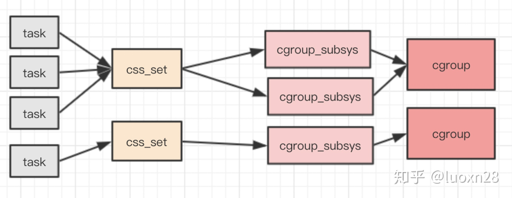

# CGroup


## linux下的cgroups数据结构



- task_struct 进程结构体

```c
// task_struct代码
#ifdef CONFIG_CGROUPS 
/* Control Group info protected by css_set_lock */ 
struct css_set *cgroups; 
/* cg_list protected by css_set_lock and tsk->alloc_lock */ 
struct list_head cg_list; 
#endif
```

- cgroup 相关结构体

```c
# css_set
struct css_set { 
    atomic_t refcount;
    struct hlist_node hlist; 
    struct list_head tasks; 
    struct list_head cg_links; 
    struct cgroup_subsys_state *subsys[CGROUP_SUBSYS_COUNT]; 
    struct rcu_head rcu_head; 
};

# cgroup子系统
struct cgroup_subsys_state {
    struct cgroup *cgroup;
    atomic_t refcnt;
    unsigned long flags;
    struct css_id *id;
};

# cgroup
struct cgroup {
    unsigned long flags; 
    atomic_t count; 
    struct list_head sibling; 
    struct list_head children; 
    struct cgroup *parent; 
    struct dentry *dentry; 
    struct cgroup_subsys_state *subsys[CGROUP_SUBSYS_COUNT]; 
    struct cgroupfs_root *root;
    struct cgroup *top_cgroup; 
    struct list_head css_sets; 
    struct list_head release_list; 
    struct list_head pidlists;
    struct mutex pidlist_mutex; 
    struct rcu_head rcu_head; 
    struct list_head event_list; 
    spinlock_t event_list_lock; 
};
```


## References

http://linux.laoqinren.net/categories/cgroup/
