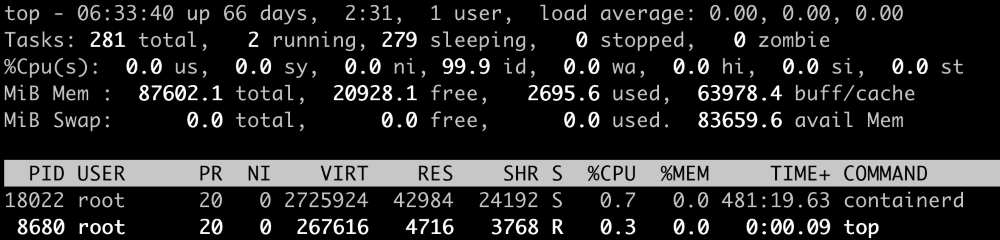
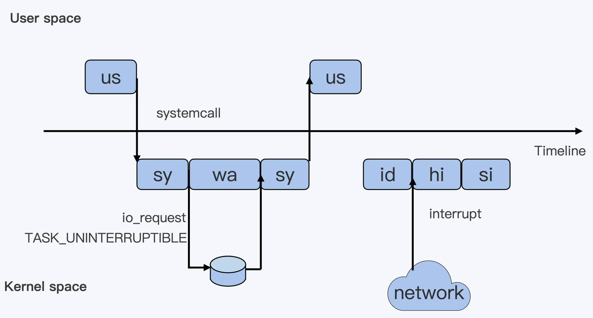
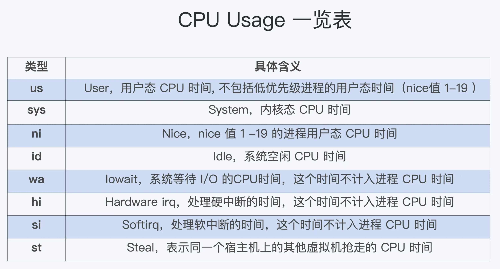

# CPU cgroup

## CPU 使用分类

top命令显示CPU消耗会分配在 us、sy、ni、id、wa、hi、si、s t

各阶段使用情况

## cgroup与CFS相关的三个参数

cgroups是对指定进程做计算机资源限制，CPU Cgroup是Cgroups其中的一个Cgroups子系统，它是用来限制进程的CPU使用。

对于进程的CPU使用，只包括两部分：

- 用户态，us、ni
- 内核态，sy

wa、hi、si，这些IO或者中断相关的CPU使用，CPU Cgroup不会去做限制

- cpu.cfs_quota_us：调度周期，一般值是100000，以microseconds为单位，也就是100ms
- cpu.cfs_period_us：在一个调度周期里呗允许的运行时间，单位同上
- cpu.shares：CPU cgroup对于控制组之间的CPU分配比例，缺省值是1024

cpu.cfs_quota_us 和 cpu.cfs_period_us 这两个值决定了每个控制组中所有进程的可使用 CPU 资源的最大值

cpu.shares 这个值决定了 CPU Cgroup 子系统下控制组可用 CPU 的相对比例，只有当系统上 CPU 完全被占满的时候，这个比例才会在各个控制组间起作用

## k8s 对CPU Cgroup配置

request 配置 cpu.shares，无论其他容器申请多少CPU资源，即使运行时整个节点的CPU都被占满的情况下，容器还是可以保证获得需要的CPU数目，cpu.shared==1024表示1个CPU的比例，request CPU的值是n就是给cpu.shares赋值为n*1024

limit 配置 cpu.cfs_quota_us，为容器设置可用CPU的上限

## 容器内CPU统计

/proc/stat是整个节点全局的状态文件，不属于任何一个namespace，无法在容器中通过读取/proc/stat文件来获取单个容器的CPU使用率

要得到单个容器的CPU使用率，可以从CPU cgroup每个控制组里的统计文件cpuacct.stat中获取

或者通过lxcfs，为每个容器虚拟/proc下的文件，比如/proc/stat

## load average

**Load Average = 可运行队列进程平均数 + 休眠队列中不可打断的进程平均数**

load average不仅仅计算了CPU Usage的部分，还计算了系统中TASK_UNINTERRUPTIBLE状态的进程数目，这些状态的进程是D状态，主要集中在disk IO、信号量、锁的访问上，这些是对linux系统资源的竞争

CPU cgroup可以限制进程的CPU资源使用，但是CPU cgroup无法限制linux系统资源的使用