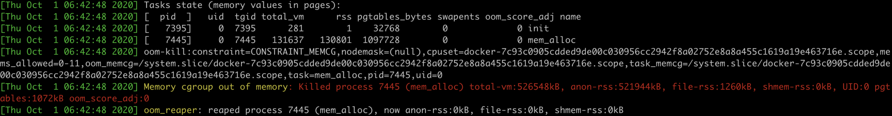

# memory cgroup


## OOM

linux判断选择OOM kill的进程判断标准涉及两个条件：

1. 进程已经使用的物理内存页面数
2. 每个进程的OOM校准值oom_score_adj，在/proc文件系统中，每个进程都有一个/proc/[pid]/oom_score_adj的文件，可以在这个文件中输入-1000到1000之间的任意一个数值，调整进程被OOM kill的几率

```c
# oom_badness()

adj = (long)p->signal->oom_score_adj;

points = get_mm_rss(p->mm) + get_mm_counter(p->mm, MM_SWAPENTS) +mm_pgtables_bytes(p->mm) / PAGE_SIZE;

adj *= totalpages / 1000;
points += adj;
```

函数oom_badness()计算方式：

用系统总的可用页面数，乘以OOM校准值oom_score_adj，再加上进程已经使用的物理页面数，计算出来的值越大，那么这个进程被OOM Kill的几率也就越大


## 与OOM相关的三个参数

- memory.limit_in_bytes：限制进程组的可用内存的最大值
- memory.oom_control：控制OOM后是否kill进程，默认触发kill，设置为1可以不kill
- memory.usage_in_bytes：当前控制组所有进程实际使用的内存总和


> Memory Cgroup OOM 不是真正依据内存使用量 memory.usage_in_bytes，而是依据 working set（使用量减去非活跃 file-backed 内存）
>
> working set 计算公式：working_set = memory.usage_in_bytes - total_inactive_file
>
> 内存使用量计算公式：memory.usage_in_bytes = memory.stat[rss] + memory.stat[cache] + memory.kmem.usage_in_bytes (该 memcg 内核内存使用量)
>
> https://github.com/google/cadvisor/blob/master/container/libcontainer/handler.go#L870


RSS的内存，就是在当前memory cgroup控制组里所有进程的RSS的综合

Page Cache是控制组里的进程读写磁盘文件后，被放到Page Cache里的物理内存

```c
static void mem_cgroup_charge_statistics(
  struct mem_cgroup *memcg, 
  struct page *page, 
  bool compound, 
  int nr_pages)
```

Memory Cgroup中有一个参数memory.stat，可以显示在当前控制组里各种内存类型的实际开销

```shell
[root memory] # cat memory.limit_in_bytes
104857600
[root memory] # cat memory.usage_in_bytes
104783872
[root memory] # cat memory.stat
cache 99508224
rss 1826816

# mem_alloc 50MB

[root memory] # cat memory.limit_in_bytes
104857600
[root memory] # cat memory.usage_in_bytes
104849408
[root memory] # cat memory.stat
cache 46632960
rss 54759424
```

> 判断容器真实的内存使用量，不能用Memory Cgroup里的memory.usage_in_bytes，而需要用memory.stat里的rss值


如果memory.oom_control设置为1，那么容器中的进程在使用内存到达memroy.limit_in_bytes之后，不会被kill掉，但memalloc进程会被暂停申请内存，状态会因等待资源申请而变成TASK INTERRUPTABLE


## OOM相关日志

查看内核日志，使用journalctl -k或者直接查看日志文件/var/log/message



日志大致分为三部分：

1. 容器里每一个进程使用的内存页面数量，在rss列，rss是Resident Set Size的缩写，指的是进程真正在使用的物理内存页面数量
2. oom-kill，这一行列出了发生OOM的memory cgroup的控制组，从控制组的信息中知道OOM是在哪个容器发生的
3. killed process 7445(men_alloc)，显示了最终被OOM killer杀死的进程


问题分析：

1. 进程本身的确需要很大的内存，说明需要给memory.limit_in_bytes里的内存上限值设置小了，需要增大内存的上限值
2. 进程的代码有bug，会导致内存泄漏，进程内存使用到达了memory cgroup中的上限，需要具体去解决代码问题


## OOM结束进程信号

OOM killer是发送sigkill信号结束进程


## k8s与内存的关系

k8s中设置memory的request、limit

- request不修改memory cgroup里的参数，只是在scheduler里调度的时候做计算看是否可以分配内存

- limit设置memory.limit_in_bytes的值


## swap

一般容器的节点配置上都是把swap功能给关闭

kubelet缺省不能在打开swap的节点上运行，配置"failSwapOn: false"参数可以允许kubelet运行在swap enabled的节点上运行


- 节点上开启swap，linux系统里swappiness的概念

如果打开了swap功能，可以配置memory.swappiness参数：

swappiness 的取值范围在 0 到 100，值为 100 的时候系统平等回收匿名内存和 Page Cache 内存；一般缺省值为 60，就是优先回收 Page Cache；即使 swappiness 为 0，也不能完全禁止 Swap 分区的使用，就是说在内存紧张的时候，也会使用 Swap 来回收匿名内存

/proc/zoneinfo可以查看水位线

- 容器上开启swap，memory cgroup里swappiness的概念

memory.swappiness可以控制这个memory cgroup控制组下匿名内存和page cache的回收

在memory cgroup的控制组里，如果设置了memory.swappiness，它会覆盖全局的swappiness

当容器内的memory.swappiness=0的时候，对匿名页的回收是始终禁止的，也就是始终都不会使用swap空间，当容器申请的内存超过limit之后就发生OOM kill

可以在宿主机节点上打开swap空间，同时在容器内对应的memory cgroups控制组里，单独配置memory.swappiness参数，如果容器不需要swap，可以设置为0，从而保证不同容器对swap功能的依赖
