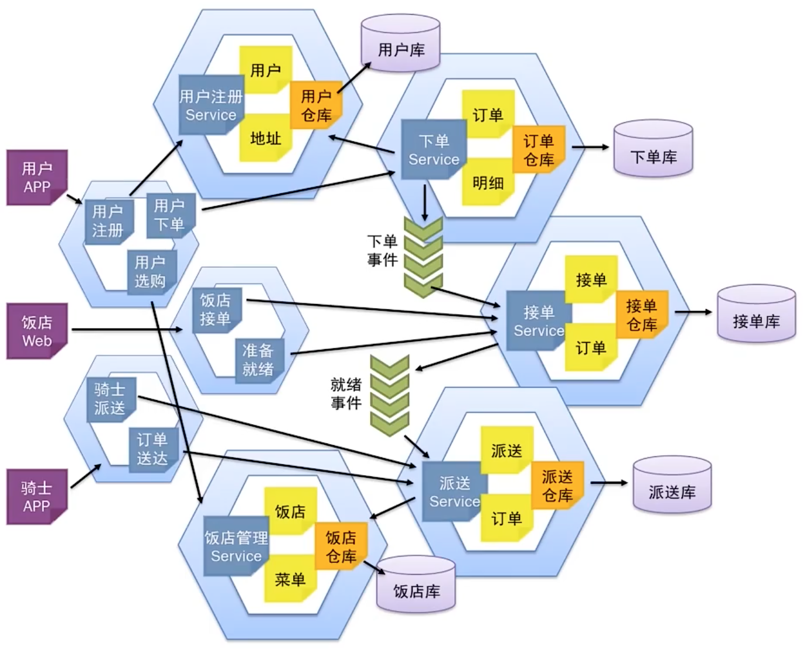

# DDD

Domain Driven Design


## 领域模型

### 服务

标识的是在领域对象之外的操作与行为，接收用户的请求和执行某些操作

- 当用户在系统界面中进行操作时，会向系统发送请求
- 服务去接收用户的这些请求，然后根据需求去执行相应的方法
- 所有操作都完成后，再将实体或值对象中的数据持久化到数据库中


### 实体

通过一个唯一标识字段来区分真实世界中的每一个个体的领域对象

- 可变性是实体的特点


### 值对象

代表的是真实世界中那些一成不变的、本质性的事物

- 不变性是值对象的本质


## 贫血模型 vs 充血模型

业务领域模型转换成程序设计


充血模型的优势：

- 保持了领域模型的原貌，可以比较直接地映射成程序的变更，代码修改起来比较直接
- 保持了对象的封装性，使得领域模型在面临多态、继承等复杂结构时，易于变更


### 充血模型的架构设计图


### 贫血模型的架构设计图


### 对比

1. 充血模型需要开发人员具有更强的 OOA/D 能力、分析业务、业务建模与设计能力
2. 充血模型需要有较强的团队协作能力
3. 贫血模型所有业务处理过程都交给 Service 去完成


贫血模型，将复杂的业务处理场景，划分成多个相对独立的步骤，然后将这些独立的步骤分配给多个 Service 串联起来执行

充血模型：将需要封装的业务逻辑放到领域对象中

贫血模型：将除此之外的业务逻辑放到 Service 中


需要封装起来按照充血模型设计的业务逻辑：

- 在领域模型中出现了类似继承、多态的情况
- 在软件设计的过程中需要将一些类型或者编码进行转换
- 希望在软件设计中能更好地表现领域对象之间的关系
- 聚合，在真实世界中那些代表整体与部分的事物


## 聚合、仓库、工厂

### 聚合

表达的是真实世界中整体与部分的关系

- 当整体不存在时，部分就变得没有了意义


- 创建订单时，将订单明细创建在订单中
- 保存订单时，同时保存订单表与订单明细表，并放在同一事务中
- 查询订单时，同时查询订单表与订单明细表，并将其装配成一个订单对象


聚合的设计思路：

- 创建或更新订单时，在订单对象中填入或更新订单的明细
- 保存订单时，只需要将订单对象作为整体去保存
- 删除订单时，删除订单对象
- 查询或装载订单时，客户程序根据查询语句或 ID 查询订单对象


聚合根：外部访问的唯一入口


在一个系统中，增删改的业务可以采用领域驱动的设计

但在非增删改的分析汇总场景中，直接 SQL 查询


### 仓库

通过订单 DAO 与订单明细 DAO 去完成数据库的保存，由订单 Service 去添加事务，这样的设计没有聚合、缺乏封装性，不利于日后的维护

采用领域驱动设计，通常就会实现一个仓库（Repository）去完成对数据库的访问

- 当数据要保存到数据库中时，由 DAO 负责保存，但保存的是某个单表
- 当数据要查询时，通过 DAO 去查询，但查询的是某个单表

通过订单仓库的封装，只需要在领域对象建模的时候设定对象间的关系，即将其设定为“聚合”


装载（Load）：通过主键 ID 去查询某条记录

- 订单仓库在查询订单时，只是简单地查询订单表
- 查询到该订单后，将其封装在订单对象中，通过查询补填用户对象、订单明细对象
- 通过补填后，会得到一个用户对象、多个订单明细对象，需要将它们装配到订单对象中


### 工厂

在设计模式中，将被调方设计成一个接口下的多个实现，将这些实现放入工厂中，工厂负责通过 key 值找到对应的实现类，创建出来返回给调用方，从而降低了调用方与被调方的耦合度


DDD 中的工厂，通过装配，创建领域对象，是领域对象生命周期的起点

比如：系统要通过 ID 装载一个订单

- 订单仓库将任务交给订单工厂，订单工厂分别调用订单 DAO、订单明细 DAO 和用户 DAO 去进行查询
- 将订单明细对象与用户对象，分别 set 到订单对象的订单明细与用户属性中（装配）
- 订单工厂将装配好的订单对象返回给订单仓库


### 对数据库的访问

如果服务器是一个非常强大的服务器，系统创建的所有领域对象都放在仓库中，当需要这些对象时，通过 ID 到仓库中去获取

当客户程序通过 ID 去获取某个领域对象时，仓库会通过这个 ID 先到缓存中进行查找

- 查找到了，则直接返回，不需要查询数据库
- 没有找到，则通知工厂，工厂调用 DAO 去数据库中查询，然后装配成领域对象返回给仓库


查询订单

- 订单仓库先通过订单 DAO 去查询订单表
- 订单 DAO 查询订单表后，会进行一个分页，将某一页的数据返回给订单仓库
- 订单仓库会将查询结果交给订单工厂，去补填其对应的用户与订单明细，完成相应的装配，将装配好的订单对象集合返回给仓库


通过仓库与工厂，对原有的 DAO 进行了一层封装

在保存、装载、查询等操作中，加入聚合、装配等操作，并将这些操作封装起来，对上层的客户程序屏蔽


## 限界上下文

将整个系统划分成许多相对独立的业务场景，在一个一个的业务场景中进行领域分析与建模，这样的业务场景称之为“问题子域”，简称“子域”

领域驱动核心的设计思想：将对软件的分析与设计还原到真实世界中，真实世界的业务与问题叫“问题域”，业务规则与知识叫“业务领域知识”

- 电商领域的问题域：人们如何进行在线购物，购物的流程是怎样的
  - 用户选购、下单、支付、物流等多个子域
- 在线订餐系统的问题域：人们如何在线订餐，饭店如何在线接单，系统是如何派送骑士去配送的
  - 用户下单、饭店接单、骑士派送等子域


一个复杂系统的领域驱动设计，是以子域为中心进行领域建模，绘制出一张一张的领域模型设计，称之为“限界上下文”（Context Bounds，CB）

限界上下文之间的相互关系，称之为“上下文地图”（Context Map）

单一职责原则：每个限界上下文中实现的都是软件变化同一个原因的业务


在用户下单的过程中，用户信息的读取是否也应该在“用户下单”这个限界上下文中实现呢？

用户信息的操作交给“用户信息管理”限界上下文


限界上下文内的高内聚：每个限界上下文内实现的功能，都是软件变化的同一个原因的代码

限界上下文间的低耦合：限界上下文通过上下文地图相互调用时，通过接口进行调用


微服务设计对设计提出了更高的要求，要求做到“高内聚”

- 从 DDD 开始需求分析、领域建模，逐渐建立起多个问题子域
- 将问题子域落实到限界上下文，它们之间的关联形成上下文地图
- 各子域落实到微服务中贫血模型或充血模型的设计，从而在微服务之间依据上下文地图形成接口


## 领域驱动设计

微服务设计最核心的难题是微服务的拆分，要讲究“小而专”的设计，要“低耦合、高内聚”

解决微服务如何拆分，实现微服务的高内聚与单一职责的问题


### 案例：在线订餐系统

在线订餐系统的业务流程图：用户选餐 -> 用户下单 -> 饭店接单 -> 餐食就绪 -> 骑士派送 -> 订单送达

如何从分析理解需求开始，通过领域驱动设计落实到拆分微服务？


统一语言建模

如何了解业务：

- 从客户那里去学习，注意捕获客户在描述业务过程中的那些专用术语，努力学会用这些专用术语与客户探讨业务


事件风暴（Event Storming）

一种基于工作坊的 DDD 事件方法，可以快速发现业务领域中正在发生的事件，指导领域建模及程序开发

事件即事实（Event as Fact），即在业务领域中那些已经发生的事件就是事实

DDD 往往应用于系统增删改的业务场景中

1. 在产品经理的引导下，与业务专家开始梳理当前的业务中有哪些领域事件，在命名的时候应当采用过去时态
2. 针对每一个领域事件，项目组成员围绕它进行业务分析，增加各种命令与事件，进而思考与之相关的资源、外部系统与时间
3. 识别模型中可能涉及的聚合及其聚合根


在线订餐系统的领域事件分析图


领域建模是将一个系统划分成多个子域，每个子域都是一个独立的业务场景，每个子域的实现就是限界上下文，它们之间的关联关系是上下文地图

通过 DDD 进行业务建模，再基于领域模型进行限界上下文划分，能保证系统的设计，在限界上下文内高内聚，在限界上下文间低耦合


已下单的限界上下文分析图


通过消息队列实现领域事件在微服务间的通知


在线订餐系统的领域事件通知


## DDD 的微服务设计

1. 按照限界上下文进行微服务的拆分，按照上下文地图定义各微服务之间的接口与调用关系
2. 将领域模型划分到多个问题子域，每个子域都有一个领域模型的设计
3. 基于充血模型与贫血模型设计各个微服务的业务领域层，即各自的 Service、Entity、Value Object
4. 按照领域模型设计各个微服务的数据库



用户 APP

- 用户注册时，调用用户注册微服务
- 用户选购时，查询饭店管理微服务
- 用户下单时，调用用户下单微服务


## 技术中台

在 DDD 实现过程中，技术中台应当能够封装那些烦琐的聚合操作

仓库与工厂的设计，以及相关的各种技术


通过分层将业务与技术解耦


整洁架构的最外层是各种技术框架：

- 与用户 UI 的交互
- 客户端与服务端的网络交互
- 与硬件设备和数据库的交互
- 与其他外部系统的交互


整洁架构的精华在于适配器层，通过适配器把核心的业务代码与外围的技术框架进行解耦

- 主动适配器（北向适配器），前端用户以不同的形式发起请求，交由应用层去接收请求，交由领域层去处理业务
- 被动适配器（南向适配器），持久化存储数据、消息，将业务逻辑与存储介质解耦


在平台建设的过程中，除了通过技术选型将各种技术整合到系统中外，还应通过封装，在其上建立接口层


支持 DDD 与微服务的技术中台：

基于整洁架构的思想，将 DDD 底层的聚合操作、仓库与工厂的设计，与微服务的技术框架，以及整洁架构中的适配器，统统封装在技术中台中


将以往业务系统中可以复用的前台与后台代码剥离个性、提取共性，形成的功用组件

- 业务中台：将抽象的业务组件，做成微服务，各个业务系统都可以使用
- 技术中台：封装各个业务系统所要采用的技术框架，设计出统一的 API
- 数据中台：整理各个业务系统的数据，建立数据存储与运算的平台


制定开发规范：

- 要求前端 json 对象的设计，与后台值对象的格式一一对应，MVC 层自动完成转换，只做一个统一 Controller

- Service 要存盘时，可以制作一个 vObj.xml 的配置文件来建立对应关系，单一 DAO


技术中台落地：

命令与查询职责分离（CQRS）模式，将系统按照职责划分为命令（增删改）与查询两部分

- 所有命令部分的增删改操作，应当采用领域驱动设计的思想进行软件设计

- 所有的查询功能应当采用事务脚本模式（Transaction Script），即直接通过 SQL 语句进行查询


## 支持快速交付的技术中台

### 单 Controller 设计

前端访问 OrmController，http://localhost:9003/orm/{bean}/{method}

bean：配置在 Spring 中的 bean.id

method：bean 中需要调用的方法

- 如果要调用的方法有值对象，必须将值对象放在方法的第一个参数上
- 如果要调用的方法既有值对象，又有其他参数，则值对象中的属性与其他参数都放在该 json 对象中


OrmController 的流程设计

- 根据前端参数 bean，从 Spring 中获得 Service
- 根据前端参数 method，通过反射获得调用方法

- 通过反射获得调用方法的第一个参数作为值对象
- 通过反射获得值对象的所有属性，从前端 json 中获得对应属性的值，写入值对象
- 根据前端 json 获得其他参数
- 将值对象与其他参数，使用反射调用 Service 中的 method 方法


### 单 DAO 的设计

```xml
<?xml version="1.0" encoding="UTF-8"?>
<vobjs>
	<vo class="com.demo.customer.entity.Customer" tableName="Customer">
  	<property name="id" column="id" isPrimaryKey="true"/>
    <property name="name" column="name"/>
    <property name="sex" column="sex"/>
    <property name="birthday" column="birthday"/>
    <property name="identification" column="identification"/>
    <property name="phone_number" column="phone_number"/>
  </vo>
</vobjs>
```

值对象中可以有很多的属性变量，但只有最终作此久化的属性变量才需要配置

每个 Service 在 Spring 中都是统一注入 BasicDao

- 如果要使用 DDD 的功能支持，注入通用仓库 Repository
- 如果要使用 Redis 缓存，注入 RepositoryWithCache

建议都采用 XML 文件的形式，而不要采用注解


BasicDao 的设计流程

- 单 DAO 调用 VObjFactory.getVObj(class) 获得配置信息 vObj
- 根据 vObj.GetTable() 获得对应的表名
- for (Property prop: vObj.getProperties())
  - 通过 prop.getColumn 获得值对象对应的字段
  - 运用反射从值对象中获得所有属性及其对应的值
  - 通过以上参数形成 SQL 语句

- 通过 SQL 语句执行数据库操作


### 查询功能的架构设计

查询也是统一 Controller（QueryController）

查询功能的 Service 只有一个，不需要传递 method 参数

进行查询时，前端输入 HTTP 请求，http://localhost:9003/query/{bean}，如：http://localhost:9003/query/customerQry?gender=male&page=1&size=30


单 Controller 的流程设计

- 从前端获得 bean、page、size、count，以及查询参数
- 根据 bean 从 Spring 中获得相应的 Service
- 从前端获得查询参数 json，将其转换成 Map
- 执行 service.query(map)
- 执行完查询后，以不同形式返回给前端

```xml
<?xml version="1.0" encoding="UTF-8"?>
<mapper namespace="com.demo.customer.query.dao.CustomerMapper">
	<sql id="searchParam">
  	<if test="id !='' and id != null">
    	and id = #{id}
    </if>
  </sql>
</mapper>
```


单 Service 的流程设计

- 将查询参数 map、page、size 传递到 DAO，执行查询 dao.query(map)
- 在查询的前后增加空方法 beforeQuery、afterQuery 作为 hook，当某业务需要在查询前后进行处理时，通过重载子类去实现
- 判断前端是否传递 count，如果有则不再求和，否则调用 dao.count() 求和计算“第x页，第y页”

- 将数据打包成 ResultSet 对象返回

```java
public class ProductQueryServiceImpl extends QueryServiceImpl {
  @Autowired
  private SupplierService supplierService;

  @Override
  protected ResultSet afterQuery(Map<String, Object> params, ResultSet resultSet) {
    List<Product> list = (List<Product>)resultSet.getData();
    for(Product product: list) {
      String supplierId = product.getSupplierId();
      Supplier supplier = supplierService.loadSupplier(supplierId);
      product.setSupplier(supplier);
    }
    resultSet.setData(list);
    return resultSet;
  }
}
```

ResultSet：

- 属性 data 是这一页的查询结果集
- page、size 是分页信息
- count 是记录总数


设计一个普通的查询，只需要制作一个 MyBatis 的查询语句配置，在 Spring 配置中制作一个 bean

对于进行查询结果集的补填，可以使用通用程序 AutofillQueryServiceImpl


## 支持 DDD 的技术中台

DDD 落地的难点：支持 DDD 的技术架构如何设计

- 不能准确掌握 DDD 的分层架构

- 把程序写得非常乱，频繁地在各种 DTO、DO、PO 进行数据转换


### 传统 DDD 的架构设计


DDD 的仓库、工厂的设计介于业务领域层与基础设施层之间

接口在业务领域层，实现在基础设施层

问题：传统 DDD 架构需要在各层次间频繁进行数据结构的转换


### 支持 DDD 的技术中台

与通用技术中台相比，只是替换了 DAO，使用通用仓库、工厂做了扩展

- 装载或查询订单时，要查询订单表，补填与订单相关的订单明细与客户信息、商品信息，并装配成一个订单对象
- 保存订单时，不仅要保存订单表，还要保存订单明细表，并将它们放到同一个事务中


装饰者模式：在原有功能的基础上进行透明功能扩展

在注入时，指定不同实现类即可


聚合代表在真实世界中的整体与部分的关系

在设计支持领域驱动的技术中台时，应当简化聚合的设计与实现

- 订单与订单明细存在聚合关系
  - 在 vObj.xml 中建模时，通过 join 标签关联它们，并置 join 标签的 isAggregation=true


## 支持微服务的技术中台

需要的能力

- 解决当前微服务架构的技术不确定性
- 更加容易地将领域驱动设计应用到微服务架构中
- 解决领域对象在仓库与工厂进行装配时，如何将本地查询替换为远程接口调用，实现微服务间数据装配的问题


聚合层微服务在调用原子微服务时，调用自己本地的接口，再由这个接口通过加载 Feign 注解，去实现远程调用

原子服务层的微服务在对外开放接口时，由统一的 Controller 开放接口，再由它去调用内部的 Service


基于领域的设计：先按照领域业务建模，然后基于限界上下文进行微服务拆分


难题：跨库的数据操作

- 经过微服务拆分，订单有订单数据库，用户有用户数据库
- 当查询订单，需要补填其对应的用户信息时，调用用户微服务的远程接口，在用户数据库中查询，然后返回给订单微服务

通用 DDD 仓库在执行查询或者装载操作时，先在订单微服务的本地编写一个用户 Service 的 Feign 接口，通过 Feign 接口实现对用户微服务的远程调用


## 基于事件溯源的设计开发

事件即事实（Event as Fact），即在业务领域中已经发生的事件就是事实。

事件风暴的精髓：精确地抓住业务进行过程中需要存储的关键事实，并围绕着这些事实进行分析设计、领域建模。


事件溯源：将过去耦合在一起的业务流程有效地解耦，让复杂的业务系统能松耦合地拆分为一个个独立组件，实现组件式的设计开发与插件式的业务变更。


根据事件风暴中分析识别的领域事件，在每次完成相应工作以后增加一个对领域事件的发布。

- 事件名称
- 发布者
- 发布事件
- 相关的数据

```json
{
  "evnet_id": "createOrder",
  "publisher": "service_order",
  "publish_time": "2021-01-07",
  "data": {
    "id": "300001",
    "customer_id": "200005",
    ...
  }
}
```

最好的做法是将每一个领域事件都予以发布。

- 业务系统的发布者只负责事件的发布
- 订阅者只负责事件的后续操作


- 事件的发布方在发布事件的时候，需要在数据库中予以记录

- Spring Cloud Stream 是 Spring Cloud 技术框架中一个实现消息驱动的技术框架，它的底层可以支持 RabbitMQ、Kafka 等主流消息队列

- 在 bootstrap.yml 文件中将领域事件与消息队列绑定

  ```yaml
  spring:
    rabbitmq:
      host: xxx.xxx.xxx.xxx
      port: 5672
      username: guest
      password: guest
    cloud:
      stream:
        bindings:
          createOrder:
            destination: createOrder
          modifyOrder:
            destination: modifyOrder
  ```


## Demo 项目

https://github.com/mooodo

- demo-ddd-trade: 基于 DDD 设计的单体应用

- demo-parent: 所有微服务项目的父项目
- demo-service-eureka: 注册中心
- demo-service-config: 配置中心

- demo-service-turbine: 断路器监控
- demo-service-zuul: 服务网关
- demo-service-parent: 各业务微服务（无数据库访问）的父项目

- demo-service-support: 各业务微服务（无数据库访问）底层技术框架
- demo-service-customer: 用户管理微服务（无数据库访问）
- demo-service-product: 产品管理微服务（无数据库访问）

- demo-service-supplier: 供应商管理微服务（无数据库访问）
- demo-service2-parent: 各业务微服务（有数据库访问）的父项目
- demo-service2-support: 各业务微服务（有数据库访问）底层技术框架
- demo-service2-customer: 用户管理微服务（有数据库访问）
- demo-service2-product: 产品管理微服务（有数据库访问）
- demo-service2-supplier: 供应商管理微服务（有数据库访问）
- demo-service2-order: 订单管理微服务（有数据库访问）


demo-service-xxx: 基于一个早起的框架设计的，可以看到以往设计开发的原始状态

demo-service2-xxx: 重点讲解的基于 DDD 的微服务设计，demo-service2-support 是框架的核心，即底层技术中台


单 Controller 的设计实现

- OrmController: 用于增删改操作，以及基于 key 值的 load、get 操作，通常基于 DDD 进行设计
- QueryController: 用于基于 SQL 语句形成的查询分析报表，查询结果会形成领域对象，并基于 DDD 进行数据补填
- 其他 Controller: 用于如 ExcelController 等特殊的操作，是继承以上两个类的功能扩展

- Service 的编写要求所有的方法，如果需要使用领域对象，必须放在第一个参数上
- 前端的 json 与领域对象中的属性一致


单 DAO 的设计实现

- 回归到 XML 的配置方式

- 注解会带来业务代码与技术框架的依赖
- 注解适用于一对一、多对一的场景，而一对多、多对多的场景往往非常麻烦


单 Service 实现数据查询

- 用单 Service 注入不同的 DAO，实现各种不同的查询
- 补填就配置 AutofillQueryServiceImpl，不补填就配置 QueryServiceImpl（如果配置的是 AutofillQueryServiceImpl，除了配置 queryDao，还要配置 basicDao）
- 补填数据时，需要远程调用微服务的相应接口，数据补填必须要技术中台提供对微服务的相应支持


通用仓库与工厂的设计

- 传统的 DDD 设计，每个模块都有自己的仓库与工厂，创建出来后放到仓库的缓存中，供上层应用访问，当领域对象在经过一系列操作以后，最后通过仓库完成数据的持久化
- 仓库和工厂对 DAO 替换的同时，还扩展了许多的功能，如数据的补填、领域对象的映射与装配、聚合的处理

- 原有的遗留系统要通过改造转型为 DDD

  - 通过领域建模增加 vObj.xml

  - 将原来注入 DAO 改为注入仓库
