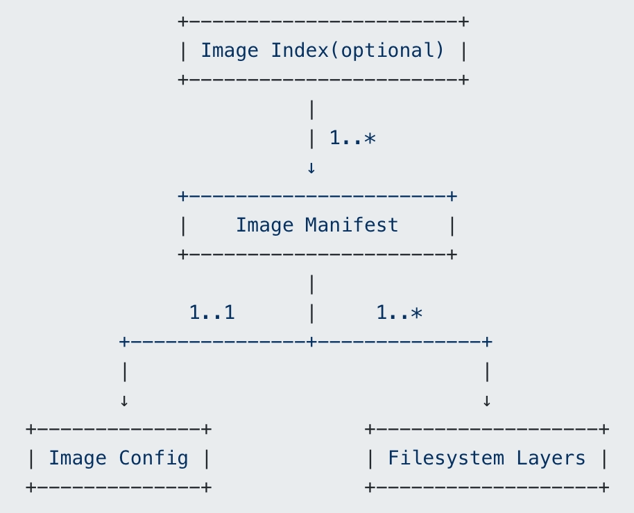

# docker


## image



- image index：json文件，可选，包含了对image中所有manifest的描述，相当于一个manifest列表，包含每个manifest的media type、文件大小、sha256码、支持的平台、平台特殊的配置
- image manifest：json文件，包含了对filesystem layers和image config的描述
- image config：json文件，包含了对image的描述
  - https://github.com/opencontainers/image-spec/blob/main/config.md
- filesystem layers：包含了文件系统的信息，即该image包含了哪些文件/目录，以及它们的属性和数据
  - https://github.com/opencontainers/image-spec/blob/main/layer.md


## 相关文件

### 镜像管理

- ubuntu：官方提供的最新ubuntu镜像，对应的完整名称为docker.io/library/ubuntu:latest
- ubuntu:16.04：官方提供的ubuntu 16.04镜像，对应的完整名称为docker.io/library/ubuntu:16.04
- ubuntu:@sha256:abcdef...：官方提供的digest码为sha256:abcdef...的ubuntu镜像，对应的完整名称为docker.io/library/ubuntu@sha256:abcdef...

docker pull的流程：

- docker发送image的名称+tag（或者digest）给registry服务器，服务器根据收到的image的名称+tag（或者digest），找到相应image的manifest，然后将manifest返回给docker
- docker得到manifest后，读取里面image配置文件的digest(sha256)，这个sha256码就是image的ID
- 根据ID在本地找有没有存在同样ID的image，有的话就不用继续下载了
- 如果没有，那么会给registry服务器发请求（里面包含配置文件的sha256和media type），拿到image的配置文件（Image Config）
- 根据配置文件中的diff_ids（每个diffid对应一个layer tar包的sha256，tar包相当于layer的原始格式），在本地找对应的layer是否存在
- 如果layer不存在，则根据manifest里面layer的sha256和media type去服务器拿相应的layer（相当去拿压缩格式的包）。
- 拿到后进行解压，并检查解压后tar包的sha256能否和配置文件（Image Config）中的diff_id对的上，对不上说明有问题，下载失败
- 根据docker所用的后台文件系统类型，解压tar包并放到指定的目录
- 等所有的layer都下载完成后，整个image下载完成，就可以使用了


镜像存放路径：/var/lib/docker/image/[storage-driver]

repositories.json记录了和本地image相关的repository信息，主要是name、image id的对应关系

```shell
root@CHNDSI-VS-208:/var/lib/docker/image/overlay2# cat repositories.json | python3 -m json.tool
{
    "Repositories": {
        "k8s.gcr.io/etcd": {
            "k8s.gcr.io/etcd:3.5.0-0": "sha256:0048118155842e4c91f0498dd298b8e93dc3aecc7052d9882b76f48e311a76ba",
            "k8s.gcr.io/etcd@sha256:9ce33ba33d8e738a5b85ed50b5080ac746deceed4a7496c550927a7a19ca3b6d": "sha256:0048118155842e4c91f0498dd298b8e93dc3aecc7052d9882b76f48e311a76ba"
        }
    }
}
```


### create管理的文件


### start管理的文件


## References

https://segmentfault.com/a/1190000009309276
