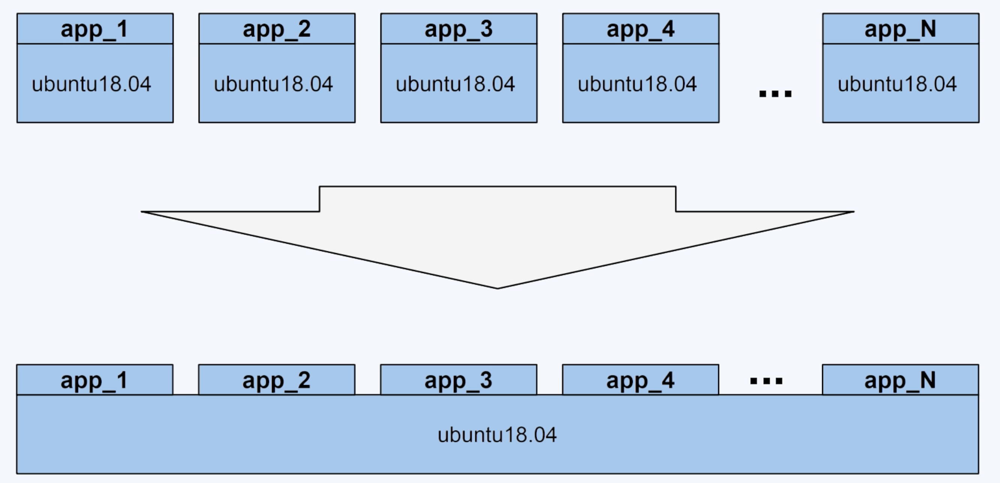
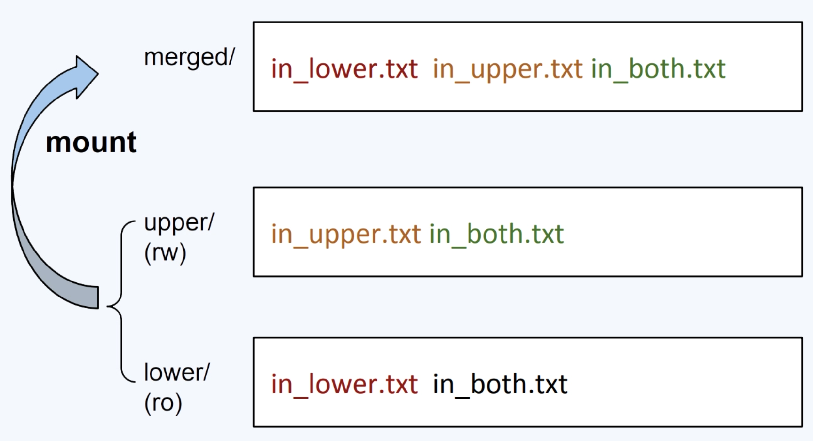
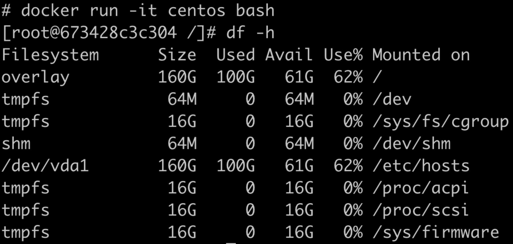

# OverlayFS


## UnionFS

目的：为了有效地减少磁盘上冗余的镜像数据，同时减少冗余的镜像数据在网络上的传输，选择一种针对于容器的文件系统是很有必要的，而这类的文件系统被称为UnionFS

UnionFS这类文件系统实现的主要功能就是把多个目录（处于不同的分区）一起挂载（mount）在一个目录下




## OverlayFS

linux 3.18版本，OverlayFS正式合入linux内核的主分支

```shell
#!/bin/bash
umount ./merged
rm upper lower merged work -r

mkdir upper lower merged work
echo "I'm from lower!" > lower/in_lower.txt
echo "I'm from upper!" > upper/in_upper.txt
# `in_both` is in both dir
ectoriesecho "I'm from lower!" > lower/in_both.txt
echo "I'm from upper!" > upper/in_both.txt

sudo mount -t overlay overlay \
	-o lowerdir=./lower,upperdir=./upper,workdir=./work \
	./merged
```


OverlayFS的一个mount命令牵涉到四类目录：lower、upper、merged、work

- lower：文件是不会被修改的，只读，支持多个lowerdir
- upper：文件的创建、修改、删除，都会在这一层反映出来，可读写
- merged：挂载点目录，也是用户看到的目录，用户的实际文件操作在这里进行
- work：只是一个存放临时文件的目录，如果有文件修改，就会在中间过程中临时存放文件在这里




启动容器后，在容器内查看df，根目录就是overlay类型

