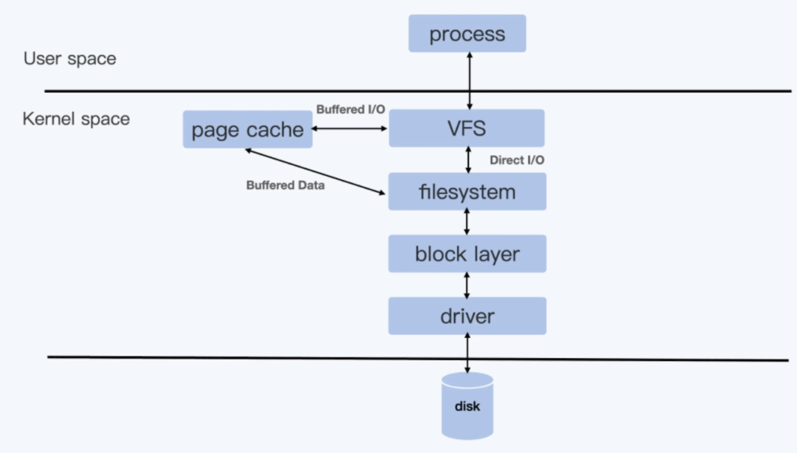

# io cgroup


## 测试工具

```shell
# 验证读性能
fio -direct=1 -iodepth=64 -rw=read -ioengine=libaio -bs=4k -size=10G -numjobs=1  -name=./fio.test
# -direct=1 代表采用非 buffered I/O 文件读写的方式，避免文件读写过程中内存缓冲对性能的影响。
# -ioengine=libaio 指文件读写采用异步 I/O（Async I/O）的方式，也就是进程可以发起多个 I/O 请求，并且不用阻塞地等待 I/O 的完成。稍后等 I/O 完成之后，进程会收到通知。这种异步 I/O 很重要，因为它可以极大地提高文件读写的性能。
# -iodepth=64 同时发出 64 个 I/O 请求
# -bs=4k 每次读 4KB 大小数块
# -size=10G 总共读 10GB 的数据
# -rw=read 这个测试是个读文件测试
# -numjobs 只有一个进程 / 线程在运行
```


## overlayFS

实验

```bash
#!/bin/bash

umount ./merged
rm upper lower merged work -r

mkdir upper lower merged work
echo "I'm from lower!" > lower/in_lower.txt
echo "I'm from upper!" > upper/in_upper.txt
# `in_both` is in both directories
echo "I'm from lower!" > lower/in_both.txt
echo "I'm from upper!" > upper/in_both.txt

sudo mount -t overlay overlay -o lowerdir=./lower,upperdir=./upper,workdir=./work ./merged
# lowerdir 容器的镜像层 只读,OverlayFS 是支持多个 lowerdir:  lowerdir=./lower1:./lower2 其中lower1是lower2的上层，会覆盖lower2
# upperdir 容器的容器层，最上层 可读写
# workdir 存放临时文件的目录，OverlayFS 中如果有文件修改，就会在中间过程中临时存放文件到这里。
# merged 它是挂载点（mount point）目录，也是用户看到的目录，用户的实际文件操作在这里进行。
```


查看容器分层挂载：

```bash
#cat /proc/mounts | grep overlay
#docker inspect containerid
```


## 容器文件系统Quota

对于容器来说，如果有大量的写操作是不建议写入容器文件系统的，一般是需要给容器挂载一个 volume，用来满足大量的文件读写。但是不能避免的是，用户在容器中运行的程序有错误，或者进行了错误的配置。比如说，我们把 log 写在了容器文件系统上，并且没有做 log rotation，那么时间一久，就会导致宿主机上的磁盘被写满。这样影响的就不止是容器本身了，而是整个宿主机了。

对于 Linux 上最常用的两个文件系统 XFS 和 ext4，它们有一个特性 Quota，用于限制一个目录的使用量。以XFS为例：

XFS 文件系统缺省都有 Quota 的特性，这个特性可以为 Linux 系统里的一个用户（user），一个用户组（group）或者一个项目（project）来限制它们使用文件系统的额度（quota），也就是限制它们可以写入文件系统的文件总量。

要使用 XFS Quota 特性，必须在文件系统挂载的时候加上对应的 Quota 选项，比如我们目前需要配置 Project Quota，那么这个挂载参数就是"pquota"。对于根目录来说，这个参数必须作为一个内核启动的参数"rootflags=pquota"，这样设置就可以保证根目录在启动挂载的时候，带上 XFS Quota 的特性并且支持 Project 模式。

```bash
#确认文件系统已经带上了支持 project 模式的 XFS quota 特性
cat /proc/mounts | grep -i prjquota
```


实验

```bash
# mkdir -p  /tmp/xfs_prjquota
# 给 /tmp/xfs_prjquota 打上 Project ID 值 101 ，这个 ID 最终是写到目录对应的 inode 上
# xfs_quota -x -c 'project -s -p /tmp/xfs_prjquota 101' /
Setting up project 101 (path /tmp/xfs_prjquota)...
Processed 1 (/etc/projects and cmdline) paths for project 101 with recursion depth infinite (-1).
#为projectid为101的目录 限制它的数据块写入量不能超过 10MB
xfs_quota -x -c 'limit -p bhard=10m 101' /
```


基于以上知识，我们可以通过**对 OverlayFS 的 upperdir 目录做 XFS Quota 的限流,**来限制容器的磁盘写入，从而保护宿主机文件系统被某个容器写满

Docker 正是使用了这个方法，也就是用 XFS Quota 来限制 OverlayFS 的 upperdir 目录，通过这个方式控制容器 OverlayFS 的根目录大小：

```bash
# docker run --storage-opt size=10M -it centos bash
# docker源码中通过setProjectID 和 setProjectQuota，两个步骤事项overlayfs限制，其实就是对应实验中的两步
```

补充： k8s中对容器文件系统的限制


## 容器磁盘限速

### blkio cgroup

iops  Input/Output Operations Per Second 的简称，也就是每秒钟磁盘读写的次数

Throughput 每秒钟磁盘中数据的读取量，一般以 MB/s 为单位。这个读取量可以叫作吞吐量，有时候也被称为带宽（Bandwidth）

吞吐量 = 数据块大小 *IOPS。


在 Cgroups v1 里，blkio Cgroup 的虚拟文件系统挂载点一般在"/sys/fs/cgroup/blkio/”, 通过以下4个参数来限制磁盘io性能：

```bash
blkio.throttle.read_iops_device
blkio.throttle.read_bps_device
blkio.throttle.write_iops_device
blkio.throttle.write_bps_device
#限制它对磁盘 /dev/vdb 的写入吞吐量不超过 10MB/s (252:16"是 /dev/vdb 的主次设备号 ls -l /dev/vdb可以查看到)
echo "252:16 10485760" > $CGROUP_CONTAINER_PATH/blkio.throttle.write_bps_device
```

尽管以上通过blkio cgroup的限制，看似能够实现磁盘io隔离，但是在实际使用中我们会发现并不能达到预期效果，通过fio测试你会发现只有当-direct=1即使用direct IO时，以上限速配置才能生效，当去掉该参数即不使用direct IO


这其实涉及到Linux 的两种文件 I/O 模式：Direct I/O 和 Buffered I/O。

Direct I/O 模式：用户进程如果要写磁盘文件，就会通过 Linux 内核的文件系统层 (filesystem) -> 块设备层 (block layer) -> 磁盘驱动 -> 磁盘硬件，这样一路下去写入磁盘。

Buffered I/O 模式，用户进程只是把文件数据写到内存中（Page Cache）就返回，而 Linux 内核自己有线程会把内存中的数据再写入到磁盘中。在 Linux 里，由于考虑到性能问题，绝大多数的应用都会使用 Buffered I/O 模式。




通过测试，我们会发现 Direct I/O 可以通过 blkio Cgroup 来限制磁盘 I/O，但是 Buffered I/O 不能被限制，这就是cgroup v1无法真正实现io隔离的原因。

为什么cgroup v1的blockio 只能限制Direct I/O,无法限制Buffered I/O？ 这与cgroup v1的架构有关

Cgroup v1 的每一个子系统都是独立的，资源的限制只能在子系统中发生。

就像下面图里的进程 pid_y，它可以分别属于 memory Cgroup 和 blkio Cgroup。但是在 blkio Cgroup 对进程 pid_y 做磁盘 I/O 做限制的时候，blkio 子系统是不会去关心 pid_y 用了哪些内存，哪些内存是不是属于 Page Cache，而这些 Page Cache 的页面在刷入磁盘的时候，产生的 I/O 也不会被计算到进程 pid_y 上面。就是这个原因，导致了 blkio 在 Cgroups v1 里不能限制 Buffered I/O


这个 Buffered I/O 限速的问题，在 Cgroup V2 里得到了解决，其实这个问题也是促使 Linux 开发者重新设计 Cgroup V2 的原因之一

Cgroup v2 相比 Cgroup v1 做的最大的变动就是一个进程属于一个控制组，而每个控制组里可以定义自己需要的多个子系统。

比如下面的 Cgroup V2 示意图里，进程 pid_y 属于控制组 group2，而在 group2 里同时打开了 io 和 memory 子系统 （Cgroup V2 里的 io 子系统就等同于 Cgroup v1 里的 blkio 子系统）。

那么，Cgroup 对进程 pid_y 的磁盘 I/O 做限制的时候，就可以考虑到进程 pid_y 写入到 Page Cache 内存的页面了，这样 buffered I/O 的磁盘限速就实现了。


在 Cgroup v2 里，设置 blkio Cgroup+Memory Cgroup 之后，对 Buffered I/O 进行磁盘限速：

- 配置 kernel 参数

  grub参数配置cgroup_no_v1=blkio,memory，这表示把 Cgroup v1 的 blkio 和 Memory 两个子系统给禁止，这样 Cgroup v2 的 io 和 Memory 这两个子系统就打开了

- 配置cgroup

```bash
# Create a new control group
mkdir -p /sys/fs/cgroup/unified/iotest

# enable the io and memory controller subsystem
echo "+io +memory" > /sys/fs/cgroup/unified/cgroup.subtree_control

# Add current bash pid in iotest control group.
# Then all child processes of the bash will be in iotest group too,
# including the fio
echo $$ >/sys/fs/cgroup/unified/iotest/cgroup.procs

# 256:16 are device major and minor ids, /mnt is on the device.
echo "252:16 wbps=10485760" > /sys/fs/cgroup/unified/iotest/io.max
cd /mnt
#Run the fio in non direct I/O mode
fio -iodepth=1 -rw=write -ioengine=libaio -bs=4k -size=1G -numjobs=1  -name=./fio.test
```

运行 fio 写入 1GB 的数据后，你会发现 fio 马上就执行完了，因为系统上有足够的内存，fio 把数据写入内存就返回了，不过只要你再运行”iostat -xz 10” 这个命令，你就可以看到磁盘 vdb 上稳定的写入速率是 10240wkB/s，也就是我们在 io Cgroup 里限制的 10MB/s。


### Dirty Pages

对于 Buffer I/O，用户的数据是先写入到 Page Cache 里的。而这些写入了数据的内存页面，在它们没有被写入到磁盘文件之前，就被叫作 dirty pages。

Linux 内核会有专门的内核线程（每个磁盘设备对应的 kworker/flush 线程）把 dirty pages 写入到磁盘中

相关参数

为了方便参数理解，先设定一个比值 A，A 等于 dirty pages 的内存 / 节点可用内存 *100%

- **dirty_background_ratio**  缺省是 10%。如果比值 A 大于 dirty_background_ratio 的话，内核 flush 线程就会把 dirty pages 刷到磁盘里
- **dirty_background_bytes** 它和 dirty_background_ratio 作用相同。区别只是 dirty_background_bytes 是具体的字节数，它用来定义的是 dirty pages 内存的临界值，而不是比例值。

dirty_background_ratio 和 dirty_background_bytes 只有一个可以起作用，如果你给其中一个赋值之后，另外一个参数就归 0 了。

- **dirty_ratio** 缺省是 20%。如果比值 A大于参数 dirty_ratio 的值，这时候正在执行 Buffered I/O 写文件的进程就会被阻塞住，直到它写的数据页面都写到磁盘为止
- **dirty_bytes** 与 dirty_ratio 相对应，它们的关系和 dirty_background_ratio 与 dirty_background_bytes 一样。我们给其中一个赋值后，另一个就会归零。
- **dirty_writeback_centisecs**  这个参数的值是个时间值，以百分之一秒为单位，缺省值是 500，也就是 5 秒钟。它表示每 5 秒钟会唤醒内核的 flush 线程来处理 dirty pages。
- **dirty_expire_centisecs** 这个参数的值也是一个时间值，以百分之一秒为单位，缺省值是 3000，也就是 30 秒钟。它定义了 dirty page 在内存中存放的最长时间，如果一个 dirty page 超过这里定义的时间，那么内核的 flush 线程也会把这个页面写入磁盘。

查看节点dirty pages的实时数目

```bash
watch -n 1 "cat /proc/vmstat | grep dirty"
```

**如果容器在做内存限制的时候，Cgroup 中 memory.limit_in_bytes 设置得比较小，而容器中的进程又有很大量的 I/O，这样申请新的 Page Cache 内存的时候，又会不断释放老的内存页面，这些操作就会带来额外的系统开销了。**


这个问题也提醒了我们：在对容器做 Memory Cgroup 限制内存大小的时候，不仅要考虑容器中进程实际使用的内存量，还要考虑容器中程序 I/O 的量，合理预留足够的内存作为 Buffered I/O 的 Page Cache。
