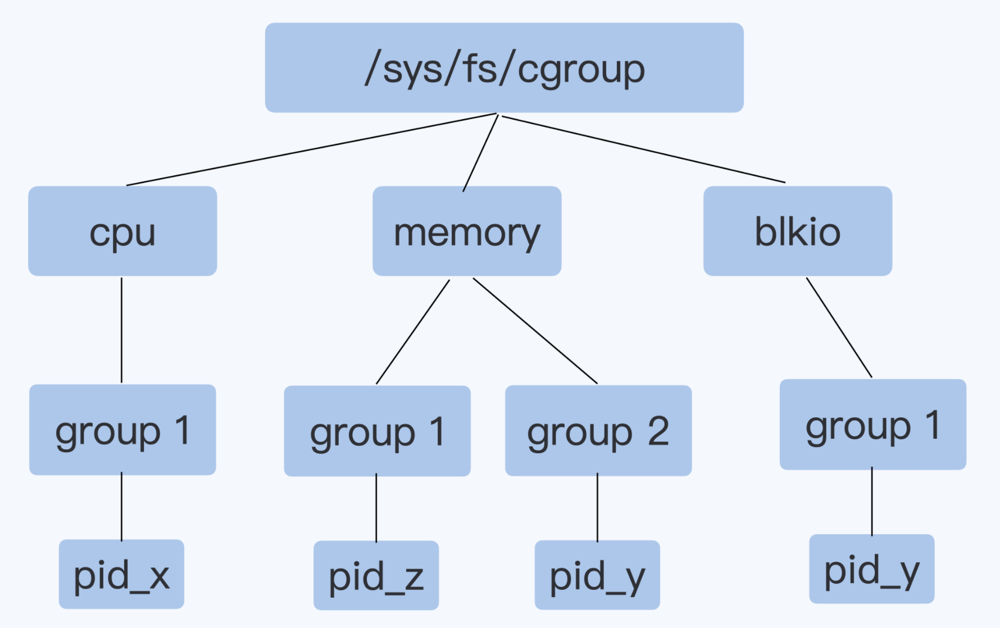
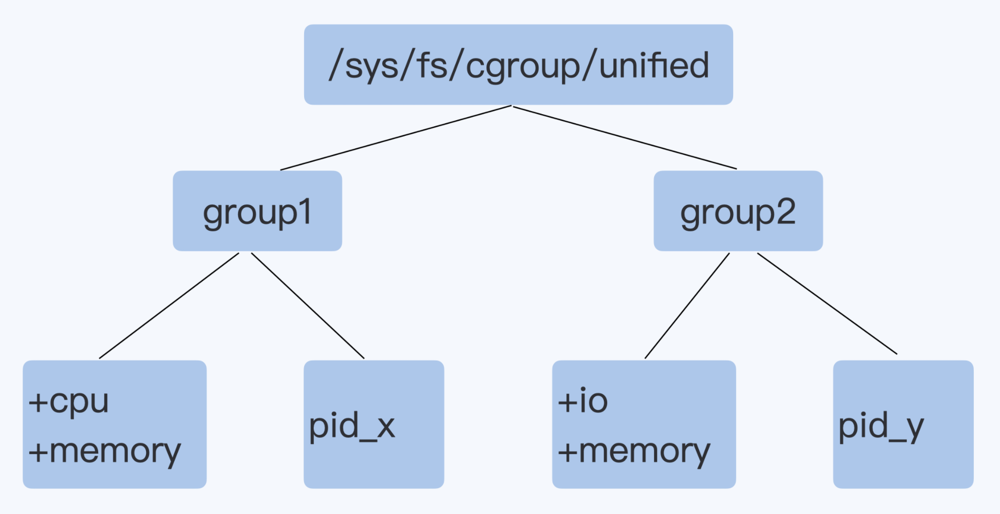

# Cgroup V1 & V2

## V1

v1中的各个子系统都是独立的，限制的资源只能在子系统中发生

问题：Buffered IO会把数据先写入到内存Page Cache中，然后由内核线程把数据写入磁盘，而Cgroup v1 blkio的子系统独立于memory子系统，无法统计到由Page Cache刷入到磁盘的数据量

## V2

v2相比v1最大的变动就是一个进程属于一个控制组，而每个控制组里可以定义自己需要的多个子系统

Cgroup v2允许一个控制组里有多个子系统协同运行，这样在一个控制组里只要同时有io和memory子系统，就可以对Buffered IO做磁盘读写的限速
