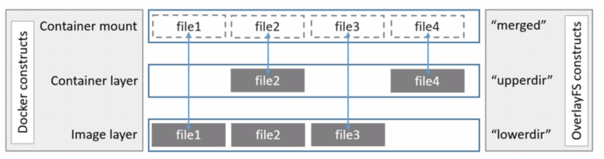
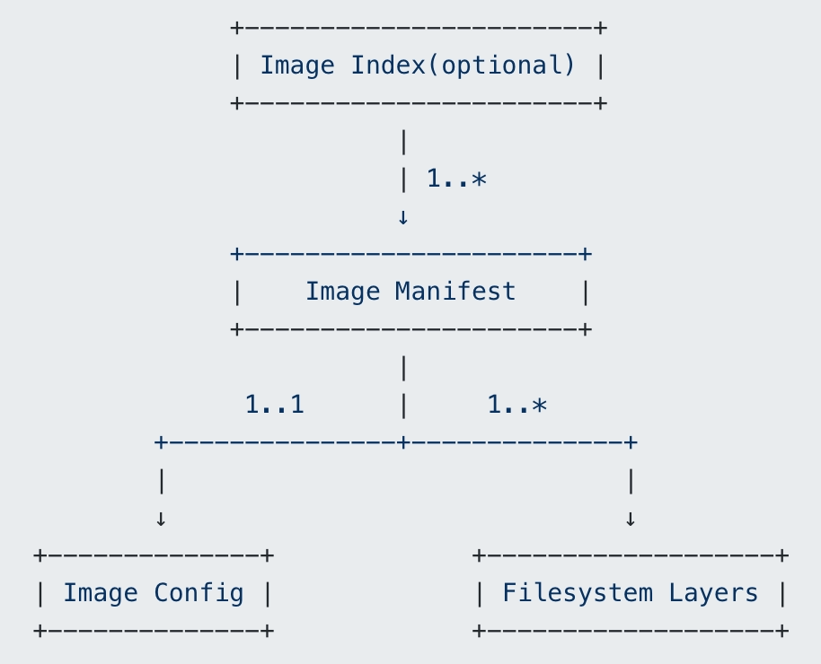

# docker


以overlay分析docker的文件形式，参考文档有点旧，会有一些偏差

主要分为三层：镜像层 lowerdir、容器层 upperdir、挂载层 merged




## image



- image index：json文件，可选，包含了对image中所有manifest的描述，相当于一个manifest列表，包含每个manifest的media type、文件大小、sha256码、支持的平台、平台特殊的配置
- image manifest：json文件，包含了对filesystem layers和image config的描述
- image config：json文件，包含了对image的描述
  - https://github.com/opencontainers/image-spec/blob/main/config.md
- filesystem layers：包含了文件系统的信息，即该image包含了哪些文件/目录，以及它们的属性和数据
  - https://github.com/opencontainers/image-spec/blob/main/layer.md


## 相关文件

### 镜像管理

- ubuntu：官方提供的最新ubuntu镜像，对应的完整名称为docker.io/library/ubuntu:latest
- ubuntu:16.04：官方提供的ubuntu 16.04镜像，对应的完整名称为docker.io/library/ubuntu:16.04
- ubuntu:@sha256:abcdef...：官方提供的digest码为sha256:abcdef...的ubuntu镜像，对应的完整名称为docker.io/library/ubuntu@sha256:abcdef...

docker pull的流程：

- docker发送image的名称+tag（或者digest）给registry服务器，服务器根据收到的image的名称+tag（或者digest），找到相应image的manifest，然后将manifest返回给docker
- docker得到manifest后，读取里面image配置文件的digest(sha256)，这个sha256码就是image的ID
- 根据ID在本地找有没有存在同样ID的image，有的话就不用继续下载了
- 如果没有，那么会给registry服务器发请求（里面包含配置文件的sha256和media type），拿到image的配置文件（Image Config）
- 根据配置文件中的diff_ids（每个diffid对应一个layer tar包的sha256，tar包相当于layer的原始格式），在本地找对应的layer是否存在
- 如果layer不存在，则根据manifest里面layer的sha256和media type去服务器拿相应的layer（相当去拿压缩格式的包）。
- 拿到后进行解压，并检查解压后tar包的sha256能否和配置文件（Image Config）中的diff_id对的上，对不上说明有问题，下载失败
- 根据docker所用的后台文件系统类型，解压tar包并放到指定的目录
- 等所有的layer都下载完成后，整个image下载完成，就可以使用了


- repositories.json

镜像存放路径：/var/lib/docker/image/[storage-driver]

repositories.json记录了和本地image相关的repository信息，主要是name、image id的对应关系

```shell
root@CHNDSI-VS-208:/var/lib/docker/image/overlay2# cat repositories.json | python3 -m json.tool
{
    "Repositories": {
        "k8s.gcr.io/etcd": {
            "k8s.gcr.io/etcd:3.5.0-0": "sha256:0048118155842e4c91f0498dd298b8e93dc3aecc7052d9882b76f48e311a76ba",
            "k8s.gcr.io/etcd@sha256:9ce33ba33d8e738a5b85ed50b5080ac746deceed4a7496c550927a7a19ca3b6d": "sha256:0048118155842e4c91f0498dd298b8e93dc3aecc7052d9882b76f48e311a76ba"
        }
    }
}
```

- 配置文件 image config

根据镜像查询出来的sha256，在imagedb里查询对应的配置

/var/lib/docker/image/[storage-driver]/imagedb/content/sha256/[image-sha256]

```shell
# 这里只关心rootfs
# 从diff_ids里可以看出etcd:3.5.0-0这个image包含了5个layer，
# 从上到下依次是从底层到顶层，417cb9...是最底层，ce8b3e...是最顶层
root@CHNDSI-VS-208:/var/lib/docker/image/overlay2/imagedb/content/sha256# cat 0048118155842e4c91f0498dd298b8e93dc3aecc7052d9882b76f48e311a76ba  | python3 -m json.tool
{
		...
    "rootfs": {
        "type": "layers",
        "diff_ids": [
            "sha256:417cb9b79adeec55f58b890dc9831e252e3523d8de5fd28b4ee2abb151b7dc8b",
            "sha256:33158bca9fb5a5ac2884b9f220006d7c000b5e7c5eac49890a651902a8d09574",
            "sha256:13de6ee856e951f4a03d2a3efd38aaf2d83c98d6b6ab117186e6384c9f074c5a",
            "sha256:eb364b1a02cae2de904b549073f5c3fcddd2c8949697f36b58f3bd5bb739fea1",
            "sha256:ce8b3ebd2ee7ca142b968754b3314a9d0c7e60dd97dbd8bde04481b2a9f40a6f"
        ]
    }
}

# docker inspect [image]也可以查看rootfs
{
	"RootFS": {
		"Type": "layers",
		"Layers": [
			"sha256:417cb9b79adeec55f58b890dc9831e252e3523d8de5fd28b4ee2abb151b7dc8b",
			"sha256:33158bca9fb5a5ac2884b9f220006d7c000b5e7c5eac49890a651902a8d09574",
			"sha256:13de6ee856e951f4a03d2a3efd38aaf2d83c98d6b6ab117186e6384c9f074c5a",
			"sha256:eb364b1a02cae2de904b549073f5c3fcddd2c8949697f36b58f3bd5bb739fea1",
			"sha256:ce8b3ebd2ee7ca142b968754b3314a9d0c7e60dd97dbd8bde04481b2a9f40a6f"
		]
	}
}
```

- layer的diff_id和digest的对应关系

layer的diff_id存在image的配置文件中，而layer的digest存在image的manifest中，他们的对应关系被存储在了image/[storage-driver]/distribution目录下

​	diffid-by-digest：存放digest到diffid的对应关系

​	v2metadata-by-diffid：存放diffid到digest的对应关系

```shell
root@CHNDSI-VS-208:/var/lib/docker/image/overlay2/distribution# tree .
.
├── diffid-by-digest
│   └── sha256
└── v2metadata-by-diffid
    └── sha256

# 根据diffid查询digest
root@CHNDSI-VS-208:/var/lib/docker/image/overlay2/distribution/v2metadata-by-diffid/sha256# cat 417cb9b79adeec55f58b890dc9831e252e3523d8de5fd28b4ee2abb151b7dc8b | python3 -m json.tool
[
    {
        "Digest": "sha256:5dea5ec2316d4a067b946b15c3c4f140b4f2ad607e73e9bc41b673ee5ebb99a3",
        "SourceRepository": "k8s.gcr.io/etcd",
        "HMAC": ""
    }
]

# 根据digest查询diffid
root@CHNDSI-VS-208:/var/lib/docker/image/overlay2/distribution/diffid-by-digest/sha256# cat 5dea5ec2316d4a067b946b15c3c4f140b4f2ad607e73e9bc41b673ee5ebb99a3
sha256:417cb9b79adeec55f58b890dc9831e252e3523d8de5fd28b4ee2abb151b7dc8b
```

- layer的元信息

layer的属性信息都放在了image/[store-driver]/layerdb目录下，目录名称是layer的chainid

chained，需要用到所有祖先layer的信息，从而保证根据chainid得到的rootfs唯一

底层的chainid，没有父层，chainid就是它自己

```shell
# tar-split.json.gz，layer压缩包的split文件，通过这个文件可以还原layer的tar包，
# 在docker save导出image的时候会用到
root@CHNDSI-VS-208:/var/lib/docker/image/overlay2/layerdb/sha256/417cb9b79adeec55f58b890dc9831e252e3523d8de5fd28b4ee2abb151b7dc8b# ls
cache-id  diff  size  tar-split.json.gz

root@CHNDSI-VS-208:/var/lib/docker/image/overlay2/layerdb/sha256# ls -al
drwx------ 2 root root 4096 12月  4 16:45 417cb9b79adeec55f58b890dc9831e252e3523d8de5fd28b4ee2abb151b7dc8b
drwx------ 2 root root 4096 12月  4 16:47 7b9df3e1ea19fce17e363ef9775a9ddbb871cda1d9994458ac80d046334749f1
drwx------ 2 root root 4096 12月  4 16:47 82c371c0fc909e86ac89663511194d0a184b997a71deaa29caafa9bbc03bf16d
drwx------ 2 root root 4096 12月  4 16:45 be3d0df9529b161eafa20b3417d99f3564ee820ba3357b7807cb6d75d7777867
drwx------ 2 root root 4096 12月  4 16:47 fc88dca1b575dd53f3b62a2b9f47c6ee915a46069bb49762868b68503a58e7c2

# 计算chainid
# 第一层chainid就是它本身
sha256:417cb9b79adeec55f58b890dc9831e252e3523d8de5fd28b4ee2abb151b7dc8b

# 第二层chainid
root@CHNDSI-VS-208:/var/lib/docker/image/overlay2/layerdb/sha256# echo -n "sha256:417cb9b79adeec55f58b890dc9831e252e3523d8de5fd28b4ee2abb151b7dc8b sha256:33158bca9fb5a5ac2884b9f220006d7c000b5e7c5eac49890a651902a8d09574" | sha256sum -
be3d0df9529b161eafa20b3417d99f3564ee820ba3357b7807cb6d75d7777867  -

# 第三层chainid，由上一层sum出来的sha256值与第三层sha256值sum
root@CHNDSI-VS-208:/var/lib/docker/image/overlay2/layerdb/sha256# echo -n "sha256:be3d0df9529b161eafa20b3417d99f3564ee820ba3357b7807cb6d75d7777867 sha256:13de6ee856e951f4a03d2a3efd38aaf2d83c98d6b6ab117186e6384c9f074c5a" | sha256sum -
82c371c0fc909e86ac89663511194d0a184b997a71deaa29caafa9bbc03bf16d  -

# 第四层chainid
root@CHNDSI-VS-208:/var/lib/docker/image/overlay2/layerdb/sha256# echo -n "sha256:82c371c0fc909e86ac89663511194d0a184b997a71deaa29caafa9bbc03bf16d sha256:eb364b1a02cae2de904b549073f5c3fcddd2c8949697f36b58f3bd5bb739fea1" | sha256sum -
7b9df3e1ea19fce17e363ef9775a9ddbb871cda1d9994458ac80d046334749f1  -

# 第五层chainid
root@CHNDSI-VS-208:/var/lib/docker/image/overlay2/layerdb/sha256# echo -n "sha256:7b9df3e1ea19fce17e363ef9775a9ddbb871cda1d9994458ac80d046334749f1 sha256:ce8b3ebd2ee7ca142b968754b3314a9d0c7e60dd97dbd8bde04481b2a9f40a6f" | sha256sum -
fc88dca1b575dd53f3b62a2b9f47c6ee915a46069bb49762868b68503a58e7c2  -

# 获取各层chainid对应的cache-id
417cb9b79adeec55f58b890dc9831e252e3523d8de5fd28b4ee2abb151b7dc8b -> 
fb47e66c771206be04a06049138231331559e806e2cb5bac39c39b7b537e43af

be3d0df9529b161eafa20b3417d99f3564ee820ba3357b7807cb6d75d7777867 -> 
2c8869080cc4d469e92d46f8473c246f186f74a003bd8d9773f695e3043ff97b

82c371c0fc909e86ac89663511194d0a184b997a71deaa29caafa9bbc03bf16d -> 
fddf4c6a3d84b8869a2b490c7fa68101617410fff29f79c27f0dfbcca3760000

7b9df3e1ea19fce17e363ef9775a9ddbb871cda1d9994458ac80d046334749f1 -> 
f9fa1f907917094fc6d7fa1b02248ba2a748a9178075cd39dedda00573e47dac

fc88dca1b575dd53f3b62a2b9f47c6ee915a46069bb49762868b68503a58e7c2 -> 
8309b39d0999be7c8fb98146b4d02a4d24d82b0bcff4de39b10d4d29c8820154
```

- layer的数据

layer的文件放在/var/lib/docker/[stoge-driver]目录下，根据上面计算出来的chainid目录获取cache-id，在该路径下查询，在对应cache-id目录下的diff文件夹，即可看到每一层的文件信息

l文件夹包含了短签名的软链，链接到diff目录下

docker inspect [image]可以查看merge后的容器路径GraphDriver.Data

```json
{
  "GraphDriver": {
    "Data": {
      "LowerDir":
      	"/var/lib/docker/overlay2/f9fa1f907917094fc6d7fa1b02248ba2a748a9178075cd39dedda00573e47dac/diff:
      	/var/lib/docker/overlay2/fddf4c6a3d84b8869a2b490c7fa68101617410fff29f79c27f0dfbcca3760000/diff:
      	/var/lib/docker/overlay2/2c8869080cc4d469e92d46f8473c246f186f74a003bd8d9773f695e3043ff97b/diff:
      	/var/lib/docker/overlay2/fb47e66c771206be04a06049138231331559e806e2cb5bac39c39b7b537e43af/diff", # 最底层
      "MergedDir": "/var/lib/docker/overlay2/8309b39d0999be7c8fb98146b4d02a4d24d82b0bcff4de39b10d4d29c8820154/merged", # 最上层
      "UpperDir": "/var/lib/docker/overlay2/8309b39d0999be7c8fb98146b4d02a4d24d82b0bcff4de39b10d4d29c8820154/diff",
      "WorkDir": "/var/lib/docker/overlay2/8309b39d0999be7c8fb98146b4d02a4d24d82b0bcff4de39b10d4d29c8820154/work"
    },
    "Name": "overlay2"
  }
}
```


### create管理的文件

dockerd在收到客户端的创建容器请求后，做了两件事情

一是准备容器需要的layer

二是检查客户端传过来的参数，并和image配置文件中的参数进行合并，然后存储成容器的配置文件

- 容器的元数据

创建容器时，docker会为每个容器创建两个新的layer

一个是只读的init layer，里面包含docker为容器准备的一些文件

另一个是容器的可写mount layer，以后在容器里面对rootfs的所有增删改操作的结果都会存在这个layer中

```shell
# layer的元数据存储在layerdb/mounts目录下，目录名称就是容器的ID
root@CHNDSI-VS-208:~# docker ps
CONTAINER ID   IMAGE                     COMMAND                  CREATED         STATUS        PORTS     NAMES
92e2b2e3b842   k8s.gcr.io/etcd:3.5.0-0   "etcd --name infra1 …"   3 seconds ago   Up 1 second             etcd1
root@CHNDSI-VS-208:/var/lib/docker/image/overlay2/layerdb/mounts/92e2b2e3b8424efee1050e6ddad09e968b28b9c5c7c0618c28ad379918d8b4ea# ls
init-id  mount-id  parent

# mount-id文件包含了mount layer的cacheid
root@CHNDSI-VS-208:/var/lib/docker/image/overlay2/layerdb/mounts/92e2b2e3b8424efee1050e6ddad09e968b28b9c5c7c0618c28ad379918d8b4ea# cat mount-id
90a2826bcfd624be7e15703373afe01019b45453c815fea43908299d9db9b90c

# init-id文件包含了init layer的cacheid
# init layer的cacheid就是在mount layer的cacheid后面加上了一个“-init”
root@CHNDSI-VS-208:/var/lib/docker/image/overlay2/layerdb/mounts/92e2b2e3b8424efee1050e6ddad09e968b28b9c5c7c0618c28ad379918d8b4ea# cat init-id
90a2826bcfd624be7e15703373afe01019b45453c815fea43908299d9db9b90c-init

# parent里面包含的是image的最上一层layer的chainid
# 表示这个容器的init layer的父layer是image的最顶层layer
root@CHNDSI-VS-208:/var/lib/docker/image/overlay2/layerdb/mounts/92e2b2e3b8424efee1050e6ddad09e968b28b9c5c7c0618c28ad379918d8b4ea# cat parent
sha256:fc88dca1b575dd53f3b62a2b9f47c6ee915a46069bb49762868b68503a58e7c2
```

新加的这两层layer比较特殊，只保存在layerdb/mounts下面，在layerdb/sha256目录下没有相关信息

说明docker将container的layer和image的layer的元数据放在了不同的两个目录中

- layer的数据

container layer的数据和image layer的数据的管理方式是一样的，都存在/var/lib/docker/[storage-driver]目录下面

```shell
root@CHNDSI-VS-208:/var/lib/docker/overlay2# tree 90a2826bcfd624be7e15703373afe01019b45453c815fea43908299d9db9b90c-init/
90a2826bcfd624be7e15703373afe01019b45453c815fea43908299d9db9b90c-init/
├── committed
├── diff # init layer包含了docker为每个容器所预先准备的文件
│   ├── dev
│   │   ├── console
│   │   ├── pts
│   │   └── shm
│   └── etc
│       ├── hostname
│       ├── hosts
│       ├── mtab -> /proc/mounts
│       └── resolv.conf
├── link # link是本层在l目录下的文件名称
├── lower # lower表示该层依赖的所有底层，用l中的文件描述
└── work
    └── work
```

init层中的diff，除了mtab文件是指向/proc/mounts的软连接之外，其他的都是空的普通文件

这几个文件都是Linux运行时必须的文件，如果缺少的话会导致某些程序或者库出现异常，所以docker需要为容器准备好这些文件：

​	/dev/console: 在Linux主机上，该文件一般指向主机的当前控制台，有些程序会依赖该文件。在容器启动的时候，docker会为容器创建一个pts，然后通过bind mount的方式将pts绑定到容器里面的/dev/console上，这样在容器里面往这个文件里面写东西就相当于往容器的控制台上打印数据。这里创建一个空文件相当于占个坑，作为后续bind mount的目的路径。

​	hostname，hosts，resolv.conf：对于每个容器来说，容器内的这几个文件内容都有可能不一样，这里也只是占个坑，等着docker在外面生成这几个文件，然后通过bind mount的方式将这些文件绑定到容器中的这些位置，即这些文件都会被宿主机中的文件覆盖掉。

​	/etc/mtab：这个文件在新的Linux发行版中都指向/proc/mounts，里面包含了当前mount namespace中的所有挂载信息，很多程序和库会依赖这个文件。

- 配置文件

/var/lib/docker/container/[container-id]

```shell
root@CHNDSI-VS-208:/var/lib/docker/containers# tree 92e2b2e3b8424efee1050e6ddad09e968b28b9c5c7c0618c28ad379918d8b4ea/
92e2b2e3b8424efee1050e6ddad09e968b28b9c5c7c0618c28ad379918d8b4ea/
├── checkpoints # 容器的checkpoint这个功能在当前版本还是experimental状态
├── config.v2.json # 通用的配置，如容器名称，要执行的命令等
├── hostconfig.json # 主机相关的配置，跟操作系统平台有关，如cgroup的配置
```

> checkpoints这个功能很强大，可以在当前node做一个checkpoint，然后再到另一个node上继续运行，相当于无缝的将一个正在运行的进程先暂停，然后迁移到另一个node上并继续运行。


### start管理的文件

start的流程：

1. docker（client）发送启动容器命令给dockerd

2. dockerd收到请求后，准备好rootfs，以及一些其它的配置文件，然后通过grpc的方式通知containerd启动容器

3. containerd根据收到的请求以及配置文件位置，创建容器运行时需要的bundle，然后启动shim进程，让它来启动容器

4. shim进程启动后，做一些准备工作，然后调用runc启动容器

- Docker
  - 准备rootfs

    dockerd做的第一件事情就是准备好容器运行时需要的rootfs，由于在docker create创建容器的时候，容器的所有layer都已经准备好了，现在就差一步将他们合并起来了

  - 准备容器内部需要的文件

    ```shell
    root@CHNDSI-VS-208:/var/lib/docker/containers# tree 92e2b2e3b8424efee1050e6ddad09e968b28b9c5c7c0618c28ad379918d8b4ea/
    92e2b2e3b8424efee1050e6ddad09e968b28b9c5c7c0618c28ad379918d8b4ea/
    ├── 92e2b2e3b8424efee1050e6ddad09e968b28b9c5c7c0618c28ad379918d8b4ea-json.log # 容器的日志文件，后续容器的stdout和stderr都会输出到这个目录。当然如果配置了其它的日志插件的话，日志就会写到别的地方
    ├── checkpoints
    ├── config.v2.json
    ├── hostconfig.json
    ├── hostname # 里面是容器的主机名，来自于config.v2.json，由docker create命令的-h参数指定，如果没指定的话，就是容器ID的前12位
    ├── hosts
    ├── mounts
    └── resolv.conf # 里面包含了DNS服务器的IP，来自于hostconfig.json，由docker create命令的--dns参数指定，没有指定的话，docker会根据容器的网络类型生成一个默认的，一般是主机配置的DNS服务器或者是docker bridge的IP
    ```

    除了日志文件外，其它文件在每次容器启动的时候都会自动生成，所以修改他们的内容后只会在当前容器运行的时候生效，容器重启后，配置又都会恢复到默认的状态

  - OCI需要的bundle

    bundle主要包含一个名字叫做config.json的配置文件，dockerd在生成这个文件前，要做一些准备工作，比如创建好cgroup的相关目录，准备网络相关的配置等，然后才生成config.json文件

    bundle的路径放在/run/containerd/io.containerd.runtime.v2.task/moby/[container-id]下，只有当容器运行时，目录才存在，容器停止后该目录被删除掉，下一次启动的时候会再次被创建

    ```shell
    root@CHNDSI-VS-208:/run/containerd/io.containerd.runtime.v2.task/moby# tree
    .
    └── 92e2b2e3b8424efee1050e6ddad09e968b28b9c5c7c0618c28ad379918d8b4ea
        ├── address
        ├── config.json
        ├── init.pid
        ├── log
        ├── log.json
        ├── options.json
        ├── rootfs
        ├── runtime
        └── work -> /var/lib/containerd/io.containerd.runtime.v2.task/moby/92e2b2e3b8424efee1050e6ddad09e968b28b9c5c7c0618c28ad379918d8b4ea
    ```

  - 准备IO文件

    dockerd还创建了一些跟io相关的命名管道，用来和容器之间进行通信

    比如这里的init-stdin文件用来向容器的stdin中写数据，init-stdout用来接收容器的stdout输出

    /run/docker/containerd/[container-id]

    ```shell
    root@CHNDSI-VS-208:/run/docker/containerd# tree 92e2b2e3b8424efee1050e6ddad09e968b28b9c5c7c0618c28ad379918d8b4ea/
    92e2b2e3b8424efee1050e6ddad09e968b28b9c5c7c0618c28ad379918d8b4ea/
    ├── init-stderr
    └── init-stdout
    
    # 它们被dockerd和containerd-shim-runc-v2两个进程所打开
    root@CHNDSI-VS-208:/run/docker/containerd/92e2b2e3b8424efee1050e6ddad09e968b28b9c5c7c0618c28ad379918d8b4ea# lsof *
    COMMAND       PID USER   FD   TYPE DEVICE SIZE/OFF NODE NAME
    dockerd    657909 root   24u  FIFO   0,24      0t0  974 init-stdout
    dockerd    657909 root   25u  FIFO   0,24      0t0  976 init-stderr
    dockerd    657909 root   28r  FIFO   0,24      0t0  974 init-stdout
    dockerd    657909 root   29r  FIFO   0,24      0t0  976 init-stderr
    container 1629196 root   14u  FIFO   0,24      0t0  974 init-stdout
    container 1629196 root   16w  FIFO   0,24      0t0  974 init-stdout
    container 1629196 root   17u  FIFO   0,24      0t0  974 init-stdout
    container 1629196 root   18r  FIFO   0,24      0t0  974 init-stdout
    container 1629196 root   19u  FIFO   0,24      0t0  976 init-stderr
    container 1629196 root   20w  FIFO   0,24      0t0  976 init-stderr
    container 1629196 root   21u  FIFO   0,24      0t0  976 init-stderr
    container 1629196 root   22r  FIFO   0,24      0t0  976 init-stderr
    ```

- Containerd

  containerd主要功能是启动并管理运行时的所有contianer

  - 准备相关文件，/run/containerd/io.containerd.runtime.v2.task/moby/[container-id]
    - log.json：runc如果运行失败的话，会写日志到这个文件
    - init.pid：容器启动后，runc会将容器中第一个进程的pid写到这个文件中（外面pid namespace中的pid）
  - 启动runc
  - 监听容器

- runc

  runc会被调用两次，第一次是shim调用runc create创建容器，第二次是containerd调用runc start启动容器

  - 创建容器

    runc会根据参数中传入的bundle目录名称以及容器ID，创建容器

    创建容器就是启动进程/proc/self/exe init，由于/proc/self/exe指向的是自己，所以相当于fork了一个新进程，并且新进程启动的参数是init，相当于运行了runc init，runc init会根据配置创建好相应的namespace，同时创建一个叫exec.fifo的临时文件，等待其它进程打开这个文件，如果有其它进程打开这个文件，则启动容器

  - 启动容器

    启动容器就是运行runc start，它会打开并读一下文件exec.fifo，这样就会触发runc init进程启动容器，如果runc start读取该文件没有异常，将会删掉文件exec.fifo，所以一般情况下我们看不到文件exec.fifo

    runc创建的容器会在/run/docker/runtime-runc/moby/[container-id]下，有一个state.json文件，包含当前容器详细的配置及状态信息

    ```shell
    root@CHNDSI-VS-208:/run/docker/runtime-runc/moby# tree
    .
    └── 92e2b2e3b8424efee1050e6ddad09e968b28b9c5c7c0618c28ad379918d8b4ea
        └── state.json
    ```


## References

https://segmentfault.com/a/1190000009309276
