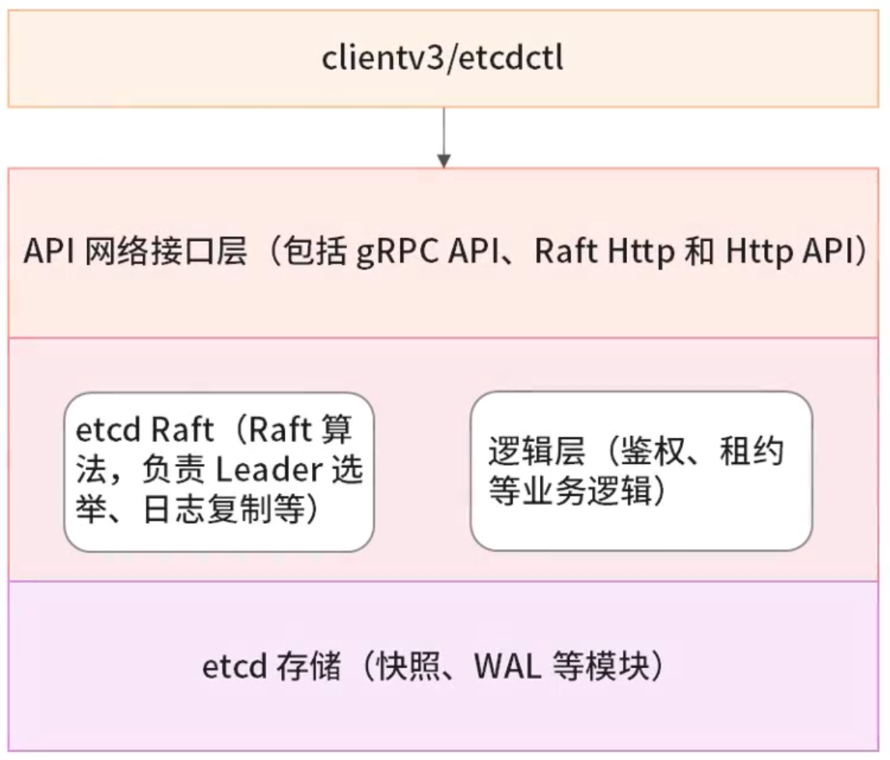

# etcd


## 整体架构

- 项目结构

| 包名                                 | 用途                             |
| ------------------------------------ | -------------------------------- |
| auth                                 | 访问权限                         |
| client/clientv3                      | go 语言客户端 SDK                |
| contrib                              | raftexample 实现                 |
| embed                                | 主要是 etcd 的 config            |
| etcdmain                             | 入口程序                         |
| etcdctl                              | 命令行客户端实现                 |
| etcdserver                           | server 主要的包                  |
| functional/hack                      | CMD、Dockerfile 之类的杂项       |
| integration                          | 和 etcd 集群相关                 |
| lease                                | 租约相关                         |
| mvcc                                 | etcd 的底层存储，包含 watch 实现 |
| pkg                                  | etcd 使用的工具集合              |
| proxy                                | etcd 使用的工具集合              |
| raft                                 | raft 算法模块                    |
| wal                                  | 日志模块                         |
| scripts/security/tests/tools/version | 脚本、测试等相关内容             |

- 架构图




## etcd 概念

### 术语

| 术语      | 描述                                    | 备注                                                     |
| --------- | --------------------------------------- | -------------------------------------------------------- |
| Raft      | Raft 算法，etcd 实现一致性的核心        | etcd 有 etcd-raft 模块                                   |
| Follower  | Raft 中的从属节点                       | 竞争 Leader 失败                                         |
| Leader    | Raft 中的领导协调节点，用于处理数据提交 | Leader 节点协调整个集群                                  |
| Candidate | 候选节点                                | 当 Follower 接收 Leader 节点的消息超时会转变为 Candidate |
| Node      | Raft 状态机的实例                       | Raft 中涉及多个节点                                      |
| Member    | etcd 实例，管理着对应的 Node 节点       | 可处理客户端请求                                         |
| Peer      | 同一个集群中的另一个 Member             | 其他成员                                                 |
| Cluster   | etcd 集群                               | 拥有多个 etcd Member                                     |
| Lease     | 租期                                    | 关键设置的租期，过期删除                                 |
| Watch     | 监测机制                                | 监控键值对的变化                                         |
| Term      | 任期                                    | 某个节点成为 Leader，到下一个竞选的时间                  |
| WAL       | 预写式日志                              | 用于持久化存储的日志格式                                 |
| Client    | 客户端                                  | 向 etcd 发起请求的客户端                                 |

### 应用场景

- 键值对存储
- 服务注册与发现
- 消息发布与订阅
- 分布式锁

### 核心架构

通过 etcdctl 客户端命令行操作和访问 etcd 中的数据

通过 HTTP API 接口直接访问 etcd

etcd 目前有 V2.x 和 V3.x 两个大版本，接口不一样、存储不一样，两个版本的数据相互隔离

- etcd server：对外接收和处理客户端的请求
- grpc server：etcd 与其他 etcd 节点之间的通信和信息同步
- MVCC：多版本控制，etcd 的存储模块，键值对的每一次操作行为都会被记录存储，数据底层存储在 BoltDB 数据库中
- WAL：预写式日志，etcd 中的数据提交前都会记录到日志
- snapshot：快照，以防 WAL 日志过多，用于存储某一时刻 etcd 的所有数据
- WAL + snapshot：etcd 可以有效地进行数据存储和节点故障恢复等操作
- raft


## etcdctl

etcdctl 支持的命令大体上分为数据库操作和非数据库操作两类

### 常用命令

| 命令                   | 描述                                       |
| ---------------------- | ------------------------------------------ |
| alarm disarm           | 解除所有的报警                             |
| alarm list             | 列出所有的报警                             |
| auth disable           | 禁用 authentication                        |
| auth enable            | 启用 authentication                        |
| check datascale        | 对于给定服务实例，检查持有数据的存储使用率 |
| check perf             | 检查 etcd 集群的性能表现                   |
| compaction             | 压缩 etcd 中的事件历史                     |
| defrag                 | 整理给定 etcd 实例的存储碎片               |
| del                    | 移除指定范围 [key, range_end) 的键值对     |
| elect                  | 加入 leader 选举                           |
| endpoint hashkv        | 打印指定 etcd 实例的历史键值对 hash 信息   |
| endpoint health        | 打印指定 etcd 实例的健康信息               |
| endpoint status        | 打印指定 etcd 实例的状态信息               |
| get                    | 获取键值对                                 |
| help                   | 帮助命令                                   |
| lease grant            | 创建 leases                                |
| lease keep-alive       | 刷新 leases                                |
| lease list             | 罗列所有有效的 leases                      |
| lease revoke           | 撤销 leases                                |
| lease timetolive       | 获取 lease 信息                            |
| lock                   | 获取一个命名锁                             |
| make-mirror            | 指定一个 etcd 集群作为镜像集群             |
| member add             | 增加一个成员到集群                         |
| member list            | 列出集群的所有成员                         |
| member promote         | 提升集群中的一个 non-voting 成员           |
| member remove          | 移除集群中的成员                           |
| member update          | 更新集群中的成员信息                       |
| migrate                | 迁移 v2 存储中的键值对到 MVCC 存储         |
| move-leader            | 移除 etcd 集群的 leader 给另一个 etcd 成员 |
| put                    | 写入键值对                                 |
| role add               | 增加一个角色                               |
| role delete            | 删除一个角色                               |
| role get               | 获取某个角色的详细信息                     |
| role grant-permission  | 给某个角色授予 key                         |
| role list              | 罗列所有的角色                             |
| role revoke-permission | 撤销一个角色的 key                         |
| snapshot restore       | 恢复快照                                   |
| snapshot save          | 存储某一个 etcd 节点的快照文件至指定位置   |
| snapshot status        | 获取指定文件的后端快照文件状态             |
| txn                    | TXN 在一个事务内处理所有的请求             |
| user add               | 增加一个用户                               |
| user delete            | 删除某个用户                               |
| user get               | 获取某个用户的详细信息                     |
| user grant-role        | 将某个角色授予某个用户                     |
| user list              | 列出所有的用户                             |
| user passwd            | 更改某个用户的密码                         |
| user revoke-role       | 撤销某个用户的角色                         |
| version                | 输出 etcdctl 的版本                        |
| watch                  | 监测指定键或者前缀的事件流                 |

### options

| 选项                               | 描述                                                         |
| ---------------------------------- | ------------------------------------------------------------ |
| --cacert=""                        | 服务端使用 HTTPS 时，使用 CA 文件进行验证                    |
| --cert=""                          | HTTPS 下客户端使用的 SSL 证书文件                            |
| --command-timeout=5s               | 命令执行超时时间设置                                         |
| --debug[=false]                    | 输出 CURL 命令，显示执行命令时发起的请求日志                 |
| --dial-timeout=2s                  | 客户端连接超时时间                                           |
| -d, --discovery-srv=""             | 用于查询描述集群端点 SRV 记录的域名                          |
| --discovery-srv-name=""            | 使用 DNS 发现时，查询的服务名                                |
| --endpoints=[127.0.0.1:2379]       | gRPC 端点                                                    |
| -h, --help[=false]                 | etcdctl 帮助                                                 |
| --hex[=false]                      | 输出二进制字符串为十六进制编码的字符串                       |
| --insecure-discovery[=true]        | 接受集群成员中不安全的 SRV 记录                              |
| --insecure-skip-tls-verify[=false] | 跳过服务端证书认证                                           |
| --insecure-transport[=true]        | 客户端禁用安全传输                                           |
| --keepalive-time=2s                | 客户端连接的 keepalive 时间                                  |
| --keepalive-timeout=6s             | 客户端连接的 keepalive 的超时时间                            |
| --key=""                           | HTTPS 下客户端使用的 SSL 密钥文件                            |
| --password=""                      | 认证的密码，当该选项开启，--user 参数中不要包含密码          |
| --user=""                          | username[:password] 的形式                                   |
| -w, --write-out="simple"           | 输出内容的格式（Fields、Json、Protobuf、Simple、Talbe，其中 Simple 为原始信息；Json 为使用 Json 格式解码，易读性高） |


## 网关、代理

### etcd 网关

- 如果同一服务器上的多个应用程序访问相同的 etcd 集群，每个应用程序仍需要知道 etcd 集群的广播的客户端端点地址
- 使用 etcd 网关作为稳定的本地端点，对于客户端应用程序来说不会感知到集群实例的变化
- 发生 etcd 集群实例的变更时，只需要网关更新其端点

启动 etcd 网关，以通过 etcd gateway 命令代理静态端点

```shell
$ etcd gateway start --endpoints=http://127.0.0.1:2379
```

### gRPC-gateway

gRPC-gateway：为非 gRPC 的客户端提供 HTTP 接口

```shell
$ curl -L http://localhost:2379/v3/kv/put -X POST -d '{"key": "k1", "value": "v1"}'
```

### gRPC Proxy

gRPC Proxy 是在 gRPC 层(L7)运行的无状态 etcd 反向代理，旨在减少核心 etcd 集群上的总处理负载

使用 etcd grpc-proxy start 的命令开启 etcd 的 gRPC proxy 模式

```shell
$ etcd grpc-proxy start --endpoints=http://127.0.0.1:2379 --listen-addr=127.0.0.1:12379 --resolver-prefix="__grpc_proxy_endpoint"
```


## 重配置操作

集群动态调整场景：

- 机器升级
- 修改集群大小
- 替换故障机器
- 重启集群


## etcd 性能

### CPU

如果 etcd 集群负载的客户端达到数千个，每秒的请求数可能是成千上万个，则需要增加 CPU 配置，通常需要 8-16 个专用内核

### Memory

etcd 对内存的需求不高，etcd 服务器内存占用相对较小，对于具有数千个 watch 监视器或者数百万键值对的大型部署，需要相应地将内存扩展到 16GB 以上

### Disk

磁盘 IO 速度是影响 etcd 集群性能和稳定性的最关键因素，大多数 etcd 集群成员须将请求写入磁盘，etcd 还将以增量的方式将检查点写入磁盘中，以便截断该日志，使用基准测试工具判断磁盘的速度是否适合 etcd

推荐的服务器配置

- etcd 对磁盘写入延迟非常敏感，通常需要 7200RPM 转速的磁盘
- 对于负载较重的集群，建议使用 SSD 固态硬盘
- 一般使用 SSD 作为 etcd 的存储
- 由于 etcd 的一致复制已经获得高可用性，至少三个集群成员不需要 RAID 的镜像和磁盘阵列

### Network

多个成员的 etcd 集群部署得益于快速可靠的网络，需要网络保证低延迟和高带宽

具有分区中断的不可靠网络将导致 etcd 集群的可用性降低

还可以通过规避在多个数据中心部署 etcd 成员的方式来减少网络开销，单个数据中心内部署 etcd 成员可以避免延迟开销，提升 etcd 集群的可用性

### 调优

- 调整 ionice，提升 etcd 磁盘读写
- 调整 tc 策略，提升 etcd 网络
  - 2380 端口的命令优先级高于 2379 端口
- 默认 10000 次更改才会保存快照，如果 etcd 的内存和磁盘使用率过高，可以降低这个阈值 (--snaptshot-count)
- 时间参数
  - 心跳间隔，节点之间网络往返时间，默认是 100ms (--heatbeat-interval)
    - 推荐设置为节点之间的最大 RTT
    - 一般可设置为 RTT 的 0.5-1.5 倍
    - 过长的心跳间隔也会延长选举超时时间
    - 测量 RTT 最简单方法就是用 PING
  - 选举超时，默认是 1000ms (--election-timeout)


## References

https://www.bilibili.com/video/BV1344y1n77t?p=1

https://mp.weixin.qq.com/s/WA_EStxexM9pxDErPNXXcg
