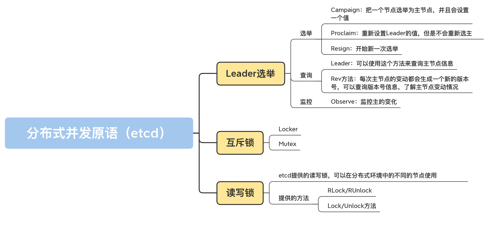

# go-concurrency

go并发主要有两个方向：channel、并发原语
- 共享资源：并发地读写共享资源，会出现数据竞争（data race）的问题，所以需要 Mutex、RWMutex 这样的并发原语来保护
- 任务编排：需要 goroutine 按照一定的规律执行，而 goroutine 之间有相互等待或者依赖的顺序关系，我们常常使用 WaitGroup 或者 Channel 来实现
- 消息传递：信息交流以及不同的 goroutine 之间的线程安全的数据交流，常常使用 Channel 来实现


## 并发原语

### mutex
- 使用 demo.go
- 竞态分析
  - go run -race xx.go
  - go tool compile -race -S xx.go
- vet静态代码检查，go vet xx.go，可以检查出死锁
- 第三方的死锁检测工具
  - go-deadlock (https://github.com/sasha-s/go-deadlock)
  - go-tools (https://github.com/dominikh/go-tools)
- 常见错误场景
  - Lock/Unlock不是成对出现
  - Copy已使用的mutex
  - mutex不是可重入锁
  - 死锁
- 扩展功能
  - TryLock
  - 等待者的数量
  - 线程安全的队列


```go
type Mutex struct {
  state int32
  sema uint32
}

const (
  mutexLocked = 1 << iota // mutex is locked
  mutexWoken
  mutexStarving // 从state字段中分出一个饥饿标记
  mutexWaiterShift = iota
  starvationThresholdNs = 1e6
)
```


### RWMutex

基于Mutex实现
- 使用
  - Lock/Unlock
  - RLock/RUnlock
  - RLocker
- 适合场景：读多写少
- 基于对读和写操作的优先级，读写锁的设计与实现，Go的RWMutex设计是Write-preferring方案，一个正在阻塞的lock调用会排除新的reader请求到锁
  - Read-preferring：读优先的设计可以提供很高的并发性，但是在竞争激烈的情况下可能会导致写饥饿
  - Write-preferring：写优先的设计意味着如果已经有一个writer在等待请求锁的话，它会阻止新来的请求锁的reader获取到锁，所以优先保障writer
  - 不指定优先级：不区分reader和writer优先级
- 常见错误场景
  - 不可复制
  - 重入导致死锁（产生原因是Go的RWMutex是Write-preferring）
    - 读写锁因为重入（或递归调用）导致死锁
    - 在reader的读操作时调用writer的写操作，这个reader和writer会形成互相依赖的死锁状态
    - 一个writer请求锁的时候如果已经有一些活跃的reader，它会等待这些活跃的reader完成才能获取到锁，但如果之后活跃的reader再以来新的reader的话这些新的reader就会等待writer释放锁之后才能继续执行，就形成一个环形依赖：writer 依赖活跃的 reader -> 活跃的 reader 依赖新来的 reader -> 新来的 reader 依赖 writer
  - 释放未加锁的RWMutex

```go
type RWMutex struct {
  w Mutex // 互斥锁解决多个writer的竞争
  writerSem uint32 // writer信号量
  readerSem uint32 // reader信号量
  readerCount int32 // reader的数量
  readerWait int32 // writer等待完成的reader的数量
}

const rwmutexMaxReaders = 1 << 30
```


### WaitGroup

解决 并发-等待 问题

- 正确姿势
  - 预先确定好WaitGroup的计数值，然后调用相同次数的Done完成相应的任务

- 常见错误场景
  - 计数器设置为负值，WaitGroup的计数器的值必须大于等于0
    - 调用Add的时候传递一个负数
    - 调用Done方法的次数过多，超过了WaitGroup的计数值
  - 不期望的Add时机，原则：等所有的Add方法调用之后再调用Wait，否则可能导致panic或者不期望的结果
  - 前一个Wait还没结束就重用WaitGroup

```go
type WaitGroup struct {
  // 避免复制使用的一个技巧，可以告诉vet工具违反了复制使用的规则
  noCopy noCopy
  // 64bit(8bytes)的值分成两段，高32bit是计数值，低32bit是waiter的计数
  // 另外32bit是用作信号量的
  // 因为64bit值的原子操作需要64bit对齐，但是32bit编译器不支持，所以数组中的元素在不同的架构中不一样，具体处理看下面的方法
  // 总之，会找到对齐的那64bit作为state，其余的32bit做信号量
  state1 [3]uint32
}
```


### Cond

为 等待/通知 场景下的并发问题提供支持

在实践中，处理等待/通知的场景时，常常使用Channel替换Cond，因为Channel类型使用起来更简洁，而且不容易出错。但是对于需要重复调用Broadcast的场景，使用Cond就再合适不过了。

调用Wait方法前必须要持有锁

Signal、Broadcast不强求要持有锁

- 常见错误场景
  - 调用Wait的时候没有加锁
  - 没有检查条件是否满足程序就继续执行

Cond有三点特性是Channel无法替代的：

- Cond和一个Locker关联，可以利用这个Locker对相关的依赖条件更改提供保护
- Cond可以同时支持Signal和Broadcast方法，而Channel只能同时支持其中一个（Channel实现Broadcast可以通过close来实现）
- Cond的Broadcast方法可以被重复调用。等待条件再次变成不满足的状态后，我们又可以调用Broadcast再次唤醒等待的goroutine。这也是Channel不能支持的，Channel被close掉之后不支持再open


### Once

Once可以用来执行且仅仅执行一次动作，常常用于单例对象的初始化场景

- 常见错误场景
  - 死锁，Once的Do方法的f参数中不要调用当前这个Once
  - 未初始化，f方法执行的时候panic或者f执行初始化资源失败了，Once还会认为初次执行已经成功


### map & sync.Map

并发map更高效的使用方式：分片+加锁（尽量减少锁的粒度和锁的持有时间）

- map的常见错误
  - 未初始化
  - 并发读写

https://github.com/elliotchance/orderedmap

https://github.com/orcaman/concurrent-map

```go
var SHARD_COUNT = 32 

// 分成SHARD_COUNT个分片的
map type ConcurrentMap []*ConcurrentMapShared

// 通过RWMutex保护的线程安全的分片，包含一个map
type ConcurrentMapShared struct {
  items map[string]interface{}
  sync.RWMutex
  // Read Write mutex, guards access to internal map.
}

// 创建并发map
func New() ConcurrentMap {
  m := make(ConcurrentMap, SHARD_COUNT)
  for i := 0; i < SHARD_COUNT; i++ {
    m[i] = &ConcurrentMapShared{items: make(map[string]interface{})}
  }
  return m
}

// 根据key计算分片索引
func (m ConcurrentMap) GetShard(key string) *ConcurrentMapShared {
  return m[uint(fnv32(key))%uint(SHARD_COUNT)]
}
```

- sync.Map使用场景
  - 只会增长的缓存系统中，一个key只写入一次而被读很多次
  - 多个goroutine为不相交的键集读、写和重写键值对

- sync.Map实现有几个优化点
  - 空间换时间，通过冗余的两个数据结构（只读的read、可写的dirty）来减少加锁对性能的影响，对只读字段的操作不需要加锁
  - 优先从read字段读取、更新、删除，因为对read字段的读取不需要锁
  - 动态调整，miss次数多了之后，将dirty数据提升为read，避免总是从dirty中加锁读取
  - double-checking，加锁之后先还要再检查read字段，确定真的不存在才操作diryt字段
  - 延迟删除，删除一个键值只是打标记，只有在提升dirty字段为read字段的时候才清理删除的数据

```go
type Map struct {
  mu Mutex
  // 基本上你可以把它看成一个安全的只读的map
  // 它包含的元素其实也是通过原子操作更新的，但是已删除的entry就需要加锁操作了
  read atomic.Value // readOnly
  
  // 包含需要加锁才能访问的元素
  // 包括所有在read字段中但未被expunged（删除）的元素以及新加的元素
  dirty map[interface{}]*entry
  
  // 记录从read中读取miss的次数，一旦miss数和dirty长度一样了，就会把dirty提升为read，并把dirty置空
  misses int
}

type readOnly struct {
  m map[interface{}]*entry
  amended bool // 当dirty中包含read没有的数据时为true，比如新增一条数据
}

// expunged是用来标识此项已经删掉的指针
// 当map中的一个项目被删除了，只是把它的值标记为expunged，以后才有机会真正删除此项
var expunged = unsafe.Pointer(new(interface{}))

// entry代表一个值
type entry struct {
  p unsafe.Pointer // *interface{}
}
```

https://github.com/zekroTJA/timedmap

https://godoc.org/github.com/emirpasic/gods/maps/treemap


### Pool

用来保存一组可独立访问的临时对象，它池化的对象会在未来的某个时候被毫无征兆地移除掉，如果没有别的对象引用这个被移除的对象的话，这个被移除的对象会被垃圾回收掉

- sync.Pool本身就是线程安全的，多个goroutine可以并发地调用它的方法存取对象
- sync.Pool不可在使用之后再复制使用

- sync.Pool的坑
  - 内存泄漏
  - 内存浪费

第三方库

- bytebufferpool https://github.com/valyala/bytebufferpool
- bpool https://github.com/oxtoacart/bpool

更多池化场景

- 连接池
- http client池
- tcp连接池 https://github.com/fatih/pool
- 数据库连接池
- memcached client连接池 https://github.com/bradfitz/gomemcache
- worker pool
  - 大部分的worker pool都是通过Channel来缓存任务的，因为Channel能够比较方便地实现并发的保护
  - 有的是多个Worker共享同一个任务Channel
  - 有些每个Worker都有一个独立的Channel
  - https://github.com/valyala/fasthttp/blob/9f11af296864153ee45341d3f2fe0f5178fd6210/workerpool.go#L16
  - https://godoc.org/github.com/gammazero/workerpool 可以无限制地提交任务，提供了更便利的 Submit 和 SubmitWait 方法提交任务，还可以提供当前的 worker 数和任务数以及关闭 Pool 的功能
  - https://godoc.org/github.com/ivpusic/grpool 创建 Pool 的时候需要提供 Worker 的数量和等待执行的任务的最大数量，任务的提交是直接往 Channel 放入任务
  - https://pkg.go.dev/github.com/dpaks/goworkers 提供了更便利的 Submit 方法提交任务以及 Worker 数、任务数等查询方法、关闭 Pool 的方法。它的任务的执行结果需要在 ResultChan 和 ErrChan 中去获取，没有提供阻塞的方法，但是它可以在初始化的时候设置 Worker 的数量和任务数
  - https://github.com/panjf2000/ants
  - https://github.com/Jeffail/tunny
  - https://github.com/benmanns/goworker
  - https://github.com/go-playground/pool
  - https://github.com/Sherifabdlnaby/gpool
  - https://github.com/alitto/pond


### Context

- 常用场景
  - 上下文信息传递，比如处理http请求、在请求处理链路上传递信息
  - 控制子goroutine的运行
  - 超时控制的方法调用
  - 可以取消的方法调用


## atomic

适用场景：不涉及到对资源复杂的竞争逻辑，只是会并发地读写这个标志

https://github.com/uber-go/atomic

atomic包提供的方法会提供内存屏障的功能，所以atomic不仅仅可以保证赋值的数据完整性，还能保证数据的可见性，一旦一个核更新了该地址的值，其他处理器总是能读取到它的最新值。但是，因为需要处理器之间保证数据的一致性，atomic的操作也是会降低性能的。

https://github.com/golang/go/issues/39351


## channel

### channel

CSP (Communicating Sequential Process)允许使用进程组件来描述系统，它们独立运行，并且只通过消息传递的方式通信

- Channel应用场景
  - 数据交流：当作并发的buffer或者queue，解决生产者-消费者问题。多个goroutine可以并发当作生产者和消费者
  - 数据传递：一个goroutine将数据交给另一个goroutine，相当于把数据的拥有权(引用)托付出去
  - 信号通知：一个goroutine可以将信号(closing、closed、data ready等)传递给另一个或者另一组goroutine
  - 任务编排：可以让一组goroutine按照一定的顺序并发或者串行的执行，这就是编排的功能
  - 锁：利用Channel也可以实现互斥锁的机制


- Channel最常见的错误是panic和goroutine泄漏
  - panic的情况
    - close为nil的chan
    - send已经close的chan
    - close已经close的chan
  - goroutine泄漏

```go
# goroutine泄漏，解决方式是将unbuffered chan改成容量为1的chan
func process(timeout time.Duration) bool {
  ch := make(chan bool)
  
  go func() {
    // 模拟处理耗时的业务
    time.Sleep((timeout + time.Second))
    ch <- true // block
    fmt.Println("exit goroutine") 
  }()
  select {
    case result := <-ch:
      return result
    case <-time.After(timeout):
      return false
  }
}
```

- Channel和传统并发原语的选择：
  - 共享资源的并发访问使用传统并发原语
  - 复杂的任务编排和小弟传递使用Channel
  - 消息通知机制使用Channel，除非只想signal一个goroutine，才使用Cond
  - 简单等待所有任务的完成用WaitGroup，也有Channel的推崇者用Channel，都可以
  - 需要和Select语句结合，使用Channel
  - 需要和超时配合时，使用Channel和Context


- 反射操作Channel
- Channel典型的应用场景
  - 消息交流：从chan的内部实现看，它是以一个循环队列的方式存放数据，所以它有时候也会被当成线程安全的队列和buffer使用。一个goroutine可以安全地往Channel中赛数据，另外一个goroutine可以安全地从Channel中读取数据，goroutine就可以安全地实现信息交流了
  - 数据传递：当前持有数据的goroutine都有一个信箱，信箱使用chan实现，goroutine只需要关注自己的信箱中的数据，处理完毕后就把结果发送到下一家的信箱中
  - 信号通知：chan类型有这样一个特点，chan如果为空，那么receiver接收数据的时候就会阻塞等待，直到chan被关闭或者有新的数据到来，利用这个机制可以实现wait/notify的设计模式
  - 锁：在chan的内部实现中就有一把互斥锁保护着它的所有字段。从外在表现上，chan的发送和接收之间也存在着happens-before关系，保证元素放进去之后，receiver才能读取到
  - 任务编排：既指安排goroutine按照指定的顺序执行，也指多个chan按照指定的方式组合处理的方式。可以通过编排数据在chan之间流转，就可以控制goroutine的执行
    - Or-Done模式：有多个任务，只要有任意一个任务执行完，就想获得这个信号
    - 扇入模式
    - 扇出模式
    - Stream
    - map-reduce

```go
func main() {
  var closing = make(chan struct{})
  var closed = make(chan struct{})
  
  go func() {
    // 模拟业务处理
    for {
      select {
        case <-closing:
          return
        default:
          // ....... 业务计算
          time.Sleep(100 * time.Millisecond)
      }
    }
  }()
  
  // 处理CTRL+C等中断信号
  termChan := make(chan os.Signal)
  signal.Notify(termChan, syscall.SIGINT, syscall.SIGTERM)
  <-termChan close(closing)
  
  // 执行退出之前的清理动作
  go doCleanup(closed) 
  
  select {
  case <-closed:
  case <-time.After(time.Second):
    fmt.Println("清理超时，不等了")
  }
  fmt.Println("优雅退出")
}

func doCleanup(closed chan struct{}) {
  time.Sleep((time.Minute))
  close(closed)
}
```


### 内存模型

并发环境中多goroutine读相同变量的时候，变量的可见性条件。具体指，在什么条件下，goroutine在读取一个变量的值的时候，能够看到其他goroutine对这个变量进行的写的结果。

CPU指令重排和多级Cache的存在，保证多核访问同一个变量变得非常复杂，不同CPU架构的处理方式也不一样，再加上编译器的优化也可能对指令进行重排，所以编程语言需要一个规范来明确多线程同时访问同一个变量的可见性和顺序。这个规范被叫做内存模型。http://nil.csail.mit.edu/6.824/2016/notes/gomem.pdf

happens-before：在一个goroutine内部，程序的执行顺序和它们的代码指定的顺序是一样的，即使编译器或者CPU重排了读写顺序，从行为上来看，也和代码指定的顺序一样

- 在Go语言中，对变量进行零值的初始化就是一个写操作
- 如果对超过机器word(64bit、32bit或者其它)大小的值进行读写，那么就可以看作是对拆成word大小的几个读写无序进行
- Go并不提供直接的CPU屏障(CPU fence)来提示编译器或者CPU保证顺序性，而是使用不同架构的内存屏障指令来实现统一的并发原语

Go语言提供的happens-before关系保证

- init函数：应用程序的初始化是在单一的goroutine执行的，如果包p导入了包q，那么q的init函数的执行一定happens before p的任何初始化代码。main函数一定在导入的包的init函数之后执行
- goroutine：启动goroutine的go语句的执行，一定happens before此goroutine内的代码执行；goroutine退出的时候是没有任何happens-before保证的，如果想观察某个goroutine的执行效果，需要使用同步机制建立happens-before关系
- Channel
  - 往Channel中的发送操作happens-before从该Channel接收相应数据的动作完成之前，即第n个send一定happens-before第n个receive的完成
  - close一个Channel的调用happens-before从关闭的Channel中读取一个零值
  - 对于unbuffered的Channel，也就是容量是0的Channel，从此Channel中读取数据的调用happens-before从此Channel发送数据的调用完成
  - 如果Channel的容量是m(m>0)，那么第n个receive一定happens-before第n+m个send的完成
- Mutex/RWMutex
  - 第 n 次的 m.Unlock 一定 happens before 第 n+1 m.Lock 方法的返回。
  - 对于读写锁 RWMutex m，如果它的第 n 个 m.Lock 方法的调用已返回，那么它的第 n 个 m.Unlock 的方法调用一定 happens before 任何一个 m.RLock 方法调用的返回，只要这些 m.RLock 方法调用 happens after 第 n 次 m.Lock 的调用的返回。这就可以保证，只有释放了持有的写锁，那些等待的读请求才能请求到读锁。
  - 对于读写锁 RWMutex m，如果它的第 n 个 m.RLock 方法的调用已返回，那么它的第 k （k<=n）个成功的 m.RUnlock 方法的返回一定 happens before 任意的 m.RUnlockLock 方法调用，只要这些 m.Lock 方法调用 happens after 第 n 次 m.RLock。

- WaitGroup：Wait方法等到计数值归零之后才返回

- Once：对于once.Do(f)调用，f函数的那个单次调用happens-before任何once.Do(f)调用的返回
- atomic：对于Go 1.15的官方实现来讲，可以保证使用atomic的Load/Store的变量之间的顺序性


## 扩展并发原语

### Semaphore

信号量可以分为计数信号量和二进位信号量，互斥锁也可以使用二进位信号量来实现

- P/V操作
  - P (descrease、wait、acquire) 减少信号量的计数值，相当于请求资源，如果资源可用就立即返回，如果没有资源或者不够就可以不断尝试或者阻塞等待
  - V (increase、signal、release) 增加信号量的计数值，释放自己持有的资源，把资源返还给信号量，信号量的值除了初始化的操作以外只能由P/V操作改变

Go在它的扩展包中提供了信号量Semaphore，不过这个信号量的类型名并不叫Semaphore，而是叫Weighted

- Acquire 方法：相当于 P 操作，你可以一次获取多个资源，如果没有足够多的资源，调用者就会被阻塞。它的第一个参数是 Context，这就意味着，你可以通过 Context 增加超时或者 cancel 的机制。如果是正常获取了资源，就返回 nil；否则，就返回 ctx.Err()，信号量不改变。
- Release 方法：相当于 V 操作，可以将 n 个资源释放，返还给信号量。
- TryAcquire 方法：尝试获取 n 个资源，但是它不会阻塞，要么成功获取 n 个资源，返回 true，要么一个也不获取，返回 false。

常见错误场景

- 请求了资源，但是忘记释放它
- 释放了从未请求的资源
- 长时间持有一个资源，即使不需要它
- 不持有一个资源，却直接使用它

https://github.com/marusama/semaphore


### SingleFlight

将并发请求合并成一个请求，以减少对下层服务的压力

每次调用都重新执行，并且在多个请求同时调用的时候只有一个执行，主要用在合并并发请求的场景中，尤其是缓存场景

在面对秒杀等大并发请求的场景，而且这些请求都是读请求时，你就可以把这些请求合并为一个请求，这样，你就可以将后端服务的压力从 n 降到 1。尤其是在面对后端是数据库这样的服务的时候，采用 SingleFlight 可以极大地提高性能。

- Do：这个方法执行一个函数，并返回函数执行的结果。你需要提供一个 key，对于同一个 key，在同一时间只有一个在执行，同一个 key 并发的请求会等待。第一个执行的请求返回的结果，就是它的返回结果。函数 fn 是一个无参的函数，返回一个结果或者 error，而 Do 方法会返回函数执行的结果或者是 error，shared 会指示 v 是否返回给多个请求。
- DoChan：类似 Do 方法，只不过是返回一个 chan，等 fn 函数执行完，产生了结果以后，就能从这个 chan 中接收这个结果。
- Forget：告诉 Group 忘记这个 key。这样一来，之后这个 key 请求会执行 f，而不是等待前一个未完成的 fn 函数的结果。

https://github.com/golang/go/blob/b1b67841d1e229b483b0c9dd50ddcd1795b0f90f/src/net/lookup.go

设计缓存问题时，我们常常需要解决缓存穿透、缓存雪崩和缓存击穿问题。缓存击穿问题是指，在平常高并发的系统中，大量的请求同时查询一个 key 时，如果这个 key 正好过期失效了，就会导致大量的请求都打到数据库上。这就是缓存击穿。用 SingleFlight 来解决缓存击穿问题再合适不过了。因为，这个时候，只要这些对同一个 key 的并发请求的其中一个到数据库中查询，就可以了，这些并发的请求可以共享同一个结果。因为是缓存查询，不用考虑幂等性问题。


### CylicBarrier

可重用的栅栏并发原语，用来控制一组请求同时执行

https://github.com/marusama/cyclicbarrier

CyclicBarrier 有两个初始化方法：

- 第一个是 New 方法，它只需要一个参数，来指定循环栅栏参与者的数量。
- 第二个方法是 NewWithAction，它额外提供一个函数，可以在每一次到达执行点的时候执行一次。具体的时间点是在最后一个参与者到达之后，但是其它的参与者还未被放行之前。我们可以利用它，做放行之前的一些共享状态的更新等操作。


### 分组操作

分组执行一批相同或类似的任务

- errgroup： 将一个通用的父任务拆成几个小任务并发执行，https://github.com/golang/sync

- Pipeline
- SizedGroup/ErrSizedGroup https://github.com/go-pkgz/syncs
- gollback https://github.com/vardius/gollback
- Hunch https://github.com/AaronJan/Hunch
- schedgroup https://github.com/mdlayher/schedgroup

https://godoc.org/github.com/bilibili/kratos/pkg/sync/errgroup

https://github.com/neilotoole/errgroup

https://github.com/facebookarchive/errgroup


## 分布式并发原语




## Ref

[深入Go并发编程研讨课](https://github.com/smallnest/dive-to-gosync-workshop)

[64位对齐](https://go101.org/article/memory-layout.html)

[Atomic vs. Non-Atomic Operations](https://preshing.com/20130618/atomic-vs-non-atomic-operations/)

[Lockless Programming Considerations for Xbox 360 and Microsoft Windows](https://docs.microsoft.com/zh-cn/windows/win32/dxtecharts/lockless-programming)

[Understanding Real-World Concurrency Bugs in Go](https://songlh.github.io/paper/go-study.pdf)

[Go语言原本的并发调度](https://golang.design/under-the-hood/zh-cn/part2runtime/ch06sched/)

[Go Concurrency Patterns](https://www.youtube.com/watch?v=f6kdp27TYZs)

[Advanced Go Concurrency Patterns](https://www.youtube.com/watch?v=QDDwwePbDtw)
