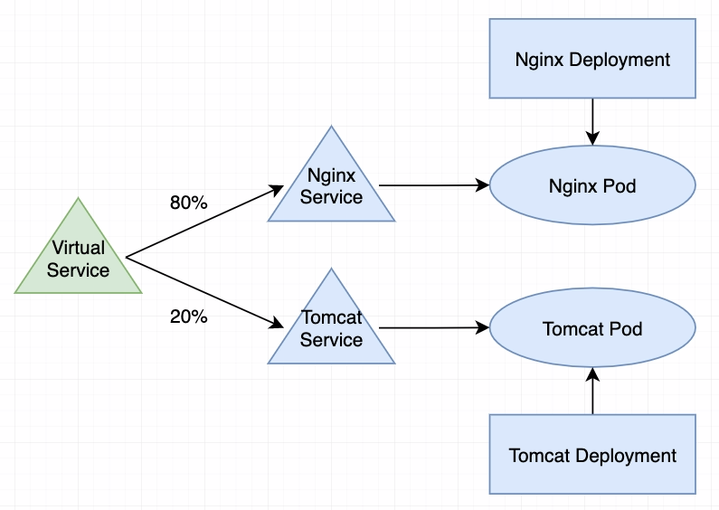
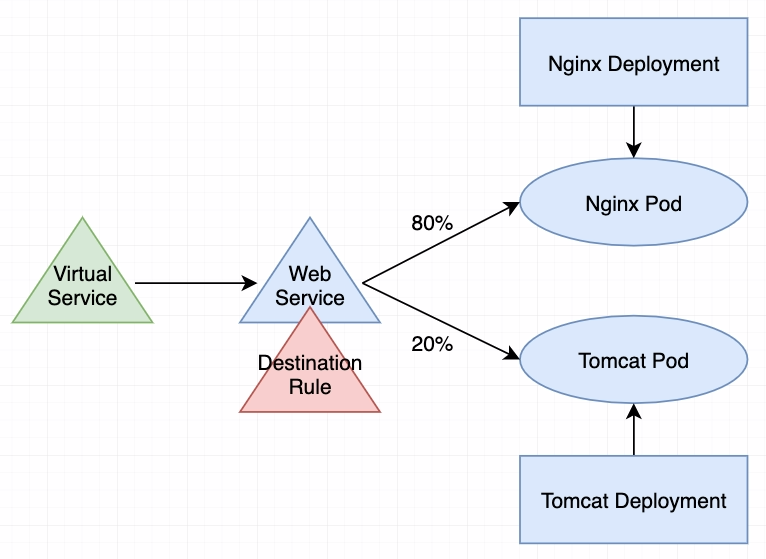

# istio


## k8s cluster

```shell
kind create cluster --config=-<<EOF
kind: Cluster
apiVersion: kind.x-k8s.io/v1alpha4
nodes:
- role: control-plane
  image: kindest/node:v1.20.7
  extraPortMappings:
  - containerPort: 80
    hostPort: 80
    protocol: TCP
EOF
```


## install istio in k8s

创建istio-system namespace

调整部署的yaml文件 istio-1.11.4-default.yaml，发布到集群

如果没有部署文件，可以通过istioctl获取后生成

```shell
# download istio
curl -L https://git.io/getLatestIstio | ISTIO_VERSION=1.11.4 sh -

# generate yaml
./bin/istioctl manifest generate --set profile=default
```


istio默认开启了privileged特性，禁止小于1024的端口，如果需要暴露80、443，需要调整删除env: ISTIO_META_UNPRIVILEGED_POD


## test

部署 istio-test.yaml

VirtualService与Gateway不在同一个namespace下的情况下，需要在VirtualService的gateways中配置"<namespace>/<gateway>"


## 灰度流量模型

- vs

```yaml
apiVersion: networking.istio.io/v1alpha3
kind: VirtualService
metadata:
  name: web-vs
  namespace: default
spec:
  gateways:
  - default/demo-gateway
  hosts:
  - "demo.com"
  http:
  - match:
    - uri:
        prefix: /
    route:
    - destination:
        host: nginx-svc
        port:
          number: 80
        weight: 80
    - destination:
        host: tomcat-svc
        port:
          number: 80
        weight: 20
```



- vs+dr

```yaml
apiVersion: networking.istio.io/v1alpha3
kind: VirtualService
metadata:
  name: web-vs
  namespace: default
spec:
  gateways:
  - default/demo-gateway
  hosts:
  - "demo.com"
  http:
  - match:
    - uri:
        prefix: /
    route:
    - destination:
        host: web
        port:
          number: 80
---
apiVersion: networking.istio.io/v1alpha3
kind: DestinationRule
metadata:
  name: web-dr
  namespace: default
spec:
  host: web
  trafficPolicy:
    loadBalancer:
      simple: ROUND_ROBIN
```




## 参考文档

- https://blog.51cto.com/u_14625168/2474277
