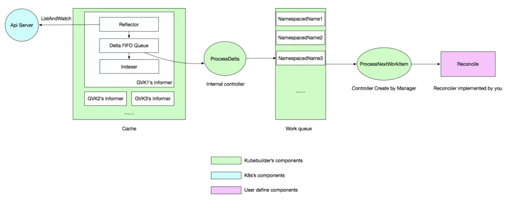

# kubebuilder


## 简介

kubebuilder 是一个使用 CRDs 构建 K8s API 的 SDK。

- 提供脚手架工具初始化 CRDs 工程，自动生成 boilerplate 代码和配置
- 提供代码库封装底层的 K8s go-client

方便用户从零开始开发 CRDs，Controllers 和 Admission Webhooks 来扩展 K8s。



- 如何同步自定义资源以及 K8s build-in 资源？

需要将自定义资源和想要 Watch 的 K8s build-in 资源的 GVKs 注册到 Scheme 上，Cache 会自动帮我们同步。

- Controller 的 Reconcile 方法是如何被触发的？

通过 Cache 里面的 Informer 获取资源的变更事件，然后通过两个内置的 Controller 以生产者消费者模式传递事件，最终触发 Reconcile 方法。

- Cache 的工作原理是什么？

GVK -> Informer 的映射，Informer 包含 Reflector 和 Indexer 来做事件监听和本地缓存。


## main.go

```go
var (
  scheme   = runtime.NewScheme()
  setupLog = ctrl.Log.WithName("setup")
)

func init() {
  appsv1alpha1.AddToScheme(scheme)
  // +kubebuilder:scaffold:scheme
}

func main() {
  ...
  // 1、init Manager
  mgr, err := ctrl.NewManager(ctrl.GetConfigOrDie(), ctrl.Options{Scheme: scheme, MetricsBindAddress: metricsAddr})
  if err != nil {
    setupLog.Error(err, "unable to start manager")
    os.Exit(1)
  }
  // 2、init Reconciler（Controller）
  err = (&controllers.ApplicationReconciler{
    Client: mgr.GetClient(),
    Log:    ctrl.Log.WithName("controllers").WithName("Application"),
    Scheme: mgr.GetScheme(),
  }).SetupWithManager(mgr)
  if err != nil {
    setupLog.Error(err, "unable to create controller", "controller", "EDASApplication")
    os.Exit(1)
  }
  // +kubebuilder:scaffold:builder
  setupLog.Info("starting manager")
  // 3、start Manager
  if err := mgr.Start(ctrl.SetupSignalHandler()); err != nil {
    setupLog.Error(err, "problem running manager")
    os.Exit(1)
  }
}
```

init 方法里面我们将 appsv1alpha1 注册到 Scheme 里面去了，这样一来 Cache 就知道 watch 谁了，main 方法里面的逻辑基本都是 Manager的。

1. 初始化了一个 Manager
2. 将 Manager 的 Client 传给 Controller，并且调用 SetupWithManager 方法传入 Manager 进行 Controller 的初始化
3. 启动 Manager


## Manager初始化

```go
// New returns a new Manager for creating Controllers.
func New(config *rest.Config, options Options) (Manager, error) {
  ...
  // Create the cache for the cached read client and registering informers
  cache, err := options.NewCache(config, cache.Options{Scheme: options.Scheme, Mapper: mapper, Resync: options.SyncPeriod, Namespace: options.Namespace})
  if err != nil {
    return nil, err
  }
  apiReader, err := client.New(config, client.Options{Scheme: options.Scheme, Mapper: mapper})
  if err != nil {
    return nil, err
  }
  writeObj, err := options.NewClient(cache, config, client.Options{Scheme: options.Scheme, Mapper: mapper})
  if err != nil {
    return nil, err
  }
  ...
  return &controllerManager{
    config:           config,
    scheme:           options.Scheme,
    errChan:          make(chan error),
    cache:            cache,
    fieldIndexes:     cache,
    client:           writeObj,
    apiReader:        apiReader,
    recorderProvider: recorderProvider,
    resourceLock:     resourceLock,
    mapper:           mapper,
    metricsListener:  metricsListener,
    internalStop:     stop,
    internalStopper:  stop,
    port:             options.Port,
    host:             options.Host,
    leaseDuration:    *options.LeaseDuration,
    renewDeadline:    *options.RenewDeadline,
    retryPeriod:      *options.RetryPeriod,
  }, nil
}
```

主要是创建 Cache 与 Clients。

### cache

```go
// New initializes and returns a new Cache.
func New(config *rest.Config, opts Options) (Cache, error) {
  opts, err := defaultOpts(config, opts)
  if err != nil {
    return nil, err
  }
  im := internal.NewInformersMap(config, opts.Scheme, opts.Mapper, *opts.Resync, opts.Namespace)
  return &informerCache{InformersMap: im}, nil
}

// newSpecificInformersMap returns a new specificInformersMap
// (like the generical InformersMap, except that it doesn't implement WaitForCacheSync).
func newSpecificInformersMap(...) *specificInformersMap {
  ip := &specificInformersMap{
    Scheme:            scheme,
    mapper:            mapper,
    informersByGVK:    make(map[schema.GroupVersionKind]*MapEntry),
    codecs:            serializer.NewCodecFactory(scheme),
    resync:            resync,
    createListWatcher: createListWatcher,
    namespace:         namespace,
  }
  return ip
}

// MapEntry contains the cached data for an Informer
type MapEntry struct {
  // Informer is the cached informer
  Informer cache.SharedIndexInformer
  // CacheReader wraps Informer and implements the CacheReader interface for a single type
  Reader CacheReader
}

func createUnstructuredListWatch(gvk schema.GroupVersionKind, ip *specificInformersMap) (*cache.ListWatch, error) {
        ...
  // Create a new ListWatch for the obj
  return &cache.ListWatch{
    ListFunc: func(opts metav1.ListOptions) (runtime.Object, error) {
      if ip.namespace != "" && mapping.Scope.Name() != meta.RESTScopeNameRoot {
        return dynamicClient.Resource(mapping.Resource).Namespace(ip.namespace).List(opts)
      }
      return dynamicClient.Resource(mapping.Resource).List(opts)
    },
    // Setup the watch function
    WatchFunc: func(opts metav1.ListOptions) (watch.Interface, error) {
      // Watch needs to be set to true separately
      opts.Watch = true
      if ip.namespace != "" && mapping.Scope.Name() != meta.RESTScopeNameRoot {
        return dynamicClient.Resource(mapping.Resource).Namespace(ip.namespace).Watch(opts)
      }
      return dynamicClient.Resource(mapping.Resource).Watch(opts)
    },
  }, nil
}
```

Cache 主要就是创建了 InformersMap，Scheme 里面的每个 GVK 都创建了对应的 Informer，通过 informersByGVK 这个 map 做 GVK 到 Informer 的映射，每个 Informer 会根据 ListWatch 函数对对应的 GVK 进行 List 和 Watch。

### clients

```go
// defaultNewClient creates the default caching client
func defaultNewClient(cache cache.Cache, config *rest.Config, options client.Options) (client.Client, error) {
  // Create the Client for Write operations.
  c, err := client.New(config, options)
  if err != nil {
    return nil, err
  }
  return &client.DelegatingClient{
    Reader: &client.DelegatingReader{
      CacheReader:  cache,
      ClientReader: c,
    },
    Writer:       c,
    StatusClient: c,
  }, nil
}
```

读操作使用上面创建的 Cache，写操作使用 K8s go-client 直连。


## Controller初始化

```go
func (r *EDASApplicationReconciler) SetupWithManager(mgr ctrl.Manager) error {
  err := ctrl.NewControllerManagedBy(mgr).
    For(&appsv1alpha1.EDASApplication{}).
    Complete(r)
return err
}

func (blder *Builder) Build(r reconcile.Reconciler) (manager.Manager, error) {
...
  // Set the Manager
  if err := blder.doManager(); err != nil {
    return nil, err
  }
  // Set the ControllerManagedBy
  if err := blder.doController(r); err != nil {
    return nil, err
  }
  // Set the Watch
  if err := blder.doWatch(); err != nil {
    return nil, err
  }
...
  return blder.mgr, nil
}
```

使用的是 Builder 模式，NewControllerManagerBy 和 For 方法都是给 Builder 传参，最重要的是最后一个方法 Complete。

主要是看看 doController 和 doWatch。

### doController

```go
func New(name string, mgr manager.Manager, options Options) (Controller, error) {
  if options.Reconciler == nil {
    return nil, fmt.Errorf("must specify Reconciler")
  }
  if len(name) == 0 {
    return nil, fmt.Errorf("must specify Name for Controller")
  }
  if options.MaxConcurrentReconciles <= 0 {
    options.MaxConcurrentReconciles = 1
  }
  // Inject dependencies into Reconciler
  if err := mgr.SetFields(options.Reconciler); err != nil {
    return nil, err
  }
  // Create controller with dependencies set
  c := &controller.Controller{
    Do:                      options.Reconciler,
    Cache:                   mgr.GetCache(),
    Config:                  mgr.GetConfig(),
    Scheme:                  mgr.GetScheme(),
    Client:                  mgr.GetClient(),
    Recorder:                mgr.GetEventRecorderFor(name),
    Queue:                   workqueue.NewNamedRateLimitingQueue(workqueue.DefaultControllerRateLimiter(), name),
    MaxConcurrentReconciles: options.MaxConcurrentReconciles,
    Name:                    name,
  }
  // Add the controller as a Manager components
  return c, mgr.Add(c)
}
```

- Do：Reconcile 逻辑
- Cache：找 Informer 注册 Watch
- Client：对 K8s 资源进行 CRUD
- Queue：Watch 资源的 CUD 事件缓存
- Recorder：事件收集

### doWatch

```go
func (blder *Builder) doWatch() error {
  // Reconcile type
  src := &source.Kind{Type: blder.apiType}
  hdler := &handler.EnqueueRequestForObject{}
  err := blder.ctrl.Watch(src, hdler, blder.predicates...)
  if err != nil {
    return err
  }
  // Watches the managed types
  for _, obj := range blder.managedObjects {
    src := &source.Kind{Type: obj}
    hdler := &handler.EnqueueRequestForOwner{
      OwnerType:    blder.apiType,
      IsController: true,
    }
    if err := blder.ctrl.Watch(src, hdler, blder.predicates...); err != nil {
      return err
    }
  }
  // Do the watch requests
  for _, w := range blder.watchRequest {
    if err := blder.ctrl.Watch(w.src, w.eventhandler, blder.predicates...); err != nil {
      return err
    }
  }
  return nil
}
```

该方法对本 Controller 负责的 CRD 进行了 watch，同时底下还会 watch 本 CRD 管理的其他资源，这个 managedObjects 可以通过 Controller 初始化 Buidler 的 Owns 方法传入。

Watch需要关注：

- 注册的handler
- 注册的流程

Handler 实际注册到 Informer 上面，通过 Cache 创建了所有 Scheme 里面 GVKs 的 Informers，然后对应 GVK 的 Controller 注册了 Watch Handler 到对应的 Informer，对应的 GVK 里面的资源有变更都会触发 Handler，将变更事件写到 Controller 的事件队列中，之后触发我们的 Reconcile 方法。


## Manager启动

```go
func (cm *controllerManager) Start(stop <-chan struct{}) error {
  ...
  go cm.startNonLeaderElectionRunnables()
  ...
}

func (cm *controllerManager) startNonLeaderElectionRunnables() {
  ...
  // Start the Cache. Allow the function to start the cache to be mocked out for testing
  if cm.startCache == nil {
    cm.startCache = cm.cache.Start
  }
  go func() {
    if err := cm.startCache(cm.internalStop); err != nil {
      cm.errChan <- err
    }
  }()
        ...
        // Start Controllers
  for _, c := range cm.nonLeaderElectionRunnables {
    ctrl := c
    go func() {
      cm.errChan <- ctrl.Start(cm.internalStop)
    }()
  }
  cm.started = true
}
```

主要就是启动 Cache，Controller，将整个事件流运转起来。

### cache启动

```go
func (ip *specificInformersMap) Start(stop <-chan struct{}) {
  func() {
    ...
    // Start each informer
    for _, informer := range ip.informersByGVK {
      go informer.Informer.Run(stop)
    }
  }()
}

func (s *sharedIndexInformer) Run(stopCh <-chan struct{}) {
  ...
  // informer push resource obj CUD delta to this fifo queue
  fifo := NewDeltaFIFO(MetaNamespaceKeyFunc, s.indexer)
  cfg := &Config{
    Queue:            fifo,
    ListerWatcher:    s.listerWatcher,
    ObjectType:       s.objectType,
    FullResyncPeriod: s.resyncCheckPeriod,
    RetryOnError:     false,
    ShouldResync:     s.processor.shouldResync,
    // handler to process delta
    Process: s.HandleDeltas,
  }
  func() {
    s.startedLock.Lock()
    defer s.startedLock.Unlock()
    // this is internal controller process delta generate by reflector
    s.controller = New(cfg)
    s.controller.(*controller).clock = s.clock
    s.started = true
  }()
  ...
  wg.StartWithChannel(processorStopCh, s.processor.run)
  s.controller.Run(stopCh)
}

func (c *controller) Run(stopCh <-chan struct{}) {
  ...
  r := NewReflector(
    c.config.ListerWatcher,
    c.config.ObjectType,
    c.config.Queue,
    c.config.FullResyncPeriod,
  )
  ...
  // reflector is delta producer
  wg.StartWithChannel(stopCh, r.Run)
  // internal controller's processLoop is comsume logic
  wait.Until(c.processLoop, time.Second, stopCh)
}
```

Cache 的初始化核心是初始化所有的 Informer，Informer 的初始化核心是创建了 reflector 和内部 controller，reflector 负责监听 Api Server 上指定的 GVK，将变更写入 delta 队列中，可以理解为变更事件的生产者，内部 controller 是变更事件的消费者，他会负责更新本地 indexer，以及计算出 CUD 事件推给我们之前注册的 Watch Handler。

### controller启动

```go
// Start implements controller.Controller
func (c *Controller) Start(stop <-chan struct{}) error {
  ...
  for i := 0; i < c.MaxConcurrentReconciles; i++ {
    // Process work items
    go wait.Until(func() {
      for c.processNextWorkItem() {
      }
    }, c.JitterPeriod, stop)
  }
  ...
}

func (c *Controller) processNextWorkItem() bool {
  ...
  obj, shutdown := c.Queue.Get()
  ...
  var req reconcile.Request
  var ok bool
  if req, ok = obj.(reconcile.Request); 
        ...
  // RunInformersAndControllers the syncHandler, passing it the namespace/Name string of the
  // resource to be synced.
  if result, err := c.Do.Reconcile(req); err != nil {
    c.Queue.AddRateLimited(req)
    ...
  } 
  ...
}
```

Controller 的初始化是启动 goroutine 不断地查询队列，如果有变更消息则触发 Reconcile 逻辑。


## References
https://mp.weixin.qq.com/s/Gzpq71nCfSBc1uJw3dR7xA

https://cloudnative.to/kubebuilder/introduction.html
