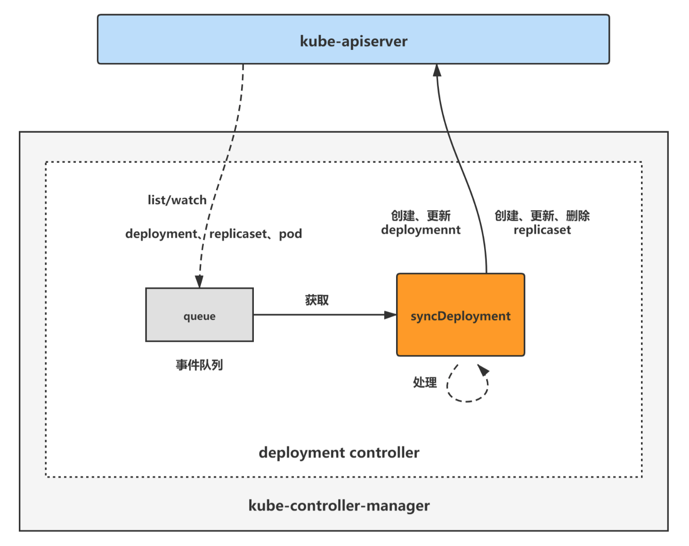

# deployment controller

## 架构

deployment controller是kube-controller-manager组件中众多控制器中的一个，是 deployment 资源对象的控制器，其通过对deployment、replicaset、pod三种资源的监听，当三种资源发生变化时会触发 deployment controller 对相应的deployment资源进行调谐操作，从而完成deployment的扩缩容、暂停恢复、更新、回滚、状态status更新、所属的旧replicaset清理等操作。

deployment controller对pod、replicaset、deployment对象注册了event handler，当有事件时，会watch到然后将对应的deployment对象放入到queue中，然后syncDeployment方法为deployment controller调谐deployment对象的核心处理逻辑所在，从queue中取出deployment对象，做调谐处理。

deployment controller主要分两块：

1. deployment controller初始化与启动
2. deployment controller处理逻辑

## References

https://www.cnblogs.com/lianngkyle/p/15333568.html
