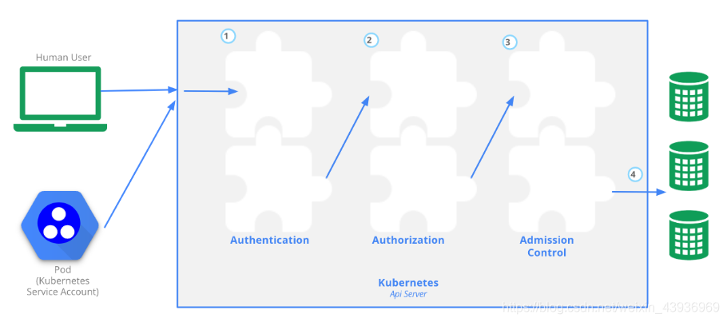
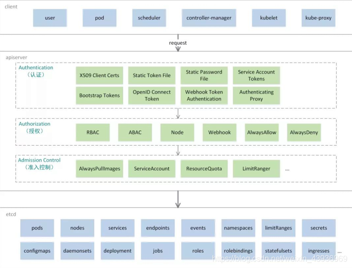
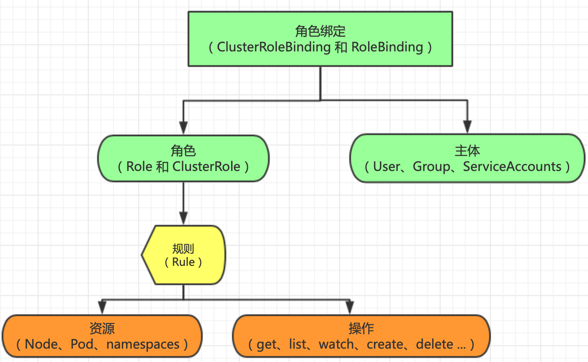

# k8s认证授权


k8s请求在访问etcd前会经历Authentication、Authorization、Admission Control三步



这三步作用分别是：

- 认证：我是谁
- 授权：我有什么权限
- 准入控制：请求是否合规，资源管理能力




## 认证

k8s用户分为两类：

1. user account用户账号，user/group。用户账号是针对人而言的，用户账户是全局性的，其名称在集群各 namespace 中都是全局唯一的，未来的用户资源不会做 namespace 隔离。
2. service account服务账号，服务账号是针对运行在pod中的进程而言的，服务账户是namespace 隔离的。


k8s认证一共有8种，可以启动一种或多种认证方式，只要有一种认证方式通过，就不再对其他方式认证，通常启动x509 Client Certs和Service Accout Tokens


- CA

kubeconfig采用的是TLS双向认证，api server需要用--client-ca-file选项来开启。CA_CERTIFICATE_FILE包括一个或者多个认证中心，可以被用来验证呈现给api server的客户端证书，客户端证书的/O作为用户组，/CN作为用户名。

- Service Account Token

Service Account是面向namespace的，每个namespace创建的时候，kubernetes会自动在这个namespace下面创建一个默认的Service Account，并且这个Service Account只能访问该namespace的资源。Service Account和pod、service、deployment一样是k8s集群中的一种资源，用户也可以创建自己的serviceaccount。

ServiceAccount主要包含了三个内容：namespace、Token和CA。namespace指定了pod所在的 namespace，CA用于验证api server 的证书，token用作身份验证。它们都通过mount的方式保存在pod的文件系统中：

token保存的路径是/var/run/secrets/kubernetes.io/serviceaccount/token，是api server通过私钥签发token的base64编码后的结果

CA保存的路径是/var/run/secrets/kubernetes.io/serviceaccount/ca.crt

namespace保存的路径是/var/run/secrets/kubernetes.io/serviceaccount/namespace，也是用 base64 编码。

如果token能够通过认证，那么请求的用户名将被设置为system:serviceaccount:(NAMESPACE):(SERVICEACCOUNT)，而请求的组名有两个：system:serviceaccounts、system:serviceaccounts:(NAMESPACE)。


以kubeadm生成的kubeconfig为例，经openssl x509解析出来Subject: O=system:masters, CN=kubernetes-admin

认证的用户名是kubernetes-admin，用户组是system:masters，该用户组绑定了cluster-amin的角色

```yaml
apiVersion: rbac.authorization.k8s.io/v1
kind: ClusterRoleBinding
metadata:
  name: cluster-admin
roleRef:
  apiGroup: rbac.authorization.k8s.io
  kind: ClusterRole
  name: cluster-admin
subjects:
- apiGroup: rbac.authorization.k8s.io
  kind: Group
  name: system:masters
```


## 授权

k8s授权类型：AlwaysDeny、AlwaysAllow、ABAC、RBAC，默认是RBAC。RBAC只有授权，没有拒绝授权，所以只需要定义允许该用户做什么。

RBAC包括四种类型：Role, ClusterRole, RoleBinding, ClusterRoleBinding


三个基本概念：

- Subject：被作用者，它表示k8s中的三类主体， user， group， serviceAccount
- Role：角色，它其实是一组规则，定义了一组对Kubernetes API对象的操作权限
- RoleBinding：定义了“被作用者”和“角色”的绑定关系


Role和ClusterRole：

- Role是一系列的权限的集合，Role只能授予单个namespace 中资源的访问权限
- ClusterRole跟Role类似，但是可以在集群中全局使用





## 准入控制

MutatingAdmissionWebhook：变更（Mutating）准入控制，修改请求的对象

ValidatingAdmissionWebhook：验证（Validating）准入控制，验证请求的对象

--admissioncontrol配置开启的准入控制器


准入规则引擎就是利用ValidatingAdmissionWebhook做验证，根据规则确认是否放行


## References

https://kubernetes.io/docs/reference/access-authn-authz/authentication/

https://kubernetes.io/docs/reference/access-authn-authz/authorization/

https://kubernetes.io/docs/reference/access-authn-authz/admission-controllers/