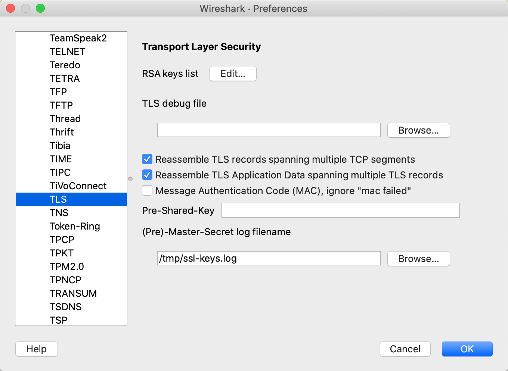

# wireshark抓包分析https


## 记录文件

```shell
touch /tmp/ssl-keys.log
```


## wireshark

在TLS下配置 (Pre)-Master-Secret log filename




## 抓包

1. 通过浏览器访问

   ```shell
   /Applications/Google\ Chrome.app/Contents/MacOS/Google\ Chrome --ssl-key-log-file=/tmp/.ssl-key.log
   ```

2. 通过curl访问

   ```shell
   export SSLKEYLOGFILE=/tmp/ssl-keys.log
   curl http://www.baidu.com
   ```