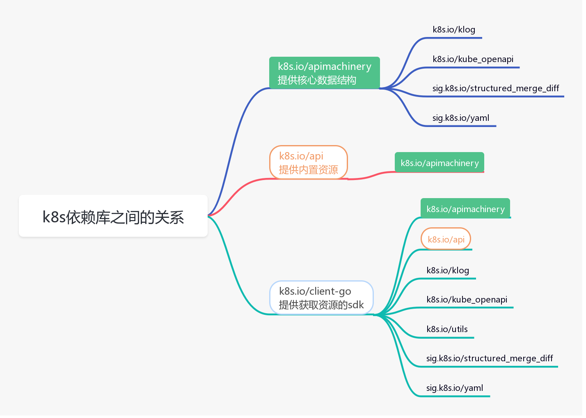
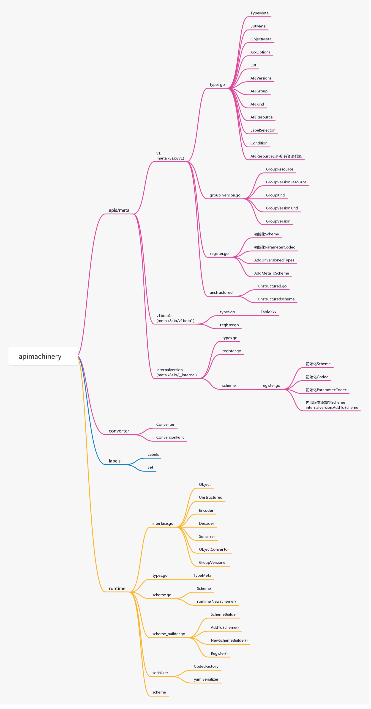
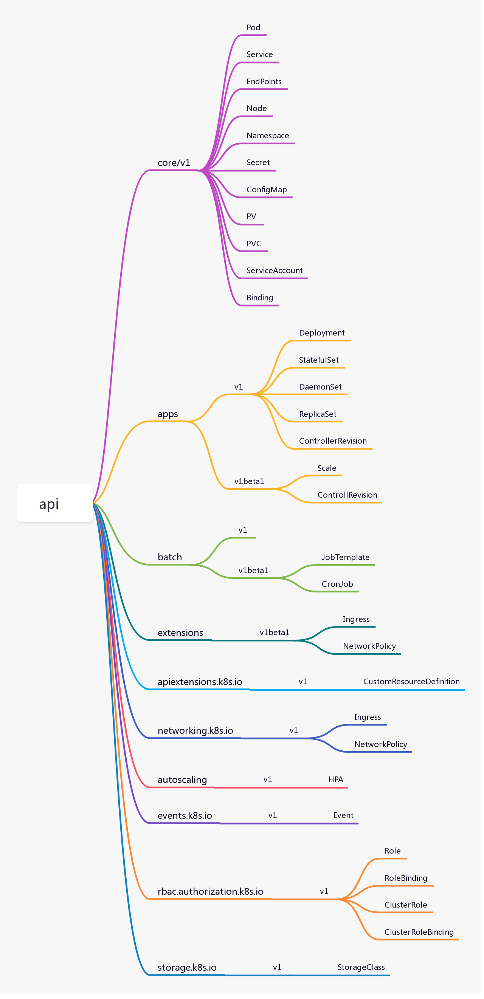
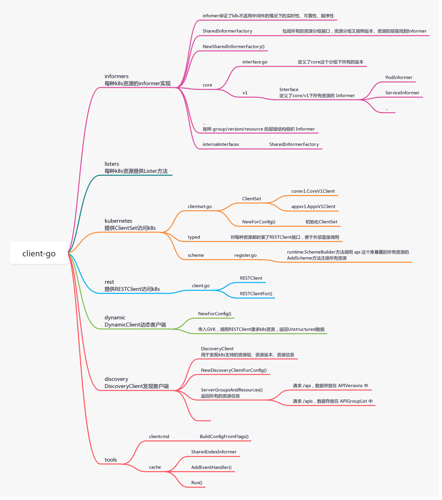

# k8s库apimachinery、API、client-go之间的关系

## 关系

三个库的依赖关系依次是：apimachinery -> api -> client-go

## apimachinery

apimachinery 是最基础的库，包括核心的数据结构，比如 Scheme、Group、Version、Kind、Resource，以及排列组合出来的 常用的GVK、GV、GK、GVR等，再就是编码、解码等操作

## api

api 库，这个库依赖 apimachinery，提供了k8s的内置资源，以及注册到 Scheme 的接口，这些资源比如：Pod、Service、Deployment、Namespace

## client-go

client-go 库，这个库依赖前两个库，提供了访问k8s 内置资源的sdk，最常用的就是 clientSet

底层通过 http 请求访问k8s 的 api-server，从etcd获取资源信息

## References

https://cloud.tencent.com/developer/article/1814637