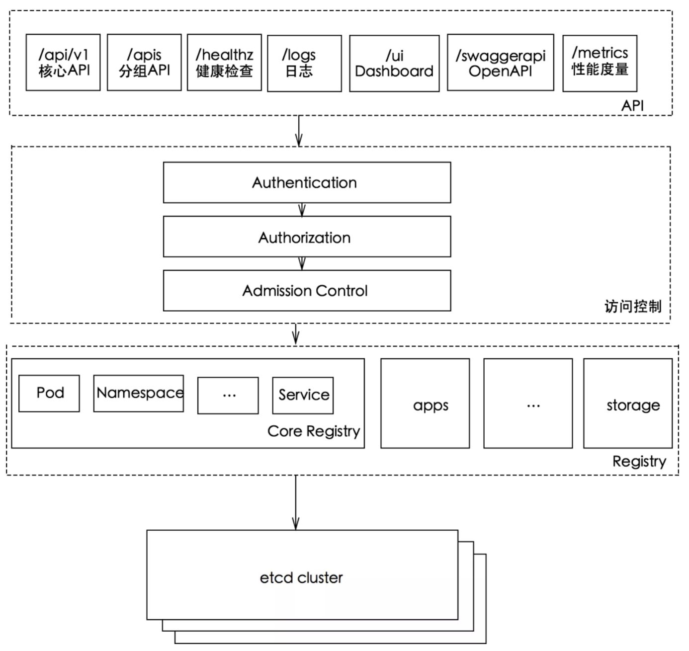
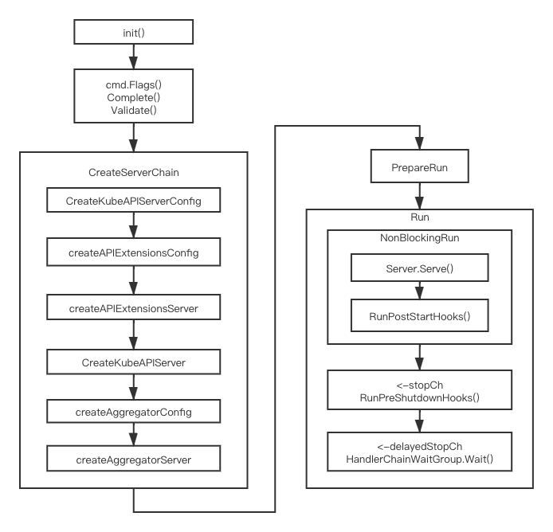
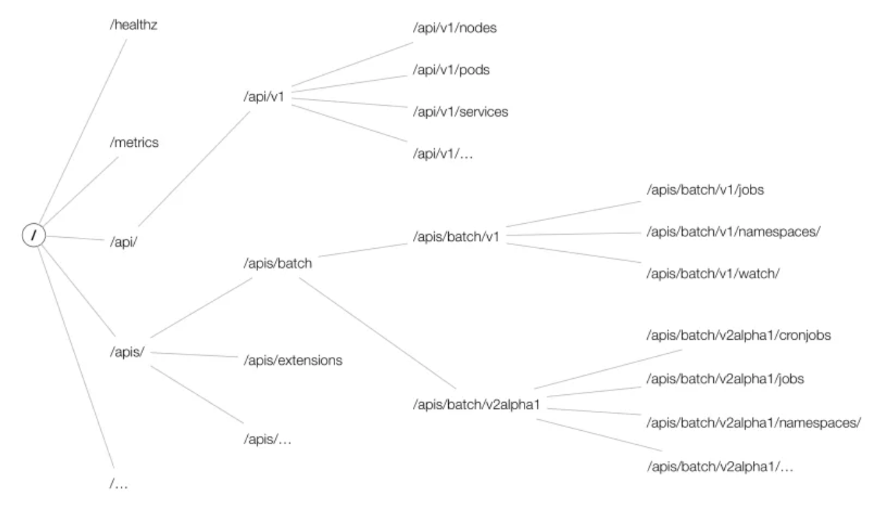
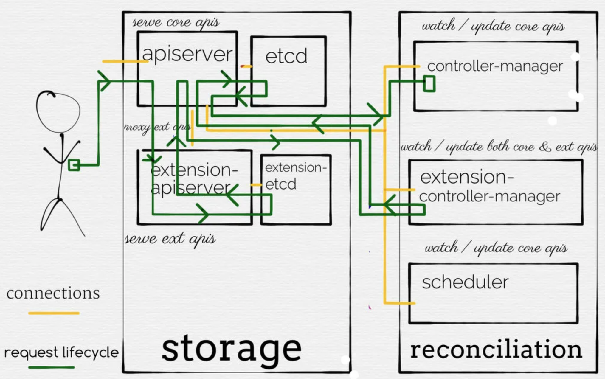

# k8s api-server


## 整体组件

kube-apiserver作为整个Kubernetes集群操作etcd的唯一入口，负责Kubernetes各资源的认证&鉴权，校验以及CRUD等操作，提供RESTful APIs，供其它组件调用




kube-apiserver包含三种APIServer：

- **aggregatorServer**：负责处理 `apiregistration.k8s.io` 组下的APIService资源请求，同时将来自用户的请求拦截转发给aggregated server(AA)
- **kubeAPIServer**：负责对请求的一些通用处理，包括：认证、鉴权以及各个内建资源(pod, deployment，service and etc)的REST服务等
- **apiExtensionsServer**：负责CustomResourceDefinition（CRD）apiResources以及apiVersions的注册，同时处理CRD以及相应CustomResource（CR）的REST请求(如果对应CR不能被处理的话则会返回404)，也是apiserver Delegation的最后一环

apiserver的服务暴露是通过bootstrap-controller来完成的


## apiserver 大致流程

本质上，APIServer是使用golang中[net/http](https://golang.org/pkg/net/http/)库中的Server构建起来的。Handler是一个非常重要的概念，它是最终处理HTTP请求的实体，在golang中，定义了Handler的接口：

```go
type Handler interface {
    ServeHTTP(ResponseWriter, *Request)
}
```

凡是实现了ServeHTTP()方法的结构体，那么它就是一个Handler了，可以用来处理HTTP请求。这就是Kubernetes APIServer的骨架，只不过它有非常复杂的Handler。



1. init()是在main()函数启动之前，就进行的一些初始化操作，主要做的事情就是注册各种API对象类型到APIServer中，这个后续会讲到。

2. 随后就是进行命令行参数的解析，以及设置默认值，还有校验了，APIServer使用[cobra](https://github.com/spf13/cobra)来构建它的CLI，各种参数通过POSIX风格的参数传给APIServer，比如下面的参数示例：

   ```
   "--bind-address=0.0.0.0",
   "--secure-port=6444",
   "--tls-cert-file=/var/run/kubernetes/serving-kube-apiserver.crt",
   "--tls-private-key-file=/var/run/kubernetes/serving-kube-apiserver.key",
   ```

   这些显示指定的参数，以及没有指定，而使用默认值的参数，最终都被解析，然后集成到了一个叫做`ServerRunOptions`的结构体中，而这个结构体又包含了很多`xxxOptions`的结构体，比如`EtcdOptions`, `SecureServingOptions`等，供后面使用。

3. 随后就到了CreateServerChain阶段，这个是整个APIServer启动过程中，最重要的也是最复杂的阶段了，整个APIServer的核心功能就包含在这个里面，这里面最主要的其实干了两件事：

   - 一个是构建起各个API对象的Handler处理函数，即针对REST的每一个资源的增删查改方法的注册，比如`/pod`，对应的会有`CREATE/DELETE/GET/LIST/UPDATE/WATCH`等Handler去处理，这些处理方法其实主要是对数据库的操作。
   - 第二个就是通过Chain的方式，或者叫Delegation的方式，实现了APIServer的扩展机制，如上图所示，`KubeAPIServer`是主APIServer，这里面包含了Kubernetes的所有内置的核心API对象，`APIExtensions`其实就是我们常说的CRD扩展，这里面包含了所有自定义的CRD，而`Aggretgator`则是另外一种高级扩展机制，可以扩展外部的APIServer，三者通过 `Aggregator` –> `KubeAPIServer` –> `APIExtensions` 这样的方式顺序串联起来，当API对象在`Aggregator`中找不到时，会去`KubeAPIServer`中找，再找不到则会去`APIExtensions`中找，这就是所谓的delegation，通过这样的方式，实现了APIServer的扩展功能。
   - 此外，还有认证，授权，Admission等都在这个阶段实现。

4. 然后是PrepareRun阶段，这个阶段主要是注册一些健康检查的API，比如Healthz, Livez, Readyz等。

5. 最后就是Run阶段，经过前面的步骤，已经生成了让Server Run起来的所有东西

   - 最重要的就是Handler
   - 然后将其通过NonBlocking的方式run起来，即将http.Server在一个goroutine中运行起来
   - 随后启动PostStartHook，PostStartHook是在CreateServerChain阶段注册的hook函数，用来周期性执行一些任务，每一个Hook起在一个单独的goroutine中
   - 之后就是通过channel的方式将关闭API Server的方法阻塞住，当channel收到os.Interrup或者syscall.SIGTERM signal时，就会将APIServer关闭。


## bootstrap-controller

运行在k8s.io/kubernetes/pkg/master目录

default/kubernetes service的spec.selector是空

几个主要功能：

- 创建 default、kube-system 和 kube-public 以及 kube-node-lease 命名空间
- 创建&维护kubernetes default apiserver service以及对应的endpoint
- 提供基于Service ClusterIP的检查及修复功能(`--service-cluster-ip-range`指定范围)
- 提供基于Service NodePort的检查及修复功能(`--service-node-port-range`指定范围)


## kubeAPIServer

KubeAPIServer主要提供对内建API Resources的操作请求，为Kubernetes中各API Resources注册路由信息，同时暴露RESTful API，使集群中以及集群外的服务都可以通过RESTful API操作Kubernetes中的资源

kubeAPIServer是整个Kubernetes apiserver的核心，aggregatorServer以及apiExtensionsServer都是建立在kubeAPIServer基础上进行扩展的(补充了Kubernetes对用户自定义资源的能力支持)

kubeAPIServer最核心的功能是为Kubernetes内置资源添加路由，如下：

- 调用 `m.InstallLegacyAPI` 将核心 API Resources添加到路由中，在apiserver中即是以 `/api` 开头的 resource
- 调用 `m.InstallAPIs` 将扩展的 API Resources添加到路由中，在apiserver中即是以 `/apis` 开头的 resource


整个kubeAPIServer提供了三类API Resource接口：

- core group：主要在 `/api/v1` 下
- named groups：其 path 为 `/apis/$GROUP/$VERSION`
- 系统状态的一些 API：如`/metrics` 、`/version` 等

而API的URL大致以 `/apis/{group}/{version}/namespaces/{namespace}/resource/{name}` 组成，结构如下图所示：




kubeAPIServer会为每种API资源创建对应的RESTStorage

RESTStorage的目的是将每种资源的访问路径及其后端存储的操作对应起来：通过构造的REST Storage实现的接口判断该资源可以执行哪些操作（如：create、update等），将其对应的操作存入到action中，每一个操作对应一个标准的REST method，如create对应REST method为POST，而update对应REST method为PUT。最终根据actions数组依次遍历，对每一个操作添加一个handler(handler对应REST Storage实现的相关接口)，并注册到route，最终对外提供RESTful API。


kubeAPIServer代码结构整理如下：

```
1. apiserver整体启动逻辑 k8s.io/kubernetes/cmd/kube-apiserver
2. apiserver bootstrap-controller创建&运行逻辑 k8s.io/kubernetes/pkg/master
3. API Resource对应后端RESTStorage(based on genericregistry.Store)创建 k8s.io/kubernetes/pkg/registry
4. aggregated-apiserver创建&处理逻辑 k8s.io/kubernetes/staging/src/k8s.io/kube-aggregator
5. extensions-apiserver创建&处理逻辑 k8s.io/kubernetes/staging/src/k8s.io/apiextensions-apiserver
6. apiserver创建&运行 k8s.io/kubernetes/staging/src/k8s.io/apiserver/pkg/server
7. 注册API Resource资源处理handler(InstallREST&Install®isterResourceHandlers) k8s.io/kubernetes/staging/src/k8s.io/apiserver/pkg/endpoints
8. 创建存储后端(etcdv3) k8s.io/kubernetes/staging/src/k8s.io/apiserver/pkg/storage
genericregistry.Store.CompleteWithOptions初始化 k8s.io/kubernetes/staging/src/k8s.io/apiserver/pkg/registry
```


## aggregatorServer

aggregatorServer主要用于处理扩展Kubernetes API Resources的第二种方式Aggregated APIServer(AA)，将CR请求代理给AA



这里结合Kubernetes官方给出的aggregated apiserver例子sample-apiserver，总结原理如下：

- aggregatorServer通过APIServices对象关联到某个Service来进行请求的转发，其关联的Service类型进一步决定了请求转发的形式。aggregatorServer包括一个`GenericAPIServer`和维护自身状态的`Controller`。其中`GenericAPIServer`主要处理`apiregistration.k8s.io`组下的APIService资源请求，而Controller包括：

- - `apiserviceRegistrationController`：负责根据APIService定义的aggregated server service构建代理，将CR的请求转发给后端的aggregated server
  - `availableConditionController`：维护 APIServices 的可用状态，包括其引用 Service 是否可用等
  - `autoRegistrationController`：用于保持 API 中存在的一组特定的 APIServices
  - `crdRegistrationController`：负责将 CRD GroupVersions 自动注册到 APIServices 中
  - `openAPIAggregationController`：将 APIServices 资源的变化同步至提供的 OpenAPI 文档

- apiserviceRegistrationController负责根据APIService定义的aggregated server service构建代理，将CR的请求转发给后端的aggregated server。apiService有两种类型：Local(Service为空)以及Service(Service非空)。apiserviceRegistrationController负责对这两种类型apiService设置代理：Local类型会直接路由给kube-apiserver进行处理；而Service类型则会设置代理并将请求转化为对aggregated Service的请求(proxyPath := "/apis/" + apiService.Spec.Group + "/" + apiService.Spec.Version)，而请求的负载均衡策略则是优先本地访问kube-apiserver(如果service为kubernetes default apiserver service:443)=>通过service ClusterIP:Port访问(默认) 或者 通过随机选择service endpoint backend进行访问


## apiExtensionsServer

apiExtensionsServer主要负责CustomResourceDefinition（CRD）apiResources以及apiVersions的注册，同时处理CRD以及相应CustomResource（CR）的REST请求(如果对应CR不能被处理的话则会返回404)，也是apiserver Delegation的最后一环


## References

https://mp.weixin.qq.com/s/2Eym6GaKdcWD_6l05Q83aQ

https://github.com/duyanghao/kubernetes-reading-notes/tree/master/core/api-server