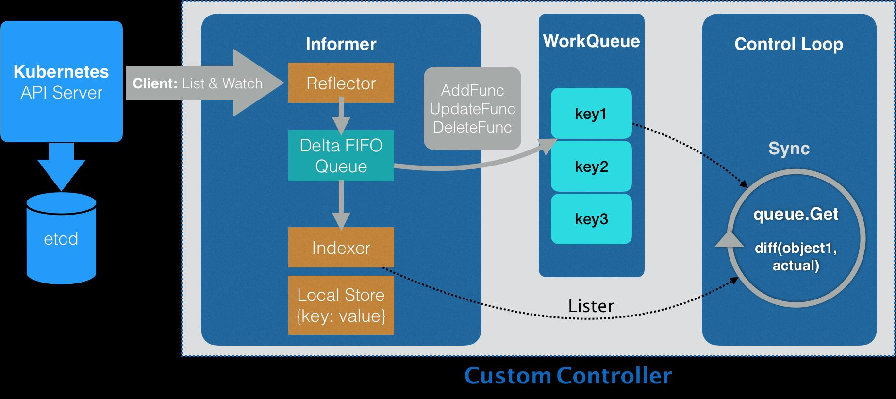
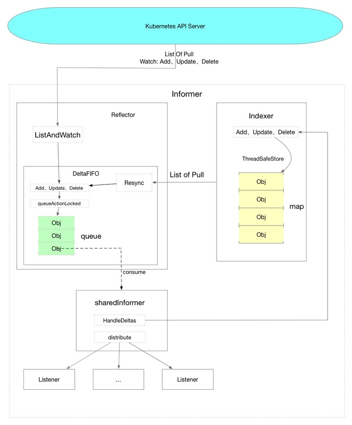
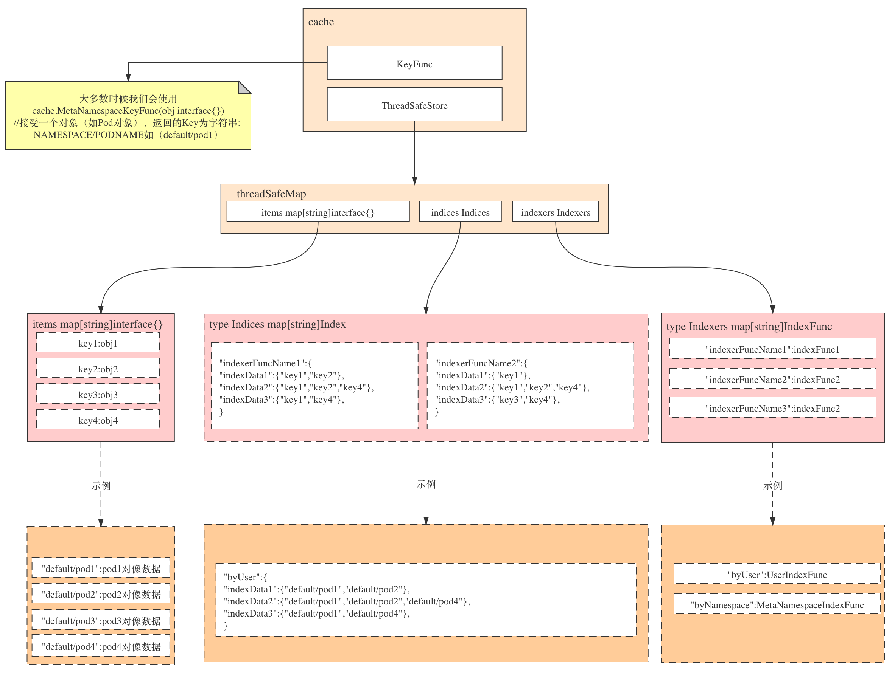
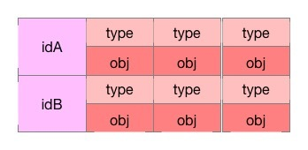
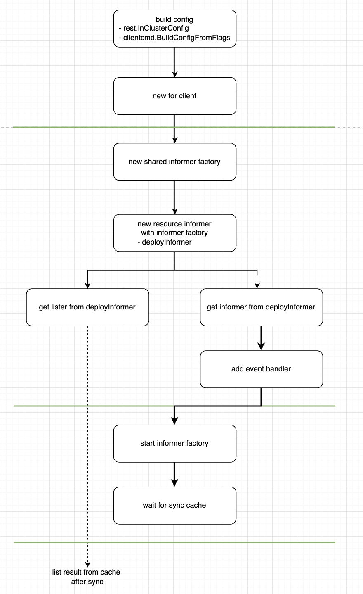
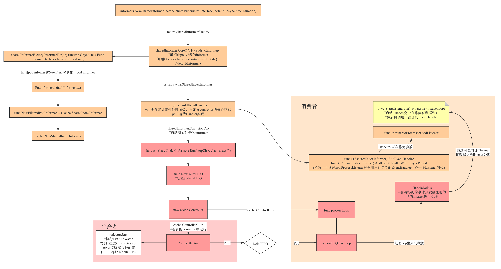

# client-go

https://github.com/kubernetes/client-go

依赖项目：

k8s.io/api

k8s.io/apimachinery


## 代码结构

```go
$ tree vendor/k8s.io/client-go -L 1
vendor/k8s.io/client-go
├── discovery  # Discoveryclient 发现客户端
├── dynamic # DynamicClient 动态客户端，对任意kubernetes对象执行通用的操作，不同于 clientset，dynamic client 返回的对象是一个 map[string]interface{}，如果一个 controller 中需要控制所有的 API，可以使用dynamic client，目前它在 garbage collector 和 namespace controller中被使用。
├── informers # 每种Kubernetes资源的informer实现
├── kubernetes # ClientSet客户端，基于restClient封装
├── listers # 为每种Kubernetes资源提供Lister功能，该功能对Get和List请求提供只读的缓存数据
├── plugin # 提供OpenStack,GCP和Azure等云服务商授权插件
├── rest # RESTClient客户端，对Kubernetes API server执行RESTful操作（Get(),Put(),Post(),Delete()等）
├── restmapper
├── scale # ScaleClient客户端，用于扩容或缩容Deployment,ReplicaSet,Replication Controller等资源对象
├── tools # 提供常用工具，例如SharedInformer、Reflector、DealtFIFO及Indexers，提供查询和缓存机制，以减少向kub-apiserver发起的请求数；client-go controller逻辑在此
├── transport # 提供安全的TCP连接，支持HTTP Stream，某些操作需要在客户端和容器之间传输二进制流，如exec,attach等
└── util # 提供常用方法，如WokrQueue工作队列，Certificate证书管理等
```


## 整体架构


在client-go中，informer对象就是一个controller struct (controller即informer)

上半部分是client-go内部核心数据流转机制，下半部分为用户自定义控制器的核心实现逻辑





包含的主要组件：

- Informer

- Reflector

- DeltaFIFO

- Indexer

- WorkQueue


## 数据流转



Informer分为三个部分，可以理解为三大逻辑：

1. Reflector，主要是把从API Server数据获取到的数据放到DeltaFIFO队列中，充当生产者角色

2. SharedInformer，主要是从DeltaFIFIO队列中获取数据并分发数据，充当消费者角色

3. Indexer，作为本地缓存的存储组件存在


### Reflector

tools/cache/reflector.go

用于监控（Watch）指定的kubernetes资源，当监控的资源发生变化时，触发相应的处理，如add、update、delete等，并将其资源对象存入本地缓存DeltaFIFO中，然后Informer会从队列里面取数据。Reflector类似一个生产者。

informers.NewSharedInformerFactory对具体资源的informer进行实例化，不会对相同资源的infromer进行多次真实的实例化，可以使相同的informer共享一个Reflector。

Reflector主要看Run、ListAndWatch、watchHandler

```go
// Run starts a watch and handles watch events. Will restart the watch if it is closed.
// Run will exit when stopCh is closed.
// 开始时执行Run，上一层调用的地方是 controller.go中的Run方法
func (r *Reflector) Run(stopCh <-chan struct{}) {
    klog.V(3).Infof("Starting reflector %v (%s) from %s", r.expectedTypeName, r.resyncPeriod, r.name)
    wait.Until(func() {
         // 启动后执行一次ListAndWatch
        if err := r.ListAndWatch(stopCh); err != nil {
            utilruntime.HandleError(err)
        }
    }, r.period, stopCh)
}
```

ListAndWatch主要分为list、定时同步和watch三个部分：

- list：设置分页参数，执行list方法，将list结果同步进DeltaFIFO队列中
- 定时同步：定时同步以协程的方式运行，使用定时器实现定期同步
- watch：在for循环里执行watch函数获取resultchan，监听resultchan中数据并处理

```go
// and then use the resource version to watch.
// It returns error if ListAndWatch didn't even try to initialize watch.
func (r *Reflector) ListAndWatch(stopCh <-chan struct{}) error {
  	// Attempt to gather list in chunks, if supported by listerWatcher, if not, the first
  	// list request will return the full response.
    // 设置分页参数
  	pager := pager.New(pager.SimplePageFunc(func(opts metav1.ListOptions) (runtime.Object, error) {
    		// 这里是调用了各个资源中的ListFunc函数,例如如果v1版本的Deployment
    		// 则调用的是informers/apps/v1/deployment.go中的ListFunc
    		return r.listerWatcher.List(opts)
  	}))
    ...
    // 从API SERVER请求一次数据 获取资源的全部Object
    // 执行list方法
    list, paginatedResult, err = pager.List(context.Background(), metav1.ListOptions{ResourceVersion: r.relistResourceVersion()})
    ...

    // 协程，一直在跑
    go func() {
        ...
        // 开始同步，将indexer的数据和deltafifo进行同步
        r.store.Resync()
    }

    ...
    options = metav1.ListOptions{
      	ResourceVersion: resourceVersion,
      	// We want to avoid situations of hanging watchers. Stop any wachers that do not
      	// receive any events within the timeout window.
      	TimeoutSeconds: &timeoutSeconds,
      	// To reduce load on kube-apiserver on watch restarts, you may enable watch bookmarks.
      	// Reflector doesn't assume bookmarks are returned at all (if the server do not support
      	// watch bookmarks, it will ignore this field).
      	AllowWatchBookmarks: true,
    }
    w, err := r.listerWatcher.Watch(options)
    // 处理Watch中的数据并且将数据放置到DeltaFIFO当中
    if err := r.watchHandler(start, w, &resourceVersion, resyncerrc, stopCh); err != nil {
      	...
    }
...
}
```

```go
// watchHandler watches w and keeps *resourceVersion up to date.
func (r *Reflector) watchHandler(start time.Time, w watch.Interface, resourceVersion *string, errc chan error, stopCh <-chan struct{}) error {
...
  		switch event.Type {
      // store就是DeltaFIFO
			case watch.Added:
				  err := r.store.Add(event.Object) // 调用DeltaFIFO的queueActionLocked方法
				  ...
			case watch.Modified:
				  err := r.store.Update(event.Object)
				  ...
			case watch.Deleted:
				  err := r.store.Delete(event.Object)
				  ...
      }
...
}
```

1. 初始化时从API Server请求数据
2. 监听后续从Watch推送来的数据


### SharedInformer

tools/cache/shared_informer.go

controller机制的基础，循环处理object对象，从Reflector取出数据，然后将数据给到Indexer去缓存，提供对象事件的handler接口。


DeltaFIFO对象的pop方法会阻塞等待信号f.cond.Wait()，DeltaFIFO在处理queueActionLocked方法时会触发广播f.cond.Broadcast()

SharedInformer是构造在c.config.Process中的处理函数，在sharedIndexInformer.Run方法中构造：s.HandleDeltas

SharedInformer主要看HandleDeltas方法，消费消息然后分发数据并且存储数据到缓存的地方

```go
func (s *sharedIndexInformer) HandleDeltas(obj interface{}) error {
  	// from oldest to newest
    for _, d := range obj.(Deltas) {
      	switch d.Type {
        case Sync, Replaced, Added, Updated:
          	...
          	// 查一下是否在Indexer缓存中 如果在缓存中就更新缓存中的对象
          	if old, exists, err := s.indexer.Get(d.Object); err == nil && exists {
              	if err := s.indexer.Update(d.Object); err != nil {
                  	return err
                }
                ...
              	// 把数据分发到Listener
              	s.processor.distribute(updateNotification{oldObj: old, newObj: d.Object}, isSync)
            } else {
                // 没有在Indexer缓存中 把对象插入到缓存中
              	if err := s.indexer.Add(d.Object); err != nil {
                return err
            }
            s.processor.distribute(addNotification{newObj: d.Object}, false)
        }
        case Deleted:
            if err := s.indexer.Delete(d.Object); err != nil {
              	return err
            }
            s.processor.distribute(deleteNotification{oldObj: d.Object}, false)
        }
    }
    return nil
}
```


### Indexer

tools/cache/thread_safe_store.go

用来存储资源对象并自带索引功能的本地存储，Reflector从DeltaFIFO消费出来的资源对象存储至indexer。indexer与etcd集群保持一致。client-go可以很方便的从本地存储中读取响应的资源对象数据，而无需每次从etcd读取，以减轻kubernetes apiserver对etcd的压力。

Indexer使用的是threadSafeMap存储数据，是一个线程安全并且带有索引功能的map，数据只会存放在内存中，每次涉及操作都会进行加锁。

```go
// threadSafeMap implements ThreadSafeStore
type threadSafeMap struct {
    lock  sync.RWMutex
    items map[string]interface{}
    indexers Indexers
    indices Indices
}
```

```go
// 索引器函数，接受一个资源对象，返回检索结果列表（字符串列表，表示根据资源对像里特定字段分析出来的索引列表）
type IndexFunc func(obj interface{}) ([]string, error)

// 缓存数据（其实存储的是根据indexFunc分析到的索引值及所关联的所有资源对像的key）
type Index map[string]sets.String

// 保存了索引器函数，key为索引器名称，value为索引器函数
type Indexers map[string]IndexFunc

// 缓存器，key为缓存器名称（一般情况下这个值与索引器名称相同），value为缓存数据
type Indices map[string]Index
```




## 补充

### DeltaFIFO

DeltaFIFO可以分开理解，FIFO是一个先进先出的队列，它拥有队列操作的基本方法，例如Add、Update、Delete、List、Pop、Close等，而Delta是一个资源对象存储，它可以保存资源对象的操作类型，例如Added（添加）操作类型、Updated（更新）操作类型、Deleted（删除）操作类型、Sync（同步）操作类型等。

DeltaFIFO中有两个重要的方法，queueActionLocked、Pop，分别作为生产者方法和消费者方法。一方对接reflector来生产数据并将数据加入到队列中，唤醒消费者；另一方对接informer controller的processLoop（该方法进而会调用用户定义的EventHandler）来消费队列中的数据。

```go
type DeltaFIFO struct {
...
    items map[string]Deltas // items存储的是以ObjectID为key的这个Object的事件列表
    queue []string 					// queue存储的是Object的id
...
}

type Delta struct {
    Type   DeltaType
    Object interface{}
}

type Deltas []Delta

type DeltaType string

// Change type definition
const (
    Added   DeltaType = "Added"
    Updated DeltaType = "Updated"
    Deleted DeltaType = "Deleted"
    Sync DeltaType = "Sync"
)
```



DeltaFIFO顾名思义存放Delta数据的先入先出队列，相当于一个数据的中转站，将数据从一个地方转移另一个地方。

DeltaFIFIO主要看queueActionLocked、Pop、Resync。

```go
func (f *DeltaFIFO) queueActionLocked(actionType DeltaType, obj interface{}) error {
...
    newDeltas := append(f.items[id], Delta{actionType, obj})
    // 去重处理
    newDeltas = dedupDeltas(newDeltas)

    if len(newDeltas) > 0 {
        ... 
        // pop消息
        f.cond.Broadcast()
    ...
    return nil
}
```

```go

func (f *DeltaFIFO) Pop(process PopProcessFunc) (interface{}, error) {
    f.lock.Lock()
    defer f.lock.Unlock()
    for {
        for len(f.queue) == 0 {
            // 阻塞 直到调用了f.cond.Broadcast()
            f.cond.Wait()
        }
				// 取出第一个元素
        id := f.queue[0]
        f.queue = f.queue[1:]
        ...
        item, ok := f.items[id]
				...
        delete(f.items, id)
        // 这个process可以在controller.go中的processLoop()找到
        // 初始化是在shared_informer.go的Run
        // 最终执行到shared_informer.go的HandleDeltas方法
        err := process(item)
        // 如果处理出错了重新放回队列中
        if e, ok := err.(ErrRequeue); ok {
            f.addIfNotPresent(id, item)
            err = e.Err
        }
         ...
    }
}
```


### Resync

使用 SharedInformerFactory 去创建 SharedInformer 时，需要填一个 ResyncDuration 的参数

这个参数指的是，多久从 Indexer 缓存中同步一次数据到 Delta FIFO 队列，重新走一遍流程

为什么需要 Resync 机制呢？因为在处理 SharedInformer 事件回调时，可能存在处理失败的情况，定时的 Resync 让这些处理失败的事件有了重新处理的机会。

那么经过 Resync 重新放入 Delta FIFO 队列的事件，和直接从 apiserver 中 watch 得到的事件处理起来有什么不一样呢？Delta FIFO 的队列处理源码中，如果是从 Resync 重新同步到 Delta FIFO 队列的事件，会分发到 updateNotification 中触发 onUpdate 的回调。

```go
// 启动的Resync地方是reflector.go的resyncChan()方法，在reflector.go的ListAndWatch方法中的调用开始定时执行。
go func() {
    // 启动定时任务
    resyncCh, cleanup := r.resyncChan()
    defer func() {
        cleanup() // Call the last one written into cleanup
    }()
    for {
    	  select {
    		case <-resyncCh:
    		case <-stopCh:
      			return
      	case <-cancelCh:
      			return
    		}
    		// 定时执行   调用会执行到delta_fifo.go的Resync()方法
    		if r.ShouldResync == nil || r.ShouldResync() {
      			klog.V(4).Infof("%s: forcing resync", r.name)
      			if err := r.store.Resync(); err != nil {
        		resyncerrc <- err
        		return
      	}
    }
    cleanup()
    resyncCh, cleanup = r.resyncChan()
  	}
}()

func (f *DeltaFIFO) Resync() error {
    ...
		// 从缓存中获取到所有的key
    keys := f.knownObjects.ListKeys()
    for _, k := range keys {
        if err := f.syncKeyLocked(k); err != nil {
            return err
        }
    }
    return nil
}

func (f *DeltaFIFO) syncKeyLocked(key string) error {
    // 获缓存拿到对应的Object
    obj, exists, err := f.knownObjects.GetByKey(key)
    ...
    // 放入到队列中执行任务逻辑
    if err := f.queueActionLocked(Sync, obj); err != nil {
        return fmt.Errorf("couldn't queue object: %v", err)
    }
    return nil
}
```


---


## 资源定义

Group、Version、Resource：GVK体现在yaml的结构体中，包含apiVersion、kind

Group、Version、Kind：GVR体现在REST api请求信息中


GVR通常用于构建REST api请求，例如apps, v1, deployments表示一个资源

```shell
GET /apis/apps/v1/namespaces/{namespace}/deployments/{name}
```

k8s提供的api-resources命令可以显示支持的kind、resource及之间的mapping关系

以deployment为例，GVK为apps/v1/Deployment，GVR为apps/v1/deployments

```shell
$ kubectl api-resources --api-group=apps
NAME                  SHORTNAMES   APIGROUP   NAMESPACED   KIND
controllerrevisions                apps       true         ControllerRevision
daemonsets            ds           apps       true         DaemonSet
deployments           deploy       apps       true         Deployment
replicasets           rs           apps       true         ReplicaSet
statefulsets          sts          apps       true         StatefulSet
```


## 客户端

1. RestClient：最基础的，相当于底层数据结构，可以通过RestClient提供的RestFul方法，如Get(), Put(), Post(), Delete()进行交互

   同时支持json和protobuf

   支持所有的原生资源和CRDs

   为了更为优雅的处理，需要进一步封装RestCLient为ClientSet，然后对外提供接口和服务

2. CleintSet：是调用kubernetes资源对象最常用的client，可以操作所有的内置资源对象，基于RestClient实现

   访问资源时，需要执行G/V/R

   优雅的方式是利用一个controller，再加上一个informer

   只支持处理k8s内置资源（不包括CRDs）

3. DynamicClient：是一种动态的client，能处理k8s所有的资源，返回的是map[string]interface{}

   如果一个controller中需要控制所有的API，可以使用DynamicClient，目前它在garbage collector和namespace controller中被使用

   只支持json

   支持处理CRDs资源

4. DiscoveryClient：发现客户端，用于发现kube-apiserver支持的所有资源组、资源版本、资源信息（即Group、Versions、Resources）

   kubectl api-resources

   kubectl api-versions


## 工作流程

代码流程 code/clientgo/informer.go







## References

https://www.freesion.com/article/39161315033

https://www.jianshu.com/p/61f2d1d884a9

https://segmentfault.com/a/1190000039031170
