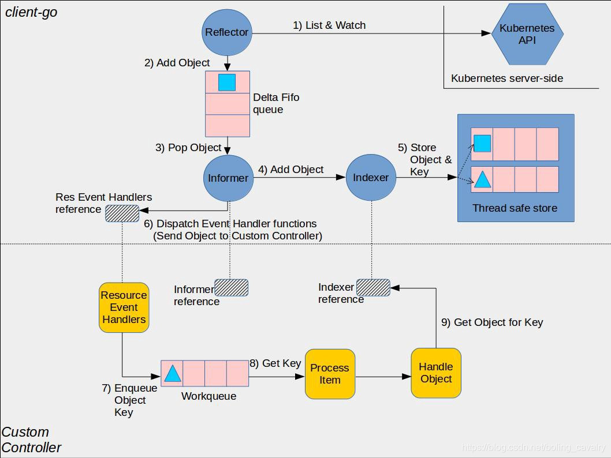

# client-go


```go
$ tree vendor/k8s.io/client-go -L 1
vendor/k8s.io/client-go
├── discovery  # Discoveryclient 发现客户端
├── dynamic # DynamicClient 动态客户端，对任意kubernetes对象执行通用的操作，不同于 clientset，dynamic client 返回的对象是一个 map[string]interface{}，如果一个 controller 中需要控制所有的 API，可以使用dynamic client，目前它在 garbage collector 和 namespace controller中被使用。
├── informers # 每种Kubernetes资源的informer实现
├── kubernetes # ClientSet客户端，基于restClient封装
├── listers # 为每种Kubernetes资源提供Lister功能，该功能对Get和List请求提供只读的缓存数据
├── plugin # 提供OpenStack,GCP和Azure等云服务商授权插件
├── rest # RESTClient客户端，对Kubernetes API server执行RESTful操作（Get(),Put(),Post(),Delete()等）
├── restmapper
├── scale # ScaleClient客户端，用于扩容或缩容Deployment,ReplicaSet,Replication Controller等资源对象
├── tools # 提供常用工具，例如SharedInformer、Reflector、DealtFIFO及Indexers，提供查询和缓存机制，以减少向kub-apiserver发起的请求数；client-go controller逻辑在此
├── transport # 提供安全的TCP连接，支持HTTP Stream，某些操作需要在客户端和容器之间传输二进制流，如exec,attach等
└── util # 提供常用方法，如WokrQueue工作队列，Certificate证书管理等
```


Informer是client-go中较为高级的类型。无论是Kubernetes内置的还是自己实现的Controller，都会用到它。

Informer设计为List/Watch的方式。Informer在初始化的时先通过List从Kubernetes中取出资源的全部对象，并同时缓存，然后通过Watch的机制去监控资源，这样的话，通过Informer及其缓存就可以直接和Informer交互而不是每次都和Kubernetes交互。

Informer另外一块内容在于提供了事件Handler机制，并触发回调，这样上层应用如Controller就可以基于回调处理具体业务逻辑。因为Informer通过List、Watch机制可以监控到所有资源的所有事件，只要给Informer添加ResourceEventHandler的回调函数实例去实现 OnAdd(obj interface{}), OnUpdate(oldObj, newObj interface{}), OnDelete(obj interface{})这三个方法，就可以处理好资源的创建、更新和删除操作。




在client-go中，informer对象就是一个controller struct (controller即informer)，图的上半部分是client-go内部核心数据流转机制，下半部分为用户自定义控制器的核心实现逻辑。


## 资源定义

Group、Version、Resource：GVK体现在yaml的结构体中，包含apiVersion、kind

Group、Version、Kind：GVR体现在REST api请求信息中


GVR通常用于构建REST api请求，例如apps, v1, deployments表示一个资源

```shell
GET /apis/apps/v1/namespaces/{namespace}/deployments/{name}
```

k8s提供的api-resources命令可以显示支持的kind、resource及之间的mapping关系

以deployment为例，GVK为apps/v1/Deployment，GVR为apps/v1/deployments

```shell
$ kubectl api-resources --api-group=apps
NAME                  SHORTNAMES   APIGROUP   NAMESPACED   KIND
controllerrevisions                apps       true         ControllerRevision
daemonsets            ds           apps       true         DaemonSet
deployments           deploy       apps       true         Deployment
replicasets           rs           apps       true         ReplicaSet
statefulsets          sts          apps       true         StatefulSet
```


## 客户端

1. RestClient：最基础的，相当于底层数据结构，可以通过RestClient提供的RestFul方法，如Get(), Put(), Post(), Delete()进行交互

   同时支持json和protobuf

   支持所有的原生资源和CRDs

   为了更为优雅的处理，需要进一步封装RestCLient为ClientSet，然后对外提供接口和服务

2. CleintSet：是调用kubernetes资源对象最常用的client，可以操作所有的内置资源对象，基于RestClient实现

   访问资源时，需要执行G/V/R

   优雅的方式是利用一个controller，再加上一个informer

   只支持处理k8s内置资源（不包括CRDs）

3. DynamicClient：是一种动态的client，能处理k8s所有的资源，返回的是map[string]interface{}

   如果一个controller中需要控制所有的API，可以使用DynamicClient，目前它在garbage collector和namespace controller中被使用

   只支持json

   支持处理CRDs资源

4. DiscoveryClient：发现客户端，用于发现kube-apiserver支持的所有资源组、资源版本、资源信息（即Group、Versions、Resources）

   kubectl api-resources

   kubectl api-versions


## 核心组件

1. Reflector

   用于监控（Watch）指定的kubernetes资源，当监控的资源发生变化时，触发相应的处理，如add、update、delete等，并将其资源对象存入本地缓存DeltaFIFO中，然后Informer会从队列里面取数据。Reflector类似一个生产者。

2. DeltaFIFO

   DeltaFIFO可以分开理解，FIFO是一个先进先出的队列，它拥有队列操作的基本方法，例如Add、Update、Delete、List、Pop、Close等，而Delta是一个资源对象存储，它可以保存资源对象的操作类型，例如Added（添加）操作类型、Updated（更新）操作类型、Deleted（删除）操作类型、Sync（同步）操作类型等。

   DeltaFIFO中有两个重要的方法，queueActionLocked、Pop，分别作为生产者方法和消费者方法。一方对接reflector来生产数据并将数据加入到队列中，唤醒消费者；另一方对接informer controller的processLoop（该方法进而会调用用户定义的EventHandler）来消费队列中的数据。

3. Informer

   controller机制的基础，循环处理object对象，从Reflector取出数据，然后将数据给到Indexer去缓存，提供对象事件的handler接口。

4. indexer

   用来存储资源对象并自带索引功能的本地存储，Reflector从DeltaFIFO消费出来的资源对象存储至indexer。indexer与etcd集群保持一致。client-go可以很方便的从本地存储中读取响应的资源对象数据，而无需每次从etcd读取，以减轻kubernetes apiserver对etcd的压力。
   
   ```go
   // 索引器函数，接受一个资源对象，返回检索结果列表（字符串列表，表示根据资源对像里特定字段分析出来的索引列表）
   type IndexFunc func(obj interface{}) ([]string, error)
   
   // 缓存数据（其实存储的是根据indexFunc分析到的索引值及所关联的所有资源对像的key）
   type Index map[string]sets.String
   
   // 保存了索引器函数，key为索引器名称，value为索引器函数
   type Indexers map[string]IndexFunc
   
   // 缓存器，key为缓存器名称（一般情况下这个值与索引器名称相同），value为缓存数据
   type Indices map[string]Index
   ```
   
   


## 工作流程


1. Shared Informer

   informers.NewSharedInformerFactory对具体资源的informer进行实例化，不会对相同资源的infromer进行多次真实的实例化，可以使相同的informer共享一个R Reflector

1. Listener (AddEventHandler)

2. HandleDeltas (消费者)

3. Reflector (生产者)

4. Resync

   在Reflector启动的时候，在一个单独的goroutine中会定期的执行Resync操作，这个操作其实是定期执行了Delta.Resync方法，将本地缓存Indexer中的资源对象同步到DeltaFIFO中，并将这些资源对象设置为Sync的操作类型，最终这些资源对象会转换成Updated的事件触发所有的Listener进行处理。Resync机制，我们可以理解为定期全量同步一次所有资源对像，并触发那些开启了定期同步机制的Listener进行业务侧处理（最终会以Updated类型事件触发用户自定义的EventHandler）。