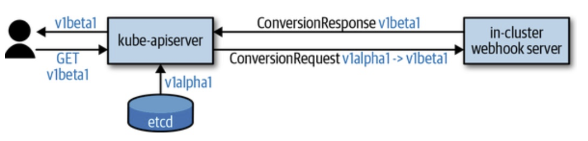

# k8s CRD多版本、升级


## CRD多版本

```yaml
apiVersion: apiextensions.k8s.io/v1beta1
kind: CustomResourceDefinition
metadata:
  name: pizzas.restaurant.programming-kubernetes.info
spec:
  group: restaurant.programming-kubernetes.info
  names:
    kind: Pizza
    listKind: PizzaList
    plural: pizzas
    singular: pizza
  scope: Namespaced
  version: v1alpha1
  versions:
  - name: v1alpha1
    served: true  # 服务版本开关
    storage: true # 存储版本开关
    schema:
      ...
  - name: v1beta1
    served: true
    storage: false
    schema:
      ...
```

- 服务版本：当某个版本v的served为true的时候，/apis/<group>/<version>路径是有效的，否则无效，通过控制served字段可以控制某个版本是否可以读写，可以有多个版本的served均为true。

- 存储版本：当某个版本v的storage为true的时候，说明etcd里面存储的资源版本为v，只能有1个版本的storage为true。1个存储版本，多个服务版本就意味着存储版本和服务版本之间需要做转换。


## k8s APIExtensionServer

k8s apiserver支持CRD定义的自定义资源引入了APIExtensionServer，APIExtensionServer对CRD资源使用的handler逻辑NewCustomResourceDefinitionHandler。

```go
// If additional API servers are added, they should be gated.
apiExtensionsConfig, err := createAPIExtensionsConfig(*kubeAPIServerConfig.GenericConfig, kubeAPIServerConfig.ExtraConfig.VersionedInformers, pluginInitializer, completedOptions.ServerRunOptions, completedOptions.MasterCount, serviceResolver, webhook.NewDefaultAuthenticationInfoResolverWrapper(proxyTransport, kubeAPIServerConfig.GenericConfig.EgressSelector, kubeAPIServerConfig.GenericConfig.LoopbackClientConfig))
if err != nil {
    return nil, err
}

apiExtensionsServer, err := createAPIExtensionsServer(apiExtensionsConfig, genericapiserver.NewEmptyDelegate())
if err != nil {
    return nil, err
}

// CRD handler
crdHandler, err := NewCustomResourceDefinitionHandler(
        versionDiscoveryHandler,
        groupDiscoveryHandler,
        s.Informers.Apiextensions().V1().CustomResourceDefinitions(),
        delegateHandler,
        c.ExtraConfig.CRDRESTOptionsGetter,
        c.GenericConfig.AdmissionControl,
        establishingController,
        c.ExtraConfig.ServiceResolver,
        c.ExtraConfig.AuthResolverWrapper,
        c.ExtraConfig.MasterCount,
        s.GenericAPIServer.Authorizer,
        c.GenericConfig.RequestTimeout,
        time.Duration(c.GenericConfig.MinRequestTimeout)*time.Second,
        apiGroupInfo.StaticOpenAPISpec,
        c.GenericConfig.MaxRequestBodyBytes,
    )
if err != nil {
    return nil, err
}
s.GenericAPIServer.Handler.NonGoRestfulMux.Handle("/apis", crdHandler)
s.GenericAPIServer.Handler.NonGoRestfulMux.HandlePrefix("/apis/", crdHandler)
```

任意一个不是内置类型的资源请求都会走到该handler，该handler负责自定义资源的读写，每个自定义资源的读写是由Storage对象完成。

```go
storages[v.Name] = customresource.NewStorage(
            resource.GroupResource(),
            kind,
            schema.GroupVersionKind{Group: crd.Spec.Group, Version: v.Name, Kind: crd.Status.AcceptedNames.ListKind},
            customresource.NewStrategy(
                typer,
                crd.Spec.Scope == apiextensionsv1.NamespaceScoped,
                kind,
                validator,
                statusValidator,
                structuralSchemas,
                statusSpec,
                scaleSpec,
            ),
            crdConversionRESTOptionsGetter{
                RESTOptionsGetter:     r.restOptionsGetter,
                converter:             safeConverter,
                decoderVersion:        schema.GroupVersion{Group: crd.Spec.Group, Version: v.Name},
                encoderVersion:        schema.GroupVersion{Group: crd.Spec.Group, Version: storageVersion},
                structuralSchemas:     structuralSchemas,
                structuralSchemaGK:    kind.GroupKind(),
                preserveUnknownFields: crd.Spec.PreserveUnknownFields,
            },
            crd.Status.AcceptedNames.Categories,
            table,
        )
```

crdConversionRESTOptionsGetter定义了资源读写的版本转换，具体来说当request里面的version与encoderVersion不一致时，就会进行转换。

```go
// Perform a conversion if necessary
out, err := c.convertor.ConvertToVersion(obj, c.encodeVersion)
if err != nil {
    return err
}
```

转换的逻辑通常使用webhook来自定义，k8s里面有一个[sample conversion webhook](https://github.com/kubernetes/kubernetes/blob/v1.15.0/test/images/crd-conversion-webhook/main.go)：

```go
func (c *webhookConverter) Convert(in runtime.Object, toGV schema.GroupVersion) (runtime.Object, error) {
    ...
}
```

该webhook可以在CRD里面定义：

```yaml
apiVersion: apiextensions.k8s.io/v1beta1
kind: CustomResourceDefinition
metadata:
  name: pizzas.restaurant.programming-kubernetes.info
spec:
  group: restaurant.programming-kubernetes.info
  names:
    kind: Pizza
    listKind: PizzaList
    plural: pizzas
    singular: pizza
  scope: Namespaced
  version: v1alpha1
  versions:
  - name: v1alpha1
    served: true
    storage: true
    ...
  - name: v1beta1
    served: true
    storage: false
    ...
  preserveUnknownFields: false
  conversion:
    strategy: Webhook # convert webhook
    webhookClientConfig:
      caBundle: <CA>
      service:
        namespace: pizza-crd
        name: webhook
        path: /convert/v1beta1/pizza
```

总结：

- 当写自定义资源时，该资源会持久化为storage version，如果请求版本与storage version不一致会做转换
- 当读自定义资源时，如果请求版本与storage version不同，也会做转换
- 如果storage version变了，底层etcd里面的资源版本不会自动改变，只有重新写才会改变




## CRD版本升级机制

### 增加新版本

- spec.versions里面新增版本，并将其served置为true，storage置为false
- 选定转换策略并部署conversion webhook
- 配置spec.conversion.webhookClientConfig到conversion webhook

当新版增加之后，新老两个版本都可以并行使用，对用户没有任何影响，要达到这样的状态意味着你的conversion需要做v1alpha1 -> v1beta1以及v1beta1 -> v1alpha1的双向支持，如果有N个版本，转换的可能性为N * (N-1)。

尽量同时支持最多不超过3个版本，如果版本没有对外开放，可以只做v1alpha1 -> v1beta1一个方向的转化，一把迁移过来。

### 迁移到最新的存储版本

- spec.versions里面将新版的storage置为true，老版本的storage置为false
- 写一个migrator，将所有资源读1遍写1遍，这样自动写到最新的storage version了
- 将旧版本从status.storedVersions去除

### 下线旧版本

- 确保所有的客户端都升级到新版本，可以通过审计日志确定
- spec.versions将旧版本的served置为false，这一步可以几个小时甚至数天，有问题可以置为true回滚
- 确保存储版本已经升级到最新
- spec.versions删除旧版本
- 下掉conversion hook


## References

https://developer.aliyun.com/article/798704?utm_content=m_1000304341
