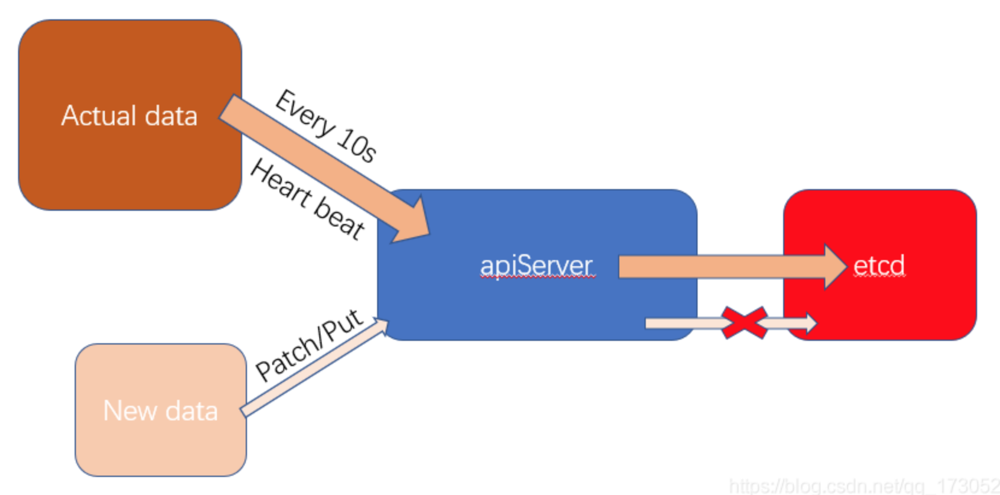
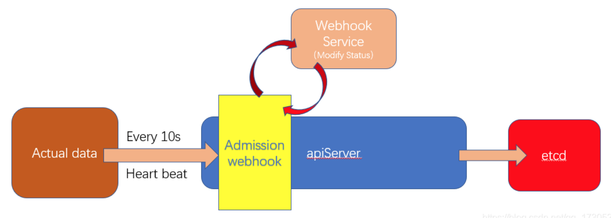
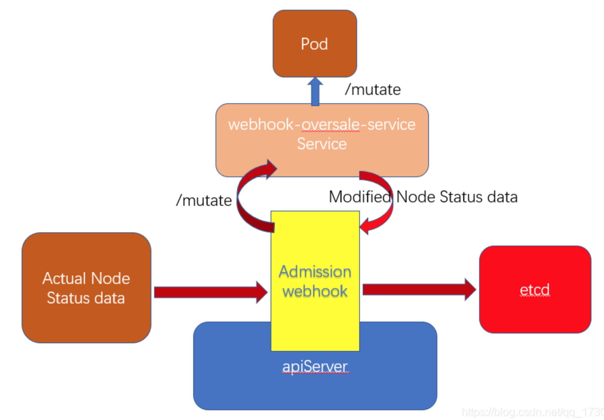

# 资源超卖


## 超卖问题分析

容器配置中有CPU和内存的资源配额：requests、limit

- requests: 节点调度pod需要的资源，每次成功调度则将节点的Allocatable属性值重新计算，新的Allocatable = 旧的Allocatable - 设置的requests值
- limit: 节点中运行pod能够获得的最大资源

超卖的方式就是动态调整Allocatable的值来让节点的可分配资源变得虚高，调度器以为节点可分配资源很大

```yaml
apiVersion: v1
kind: Node
metadata:
  annotations:
    ...
  labels:
    ...
  name: cluster1-control-plane
spec:
  podCIDR: 10.244.0.0/24
status:
  addresses:
  - address: 172.18.0.2
    type: InternalIP
  - address: cluster1-control-plane
    type: Hostname
  allocatable: ## 这就是需要动态修改的字段 !!!
    cpu: "4"
    ephemeral-storage: 61255492Ki
    hugepages-2Mi: "0"
    memory: 4028788Ki
    pods: "110"
  capacity:
    cpu: "4"
    ephemeral-storage: 61255492Ki
    hugepages-2Mi: "0"
    memory: 4028788Ki
    pods: "110"
  conditions:
    ...
  daemonEndpoints:
    ...
  images:
    ...
  nodeInfo:
    ...
```


## 实现思路

实现超卖的关键在于修改节点Node对象的allocatable字段值，该字段属于Status字段，不能直接通过kubectl edit命令直接修改。因为Status字段和Spec字段不同，Spec是用户设置的期望数据，而Status是实际数据（Node节点通过不断向apiServer发送心跳来更新自己的实际状态，最终保存在etcd中）

要修改k8s中任何资源对象的Status值，k8s提供了patch或者put方法来调用k8s的RESTful API实现Status字段的修改。

但是Node资源对象比较特殊，计算节点会不断给apiServer发送心跳（默认每隔10s发送一次），将带有Status字段的真实信息发送给apiServer并更新到etcd中。也就是说无法通过patch/put方法来修改Node的Status字段，计算节点都会定时通过发送心跳将真实的Status数据覆盖修改的数据，也就是说无法通过直接调用RESTful API修改Node对象中的Status数据。




## MutatingAdmissionWebhook

k8s在apiServer中提供了Admission Controller（准入控制器）的机制，其中包括了MutatingAdmissionWebhook。通过这个webhook，所有和集群中apiServer交互的请求都被发送到一个指定的接口中，只需要提供一个接口就可以获取到Node往apiServer发送心跳的Status数据，然后将这个数据进行自定义修改，再往后传给etcd，就能让etcd以为修改过的Status数据就是节点的真实Status，最终实现资源的超卖。




## MutatingWebhookConfiguration

> MutatingAdmissionWebhook作为kubernetes的apiServer中Admission Controller的一部分，提供了非常灵活的扩展机制，通过配置MutatingWebhookConfiguration对象，理论上可以监听并修改任何经过apiServer处理的请求。

```yaml
apiVersion: admissionregistration.k8s.io/v1beta1
kind: MutatingWebhookConfiguration
metadata:
  name: mutating-webhook-oversale
webhooks:
- clientConfig:
    caBundle: ...
    service:
      name: webhook-oversale-service
      namespace: oversale
      path: /mutate
  failurePolicy: Ignore
  name: oversale
  rules:
  - apiGroups:
    - *
    apiVersions:
    - v1
    operations:
    - UPDATE
    resources:
    - nodes/status
```

MutatingWebhookConfiguration是k8s的一个官方资源对象

- clientConfig.caBundle：apiServer访问我们自定义的webhook服务时需要的加密认证数据
- clientConfig.service：apiServer访问我们自定义的webhook服务的Service相关信息（包括具体接口信息）
- failurePolicy：当apiServer调用我们自定义的webhook服务异常时，采取的策略（Ignore：忽略异常继续处理，Fail：直接失败退出不继续处理）
- rules.operations：监听apiServer的操作类型，样例中，只有符合UPDATE类型的apiServer调用才会交给我们自定义的webhook服务处理
- rules.resources：监听apiServer的资源和子资源类型，样例中，只有符合nodes的status字段资源类型的apiServer调用才会交给我们自定义的webhook服务处理

结合rules.operations和rules.resources的属性，样例中的MutatingWebhookConfiguration监听了集群中nodes资源的status数据向apiServer提交的更新操作（就是我们前面提到的心跳信息），并且将所有的心跳信息发给了名为webhook-oversale-service的Service下的/mutate接口处理，这个接口就是自定义的webhook服务提供的。

Demo: https://gitee.com/lianghaocs/admission-webhook-oversale-sample




## References

https://blog.csdn.net/qq_17305249/article/details/105024493