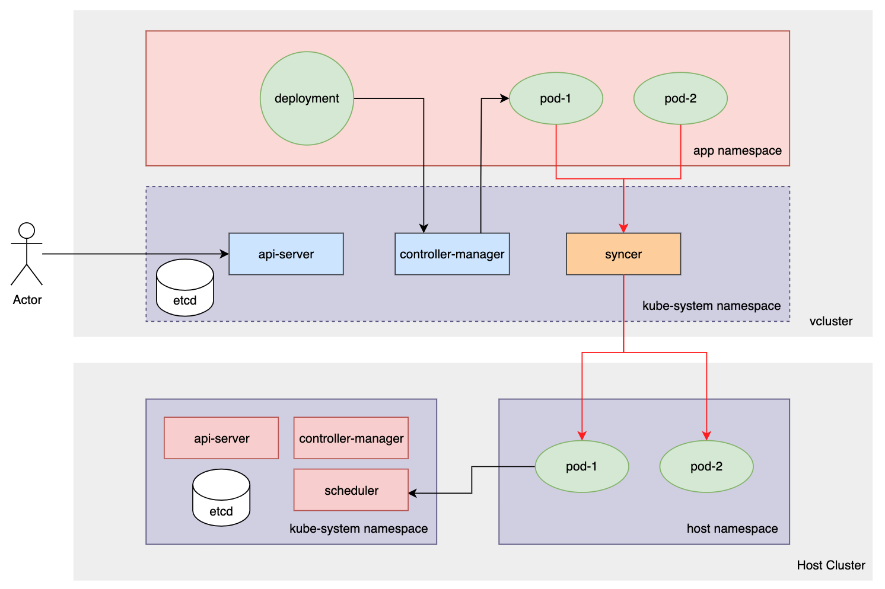

# vcluster

https://github.com/loft-sh/vcluster




vcluster 可以是独立部署的集群，也可以采用 kink 的方式与 Host Cluster 混部


## 安装测试

### 宿主集群

```shell
kind create cluster
```


### 安装必要项

- kubectl

- helm

- vcluster

  ```shell
  curl -s -L "https://github.com/loft-sh/vcluster/releases/latest" | sed -nE 's!.*"([^"]*vcluster-darwin-amd64)".*!https://github.com\1!p' | xargs -n 1 curl -L -o vcluster
  ```


### 测试

#### deploy vclusters

创建一个 virtual cluster `vcluster-1`，指定 namespace 为 `host-namespace-1`

```shell
vcluster create vcluster-1 -n host-namespace-1 --distro k8s
```

在创建出来的资源上，etcd 的 statefulset 使用 pvc 绑定存储，可以去掉 pvc 测试

#### use

- 终端1，vcluster-1 暴露 apiserver

  ```shell
  vcluster connect vcluster-1 -n host-namespace-1
  ```

- 终端2，连接 vcluster-1

  ```shell
  export KUBECONFIG=./kubeconfig.yaml
  
  kubectl get namespace
  
  kubectl create namespace demo-nginx
  kubectl create deployment nginx-deployment -n demo-nginx --image=nginx
  
  kubectl get pods -n demo-nginx
  ```

- 终端3，连接宿主集群

  ```shell
  export KUBECONFIG=
  
  kubectl get namespaces
  kubectl get deployments -n host-namespace-1
  kubectl get pods -n host-namespace-1
  ```


## 分析

### 创建 vcluster

通过命令创建，--distro 应该是对接了不同的实现，但需要指定绑定的宿主集群上的 namespace

```shell
# kubectl get deploy -n host-namespace-1
NAME                    READY   UP-TO-DATE   AVAILABLE   AGE
vcluster-1              1/1     1            1           15h
vcluster-1-api          1/1     1            1           15h
vcluster-1-controller   1/1     1            1           15h
vcluster-2              1/1     1            1           15m
vcluster-2-api          1/1     1            1           15m
vcluster-2-controller   1/1     1            1           15m
```

可以创建两个 vcluster 同时绑定到相同的宿主集群上的 namespace


### 访问方式

访问 vcluster 通过 svc 的方式暴露服务，简单测试可以使用 vcluster 提供的 connect 命令（kubectl port-forward）

```shell
# kubectl get svc -n host-namespace-1
NAME                                  TYPE        CLUSTER-IP        EXTERNAL-IP   PORT(S)                  AGE
kube-dns-x-kube-system-x-vcluster-1   ClusterIP   100.100.125.68    <none>        53/UDP,53/TCP,9153/TCP   15h
kube-dns-x-kube-system-x-vcluster-2   ClusterIP   100.100.113.236   <none>        53/UDP,53/TCP,9153/TCP   11m
vcluster-1                            ClusterIP   100.100.69.199    <none>        443/TCP                  15h
vcluster-1-api                        ClusterIP   100.100.196.1     <none>        443/TCP                  15h
vcluster-1-etcd                       ClusterIP   100.100.181.25    <none>        2379/TCP,2380/TCP        15h
vcluster-1-etcd-headless              ClusterIP   None              <none>        2379/TCP,2380/TCP        15h
vcluster-1-node-chndsi-vs-208-211     ClusterIP   100.100.179.64    <none>        10250/TCP                15h
vcluster-2                            ClusterIP   100.100.179.133   <none>        443/TCP                  17m
vcluster-2-api                        ClusterIP   100.100.35.67     <none>        443/TCP                  17m
vcluster-2-etcd                       ClusterIP   100.100.63.185    <none>        2379/TCP,2380/TCP        17m
vcluster-2-etcd-headless              ClusterIP   None              <none>        2379/TCP,2380/TCP        17m
vcluster-2-node-chndsi-vs-208-211     ClusterIP   100.100.57.114    <none>        10250/TCP                11m
```


### 应用视角

#### 租户视角

namespace、deployment 只能查看到自己部署的资源

node 是一个 fake 的资源

```shell
# kubectl get ns
NAME              STATUS   AGE
default           Active   15h
demo-nginx        Active   15h
kube-node-lease   Active   15h
kube-public       Active   15h
kube-system       Active   15h

# kubectl get deploy -n demo-nginx
NAME               READY   UP-TO-DATE   AVAILABLE   AGE
nginx-deployment   1/1     1            1           15h

# kubectl get node --show-labels
NAME                STATUS   ROLES    AGE   VERSION   LABELS
chndsi-vs-208.211   Ready    <none>   15h   v1.22.4   beta.kubernetes.io/arch=amd64,beta.kubernetes.io/os=linux,kubernetes.io/arch=amd64,kubernetes.io/hostname=fake-chndsi-vs-208.211,kubernetes.io/os=linux,vcluster.loft.sh/fake-node=true
```

#### 管理视角

注：只看应用相关的资源

租户部署的 namespace、deployment 没有实际创建

只会创建 pod，namespace 是 vcluster 绑定的 namespace，name 是结合 [pod-name]-x-[deployment-name]-x-[vcluster-name]

```shell
# kubectl get node --show-labels
NAME                STATUS   ROLES                  AGE   VERSION   LABELS
chndsi-vs-208.211   Ready    control-plane,master   16h   v1.22.4   beta.kubernetes.io/arch=amd64,beta.kubernetes.io/os=linux,kubernetes.io/arch=amd64,kubernetes.io/hostname=chndsi-vs-208.211,kubernetes.io/os=linux,node-role.kubernetes.io/control-plane=,node-role.kubernetes.io/master=,node.kubernetes.io/exclude-from-external-load-balancers=

# kubectl get ns
NAME               STATUS   AGE
host-namespace-1   Active   16h

# kubectl get deploy -n host-namespace-1
NAME                    READY   UP-TO-DATE   AVAILABLE   AGE

# kubectl get po -n host-namespace-1
NAME                                                          READY   STATUS    RESTARTS      AGE
nginx-deployment-84cd76b964-gxdgg-x-demo-nginx-x-vcluster-1   1/1     Running   0             15h
```


pod 对比

```yaml
# vcluster connect vcluster-1 -n host-namespace-1 -- kubectl get po nginx-deployment-84cd76b964-gxdgg -n demo-nginx -oyaml
apiVersion: v1
kind: Pod
metadata:
  creationTimestamp: "2022-03-30T10:49:57Z"
  generateName: nginx-deployment-84cd76b964-
  labels:
    app: nginx-deployment
    pod-template-hash: 84cd76b964
  name: nginx-deployment-84cd76b964-gxdgg
  namespace: demo-nginx
  ownerReferences:
  - apiVersion: apps/v1
    blockOwnerDeletion: true
    controller: true
    kind: ReplicaSet
    name: nginx-deployment-84cd76b964
    uid: b997853a-0a35-4975-b766-c77cce08564a
  resourceVersion: "498"
  uid: 8ec2ec61-f374-46c7-a5c5-f7e7061bfa64
spec:
  containers:
  - image: nginx
    imagePullPolicy: Always
    name: nginx
    resources: {}
    terminationMessagePath: /dev/termination-log
    terminationMessagePolicy: File
    volumeMounts:
    - mountPath: /var/run/secrets/kubernetes.io/serviceaccount
      name: kube-api-access-94fwp
      readOnly: true
  dnsPolicy: ClusterFirst
  enableServiceLinks: true
  nodeName: chndsi-vs-208.211
  preemptionPolicy: PreemptLowerPriority
  priority: 0
  restartPolicy: Always
  schedulerName: default-scheduler
  securityContext: {}
  serviceAccount: default
  serviceAccountName: default
  terminationGracePeriodSeconds: 30
  tolerations:
  - effect: NoExecute
    key: node.kubernetes.io/not-ready
    operator: Exists
    tolerationSeconds: 300
  - effect: NoExecute
    key: node.kubernetes.io/unreachable
    operator: Exists
    tolerationSeconds: 300
  volumes:
  - name: kube-api-access-94fwp
    projected:
      defaultMode: 420
      sources:
      - serviceAccountToken:
          expirationSeconds: 3607
          path: token
      - configMap:
          items:
          - key: ca.crt
            path: ca.crt
          name: kube-root-ca.crt
      - downwardAPI:
          items:
          - fieldRef:
              apiVersion: v1
              fieldPath: metadata.namespace
            path: namespace
status:
  conditions:
  - lastProbeTime: null
    lastTransitionTime: "2022-03-30T10:49:57Z"
    status: "True"
    type: Initialized
  - lastProbeTime: null
    lastTransitionTime: "2022-03-30T10:50:25Z"
    status: "True"
    type: Ready
  - lastProbeTime: null
    lastTransitionTime: "2022-03-30T10:50:25Z"
    status: "True"
    type: ContainersReady
  - lastProbeTime: null
    lastTransitionTime: "2022-03-30T10:49:57Z"
    status: "True"
    type: PodScheduled
  containerStatuses:
  - containerID: docker://4d7ab1b41667cb8c6100ff21b2e7dcf5c9991c81628f78d52718e1bfc9688c75
    image: nginx:latest
    imageID: docker-pullable://nginx@sha256:2275af0f20d71b293916f1958f8497f987b8d8fd8113df54635f2a5915002bf1
    lastState: {}
    name: nginx
    ready: true
    restartCount: 0
    started: true
    state:
      running:
        startedAt: "2022-03-30T10:50:24Z"
  hostIP: 10.12.208.211
  phase: Running
  podIP: 100.78.181.206
  podIPs:
  - ip: 100.78.181.206
  qosClass: BestEffort
  startTime: "2022-03-30T10:49:57Z"

---

# kubectl get po -n host-namespace-1 nginx-deployment-84cd76b964-gxdgg-x-demo-nginx-x-vcluster-1 -oyaml
apiVersion: v1
kind: Pod
metadata:
  annotations:
    cluster-autoscaler.kubernetes.io/safe-to-evict: "true"
    cni.projectcalico.org/containerID: f6d404c353cf0d6556967f9a188e9d902810213390d371c88abbacb3a3d29152
    cni.projectcalico.org/podIP: 100.78.181.206/32
    cni.projectcalico.org/podIPs: 100.78.181.206/32
    vcluster.loft.sh/labels: |-
      app="nginx-deployment"
      pod-template-hash="84cd76b964"
    vcluster.loft.sh/name: nginx-deployment-84cd76b964-gxdgg
    vcluster.loft.sh/namespace: demo-nginx
    vcluster.loft.sh/object-name: nginx-deployment-84cd76b964-gxdgg
    vcluster.loft.sh/object-namespace: demo-nginx
    vcluster.loft.sh/owner-set-kind: ReplicaSet
    vcluster.loft.sh/service-account-name: default
    vcluster.loft.sh/token-tpyfpblh: eyJhbGciOiJSUzI1NiIsImtpZCI6IlVWVUxzdGFnVC1yU19JTFhJaWZxMV9nVDNxMXFUc0U4RFlpZzhySTRCalEifQ.eyJhdWQiOlsiaHR0cHM6Ly9rdWJlcm5ldGVzLmRlZmF1bHQuc3ZjLmNsdXN0ZXIubG9jYWwiLCJodHRwczovL2t1YmVybmV0ZXMuZGVmYXVsdC5zdmMiLCJodHRwczovL2t1YmVybmV0ZXMuZGVmYXVsdCJdLCJleHAiOjE5NjM5OTczOTcsImlhdCI6MTY0ODYzNzM5NywiaXNzIjoiaHR0cHM6Ly9rdWJlcm5ldGVzLmRlZmF1bHQuc3ZjLmNsdXN0ZXIubG9jYWwiLCJrdWJlcm5ldGVzLmlvIjp7Im5hbWVzcGFjZSI6ImRlbW8tbmdpbngiLCJwb2QiOnsibmFtZSI6Im5naW54LWRlcGxveW1lbnQtODRjZDc2Yjk2NC1neGRnZyIsInVpZCI6IjhlYzJlYzYxLWYzNzQtNDZjNy1hNWM1LWY3ZTcwNjFiZmE2NCJ9LCJzZXJ2aWNlYWNjb3VudCI6eyJuYW1lIjoiZGVmYXVsdCIsInVpZCI6ImE4ZjEzZjYyLTRlY2UtNDhlMS1iZWRiLWIyZWUzZGY5MzA0YSJ9fSwibmJmIjoxNjQ4NjM3Mzk3LCJzdWIiOiJzeXN0ZW06c2VydmljZWFjY291bnQ6ZGVtby1uZ2lueDpkZWZhdWx0In0.ZnqBcY4XKGFYprX0Zca9QbXUJBBUv-rbOCt7zgEKo8LsFUhS_csPTPrZLLv3CS04-Nc4_EoHQrN3SHTCZDXY5Me3NWDsbpXQJJz8LbsMWCpjV2HydmWsC4K8vFzBvv_dkY7_f5nqwuUZtCw_rnQ0SBLTHbclI3Wk2RVHlT6Huqr5SqzbVhHcFNYrRwHUjWJI9Fgo8w6IP7PZewlR_Rlj8wf2ezmTc0WkMBiuv5-X0SAwf19FvZXlo-w4LPM_aVgKacUH-mGDaUw2Z_bdZFmntMXNpHgnZk-Mec5UdhVTkpPHJpZjAeFHC0fQwsm-8kpYm9RRfVdYglhJoJPkG4AEaQ
    vcluster.loft.sh/uid: 8ec2ec61-f374-46c7-a5c5-f7e7061bfa64
  creationTimestamp: "2022-03-30T10:49:57Z"
  labels:
    vcluster.loft.sh/label-vcluster-1-x-a172cedcae: nginx-deployment
    vcluster.loft.sh/label-vcluster-1-x-fdcdfa3fd8: 84cd76b964
    vcluster.loft.sh/managed-by: vcluster-1
    vcluster.loft.sh/namespace: demo-nginx
    vcluster.loft.sh/ns-label-vcluster-1-x-cf1227b7b2: demo-nginx
  name: nginx-deployment-84cd76b964-gxdgg-x-demo-nginx-x-vcluster-1
  namespace: host-namespace-1
  ownerReferences:
  - apiVersion: v1
    controller: true
    kind: Service
    name: vcluster-1
    uid: aedc2478-a3fe-4710-b912-bc6be6d9e932
  resourceVersion: "3657"
  uid: 3c73f3c0-b5a8-4352-b0a1-a50557fe8d94
spec:
  automountServiceAccountToken: false
  containers:
  - env:
    - name: KUBERNETES_PORT
      value: tcp://100.100.69.199:443
    - name: KUBERNETES_PORT_443_TCP
      value: tcp://100.100.69.199:443
    - name: KUBERNETES_PORT_443_TCP_ADDR
      value: 100.100.69.199
    - name: KUBERNETES_PORT_443_TCP_PORT
      value: "443"
    - name: KUBERNETES_PORT_443_TCP_PROTO
      value: tcp
    - name: KUBERNETES_SERVICE_HOST
      value: 100.100.69.199
    - name: KUBERNETES_SERVICE_PORT
      value: "443"
    - name: KUBERNETES_SERVICE_PORT_HTTPS
      value: "443"
    image: nginx
    imagePullPolicy: Always
    name: nginx
    resources: {}
    terminationMessagePath: /dev/termination-log
    terminationMessagePolicy: File
    volumeMounts:
    - mountPath: /var/run/secrets/kubernetes.io/serviceaccount
      name: kube-api-access-94fwp
      readOnly: true
  dnsConfig:
    nameservers:
    - 100.100.125.68
    options:
    - name: ndots
      value: "5"
    searches:
    - demo-nginx.svc.cluster.local
    - svc.cluster.local
    - cluster.local
  dnsPolicy: None
  enableServiceLinks: false
  hostAliases:
  - hostnames:
    - kubernetes
    - kubernetes.default
    - kubernetes.default.svc
    ip: 100.100.69.199
  hostname: nginx-deployment-84cd76b964-gxdgg
  nodeName: chndsi-vs-208.211
  preemptionPolicy: PreemptLowerPriority
  priority: 0
  restartPolicy: Always
  schedulerName: default-scheduler
  securityContext: {}
  serviceAccount: default
  serviceAccountName: default
  terminationGracePeriodSeconds: 30
  tolerations:
  - effect: NoExecute
    key: node.kubernetes.io/not-ready
    operator: Exists
    tolerationSeconds: 300
  - effect: NoExecute
    key: node.kubernetes.io/unreachable
    operator: Exists
    tolerationSeconds: 300
  volumes:
  - name: kube-api-access-94fwp
    projected:
      defaultMode: 420
      sources:
      - downwardAPI:
          items:
          - fieldRef:
              apiVersion: v1
              fieldPath: metadata.annotations['vcluster.loft.sh/token-tpyfpblh']
            mode: 420
            path: token
      - configMap:
          items:
          - key: ca.crt
            path: ca.crt
          name: kube-root-ca.crt-x-demo-nginx-x-vcluster-1
      - downwardAPI:
          items:
          - fieldRef:
              apiVersion: v1
              fieldPath: metadata.annotations['vcluster.loft.sh/namespace']
            path: namespace
status:
  conditions:
  - lastProbeTime: null
    lastTransitionTime: "2022-03-30T10:49:57Z"
    status: "True"
    type: Initialized
  - lastProbeTime: null
    lastTransitionTime: "2022-03-30T10:50:25Z"
    status: "True"
    type: Ready
  - lastProbeTime: null
    lastTransitionTime: "2022-03-30T10:50:25Z"
    status: "True"
    type: ContainersReady
  - lastProbeTime: null
    lastTransitionTime: "2022-03-30T10:49:57Z"
    status: "True"
    type: PodScheduled
  containerStatuses:
  - containerID: docker://4d7ab1b41667cb8c6100ff21b2e7dcf5c9991c81628f78d52718e1bfc9688c75
    image: nginx:latest
    imageID: docker-pullable://nginx@sha256:2275af0f20d71b293916f1958f8497f987b8d8fd8113df54635f2a5915002bf1
    lastState: {}
    name: nginx
    ready: true
    restartCount: 0
    started: true
    state:
      running:
        startedAt: "2022-03-30T10:50:24Z"
  hostIP: 10.12.208.211
  phase: Running
  podIP: 100.78.181.206
  podIPs:
  - ip: 100.78.181.206
  qosClass: BestEffort
  startTime: "2022-03-30T10:49:57Z"
```


vcluster create 后创建的资源

```yaml
# helm get manifest vcluster-1 -n host-namespace-1
---
# Source: vcluster-k8s/templates/serviceaccount.yaml
apiVersion: v1
kind: ServiceAccount
metadata:
  name: vc-vcluster-1
  namespace: host-namespace-1
  labels:
    app: vcluster
    chart: "vcluster-k8s-0.7.1"
    release: "vcluster-1"
    heritage: "Helm"
---
# Source: vcluster-k8s/templates/coredns.yaml
apiVersion: v1
kind: ConfigMap
metadata:
  name: vcluster-1-coredns
data:
  coredns.yaml: |-
    apiVersion: v1
    kind: ServiceAccount
    metadata:
      name: coredns
      namespace: kube-system
    ---
    apiVersion: rbac.authorization.k8s.io/v1
    kind: ClusterRole
    metadata:
      labels:
        kubernetes.io/bootstrapping: rbac-defaults
      name: system:coredns
    rules:
      - apiGroups:
          - ""
        resources:
          - endpoints
          - services
          - pods
          - namespaces
        verbs:
          - list
          - watch
      - apiGroups:
          - discovery.k8s.io
        resources:
          - endpointslices
        verbs:
          - list
          - watch
    ---
    apiVersion: rbac.authorization.k8s.io/v1
    kind: ClusterRoleBinding
    metadata:
      annotations:
        rbac.authorization.kubernetes.io/autoupdate: "true"
      labels:
        kubernetes.io/bootstrapping: rbac-defaults
      name: system:coredns
    roleRef:
      apiGroup: rbac.authorization.k8s.io
      kind: ClusterRole
      name: system:coredns
    subjects:
      - kind: ServiceAccount
        name: coredns
        namespace: kube-system
    ---
    apiVersion: v1
    kind: ConfigMap
    metadata:
      name: coredns
      namespace: kube-system
    data:
      Corefile: |
        .:1053 {
            {{.LOG_IN_DEBUG}}
            errors
            health
            ready
            kubernetes cluster.local in-addr.arpa ip6.arpa {
              pods insecure
              fallthrough in-addr.arpa ip6.arpa
            }
            hosts /etc/coredns/NodeHosts {
              ttl 60
              reload 15s
              fallthrough
            }
            prometheus :9153
            forward . /etc/resolv.conf
            cache 30
            loop
            reload
            loadbalance
        }

        import /etc/coredns/custom/*.server
      NodeHosts: ""
    ---
    apiVersion: apps/v1
    kind: Deployment
    metadata:
      name: coredns
      namespace: kube-system
      labels:
        k8s-app: kube-dns
        kubernetes.io/name: "CoreDNS"
    spec:
      replicas: 1
      strategy:
        type: RollingUpdate
        rollingUpdate:
          maxUnavailable: 1
      selector:
        matchLabels:
          k8s-app: kube-dns
      template:
        metadata:
          labels:
            k8s-app: kube-dns
        spec:
          priorityClassName: "system-cluster-critical"
          serviceAccountName: coredns
          nodeSelector:
            kubernetes.io/os: linux
          topologySpreadConstraints:
            - maxSkew: 1
              topologyKey: kubernetes.io/hostname
              whenUnsatisfiable: DoNotSchedule
              labelSelector:
                matchLabels:
                  k8s-app: kube-dns
          containers:
            - name: coredns
              image: {{.IMAGE}}
              imagePullPolicy: IfNotPresent
              resources:
                limits:
                  cpu: 1000m
                  memory: 170Mi
                requests:
                  cpu: 100m
                  memory: 70Mi
              args: [ "-conf", "/etc/coredns/Corefile" ]
              volumeMounts:
                - name: config-volume
                  mountPath: /etc/coredns
                  readOnly: true
                - name: custom-config-volume
                  mountPath: /etc/coredns/custom
                  readOnly: true
              ports:
                - containerPort: 1053
                  name: dns
                  protocol: UDP
                - containerPort: 1053
                  name: dns-tcp
                  protocol: TCP
                - containerPort: 9153
                  name: metrics
                  protocol: TCP
              securityContext:
                runAsUser: {{.RUN_AS_USER}}
                runAsNonRoot: {{.RUN_AS_NON_ROOT}}
                allowPrivilegeEscalation: false
                capabilities:
                  drop:
                    - ALL
                readOnlyRootFilesystem: true
              livenessProbe:
                httpGet:
                  path: /health
                  port: 8080
                  scheme: HTTP
                initialDelaySeconds: 60
                periodSeconds: 10
                timeoutSeconds: 1
                successThreshold: 1
                failureThreshold: 3
              readinessProbe:
                httpGet:
                  path: /ready
                  port: 8181
                  scheme: HTTP
                initialDelaySeconds: 0
                periodSeconds: 2
                timeoutSeconds: 1
                successThreshold: 1
                failureThreshold: 3
          dnsPolicy: Default
          volumes:
            - name: config-volume
              configMap:
                name: coredns
                items:
                  - key: Corefile
                    path: Corefile
                  - key: NodeHosts
                    path: NodeHosts
            - name: custom-config-volume
              configMap:
                name: coredns-custom
                optional: true
    ---
    apiVersion: v1
    kind: Service
    metadata:
      name: kube-dns
      namespace: kube-system
      annotations:
        prometheus.io/port: "9153"
        prometheus.io/scrape: "true"
      labels:
        k8s-app: kube-dns
        kubernetes.io/cluster-service: "true"
        kubernetes.io/name: "CoreDNS"
    spec:
      selector:
        k8s-app: kube-dns
      ports:
        - name: dns
          port: 53
          targetPort: 1053
          protocol: UDP
        - name: dns-tcp
          port: 53
          targetPort: 1053
          protocol: TCP
        - name: metrics
          port: 9153
          protocol: TCP
---
# Source: vcluster-k8s/templates/rbac/role.yaml
kind: Role
apiVersion: rbac.authorization.k8s.io/v1
metadata:
  name: vcluster-1
  namespace: host-namespace-1
  labels:
    app: vcluster
    chart: "vcluster-k8s-0.7.1"
    release: "vcluster-1"
    heritage: "Helm"
rules:
  - apiGroups: [""]
    resources: ["configmaps", "secrets", "services", "pods", "pods/attach", "pods/portforward", "pods/exec", "endpoints", "persistentvolumeclaims"]
    verbs: ["create", "delete", "patch", "update", "get", "list", "watch"]
  - apiGroups: [""]
    resources: ["events", "pods/log"]
    verbs: ["get", "list", "watch"]
  - apiGroups: ["networking.k8s.io"]
    resources: ["ingresses"]
    verbs: ["create", "delete", "patch", "update", "get", "list", "watch"]
  - apiGroups: ["apps"]
    resources: ["statefulsets", "replicasets", "deployments"]
    verbs: ["get", "list", "watch"]
---
# Source: vcluster-k8s/templates/rbac/rolebinding.yaml
kind: RoleBinding
apiVersion: rbac.authorization.k8s.io/v1
metadata:
  name: vcluster-1
  namespace: host-namespace-1
  labels:
    app: vcluster
    chart: "vcluster-k8s-0.7.1"
    release: "vcluster-1"
    heritage: "Helm"
subjects:
  - kind: ServiceAccount
    name: vc-vcluster-1
    namespace: host-namespace-1
roleRef:
  kind: Role
  name: vcluster-1
  apiGroup: rbac.authorization.k8s.io
---
# Source: vcluster-k8s/templates/api-service.yaml
apiVersion: v1
kind: Service
metadata:
  name: vcluster-1-api
  namespace: host-namespace-1
  labels:
    app: vcluster-api
    chart: "vcluster-k8s-0.7.1"
    release: "vcluster-1"
    heritage: "Helm"
spec:
  type: ClusterIP
  ports:
    - name: https
      port: 443
      targetPort: 6443
      protocol: TCP
  selector:
    app: vcluster-api
    release: vcluster-1
---
# Source: vcluster-k8s/templates/etcd-service.yaml
apiVersion: v1
kind: Service
metadata:
  name: vcluster-1-etcd
  namespace: host-namespace-1
  labels:
    app: vcluster-etcd
    chart: "vcluster-k8s-0.7.1"
    release: "vcluster-1"
    heritage: "Helm"
spec:
  type: ClusterIP
  ports:
    - name: etcd
      port: 2379
      targetPort: 2379
      protocol: TCP
    - name: peer
      port: 2380
      targetPort: 2380
      protocol: TCP
  selector:
    app: vcluster-etcd
    release: vcluster-1
---
# Source: vcluster-k8s/templates/etcd-statefulset-service.yaml
apiVersion: v1
kind: Service
metadata:
  name: vcluster-1-etcd-headless
  namespace: host-namespace-1
  labels:
    app: vcluster-etcd
    chart: "vcluster-k8s-0.7.1"
    release: "vcluster-1"
    heritage: "Helm"
spec:
  publishNotReadyAddresses: true
  ports:
    - name: etcd
      port: 2379
      targetPort: 2379
      protocol: TCP
    - name: peer
      port: 2380
      targetPort: 2380
      protocol: TCP
  clusterIP: None
  selector:
    app: vcluster-etcd
    release: "vcluster-1"
---
# Source: vcluster-k8s/templates/syncer-service.yaml
apiVersion: v1
kind: Service
metadata:
  name: vcluster-1
  namespace: host-namespace-1
  labels:
    app: vcluster
    chart: "vcluster-k8s-0.7.1"
    release: "vcluster-1"
    heritage: "Helm"
spec:
  type: ClusterIP
  ports:
    - name: https
      port: 443
      targetPort: 8443
      protocol: TCP
  selector:
    app: vcluster
    release: vcluster-1
---
# Source: vcluster-k8s/templates/api-deployment.yaml
apiVersion: apps/v1
kind: Deployment
metadata:
  name: vcluster-1-api
  namespace: host-namespace-1
  labels:
    app: vcluster-api
    chart: "vcluster-k8s-0.7.1"
    release: "vcluster-1"
    heritage: "Helm"
spec:
  replicas: 1
  strategy:
    rollingUpdate:
      maxSurge: 1
      maxUnavailable: 0
    type: RollingUpdate
  selector:
    matchLabels:
      app: vcluster-api
      release: vcluster-1
  template:
    metadata:
      labels:
        app: vcluster-api
        release: vcluster-1
    spec:
      terminationGracePeriodSeconds: 10
      nodeSelector:
        {}
      affinity:
        {}
      tolerations:
        []
      automountServiceAccountToken: false
      volumes:
        - name: certs
          secret:
            secretName: vcluster-1-certs
      containers:
      - name: kube-apiserver
        image: "k8s.gcr.io/kube-apiserver:v1.22.4"
        command:
          - kube-apiserver
          - '--advertise-address=0.0.0.0'
          - '--allow-privileged=true'
          - '--authorization-mode=Node,RBAC'
          - '--client-ca-file=/run/config/pki/ca.crt'
          - '--enable-admission-plugins=NodeRestriction'
          - '--enable-bootstrap-token-auth=true'
          - '--etcd-cafile=/run/config/pki/etcd-ca.crt'
          - '--etcd-certfile=/run/config/pki/apiserver-etcd-client.crt'
          - '--etcd-keyfile=/run/config/pki/apiserver-etcd-client.key'
          - '--etcd-servers=https://vcluster-1-etcd:2379'
          - '--insecure-port=0'
          - '--kubelet-client-certificate=/run/config/pki/apiserver-kubelet-client.crt'
          - '--kubelet-client-key=/run/config/pki/apiserver-kubelet-client.key'
          - '--kubelet-preferred-address-types=InternalIP,ExternalIP,Hostname'
          - '--proxy-client-cert-file=/run/config/pki/front-proxy-client.crt'
          - '--proxy-client-key-file=/run/config/pki/front-proxy-client.key'
          - '--requestheader-allowed-names=front-proxy-client'
          - '--requestheader-client-ca-file=/run/config/pki/front-proxy-ca.crt'
          - '--requestheader-extra-headers-prefix=X-Remote-Extra-'
          - '--requestheader-group-headers=X-Remote-Group'
          - '--requestheader-username-headers=X-Remote-User'
          - '--secure-port=6443'
          - '--service-account-issuer=https://kubernetes.default.svc.cluster.local'
          - '--service-account-key-file=/run/config/pki/sa.pub'
          - '--service-account-signing-key-file=/run/config/pki/sa.key'
          - '--service-cluster-ip-range=100.100.0.0/16'
          - '--tls-cert-file=/run/config/pki/apiserver.crt'
          - '--tls-private-key-file=/run/config/pki/apiserver.key'
          - '--watch-cache=false'
        livenessProbe:
          httpGet:
            path: /livez
            port: 6443
            scheme: HTTPS
          initialDelaySeconds: 10
          timeoutSeconds: 15
          periodSeconds: 10
          successThreshold: 1
          failureThreshold: 8
        readinessProbe:
          httpGet:
            path: /readyz
            port: 6443
            scheme: HTTPS
          timeoutSeconds: 15
          periodSeconds: 1
          successThreshold: 1
          failureThreshold: 3
        securityContext:
          null
        env:
          null
        volumeMounts:
          - mountPath: /run/config/pki
            name: certs
            readOnly: true
        resources:
          requests:
            cpu: 200m
---
# Source: vcluster-k8s/templates/controller-deployment.yaml
apiVersion: apps/v1
kind: Deployment
metadata:
  name: vcluster-1-controller
  namespace: host-namespace-1
  labels:
    app: vcluster-controller
    chart: "vcluster-k8s-0.7.1"
    release: "vcluster-1"
    heritage: "Helm"
spec:
  replicas: 1
  strategy:
    rollingUpdate:
      maxSurge: 1
      maxUnavailable: 0
    type: RollingUpdate
  selector:
    matchLabels:
      app: vcluster-controller
      release: vcluster-1
  template:
    metadata:
      labels:
        app: vcluster-controller
        release: vcluster-1
    spec:
      terminationGracePeriodSeconds: 10
      nodeSelector:
        {}
      affinity:
        {}
      tolerations:
        []
      automountServiceAccountToken: false
      volumes:
        - name: certs
          secret:
            secretName: vcluster-1-certs
      containers:
      - name: kube-controller-manager
        image: "k8s.gcr.io/kube-controller-manager:v1.22.4"
        command:
          - kube-controller-manager
          - '--authentication-kubeconfig=/run/config/pki/controller-manager.conf'
          - '--authorization-kubeconfig=/run/config/pki/controller-manager.conf'
          - '--bind-address=0.0.0.0'
          - '--client-ca-file=/run/config/pki/ca.crt'
          - '--cluster-name=kubernetes'
          - '--cluster-signing-cert-file=/run/config/pki/ca.crt'
          - '--cluster-signing-key-file=/run/config/pki/ca.key'
          - '--controllers=*,-nodeipam,-nodelifecycle,-persistentvolume-binder,-attachdetach,-persistentvolume-expander,-cloud-node-lifecycle'
          - '--horizontal-pod-autoscaler-sync-period=60s'
          - '--kubeconfig=/run/config/pki/controller-manager.conf'
          - '--service-cluster-ip-range=100.100.0.0/16'
          - '--leader-elect=false'
          - '--node-monitor-grace-period=180s'
          - '--node-monitor-period=30s'
          - '--port=0'
          - '--pvclaimbinder-sync-period=60s'
          - '--requestheader-client-ca-file=/run/config/pki/front-proxy-ca.crt'
          - '--root-ca-file=/run/config/pki/ca.crt'
          - '--service-account-private-key-file=/run/config/pki/sa.key'
          - '--use-service-account-credentials=true'
        livenessProbe:
          httpGet:
            path: /healthz
            port: 10257
            scheme: HTTPS
          initialDelaySeconds: 10
          timeoutSeconds: 15
          periodSeconds: 10
          successThreshold: 1
          failureThreshold: 8
        startupProbe:
          httpGet:
            path: /healthz
            port: 10257
            scheme: HTTPS
          initialDelaySeconds: 10
          timeoutSeconds: 15
          periodSeconds: 10
          successThreshold: 1
          failureThreshold: 24
        securityContext:
          null
        env:
          null
        volumeMounts:
          - mountPath: /run/config/pki
            name: certs
            readOnly: true
        resources:
          requests:
            cpu: 200m
---
# Source: vcluster-k8s/templates/syncer-deployment.yaml
apiVersion: apps/v1
kind: Deployment
metadata:
  name: vcluster-1
  namespace: host-namespace-1
  labels:
    app: vcluster
    chart: "vcluster-k8s-0.7.1"
    release: "vcluster-1"
    heritage: "Helm"
spec:
  replicas: 1
  strategy:
    rollingUpdate:
      maxSurge: 1
      maxUnavailable: 0
    type: RollingUpdate
  selector:
    matchLabels:
      app: vcluster
      release: vcluster-1
  template:
    metadata:
      labels:
        app: vcluster
        release: vcluster-1
    spec:
      terminationGracePeriodSeconds: 10
      nodeSelector:
        {}
      affinity:
        {}
      tolerations:
        []
      serviceAccountName: vc-vcluster-1
      volumes:
        - name: certs
          secret:
            secretName: vcluster-1-certs
        - name: coredns
          configMap:
            name: vcluster-1-coredns
      containers:
      - name: syncer
        image: "loftsh/vcluster:0.7.1"
        args:
          - --name=vcluster-1
          - --request-header-ca-cert=/pki/ca.crt
          - --client-ca-cert=/pki/ca.crt
          - --server-ca-cert=/pki/ca.crt
          - --server-ca-key=/pki/ca.key
          - --kube-config=/pki/admin.conf
          - --leader-elect=false
        livenessProbe:
          httpGet:
            path: /healthz
            port: 8443
            scheme: HTTPS
          failureThreshold: 10
          initialDelaySeconds: 60
          periodSeconds: 2
        readinessProbe:
          httpGet:
            path: /readyz
            port: 8443
            scheme: HTTPS
          failureThreshold: 30
          periodSeconds: 2
        securityContext:
          null
        env:
          []
        volumeMounts:
          - name: coredns
            mountPath: /manifests/coredns
            readOnly: true
          - mountPath: /pki
            name: certs
            readOnly: true
        resources:
          limits:
            memory: 1Gi
          requests:
            cpu: 100m
            memory: 128Mi
---
# Source: vcluster-k8s/templates/etcd-statefulset.yaml
apiVersion: apps/v1
kind: StatefulSet
metadata:
  name: vcluster-1-etcd
  namespace: host-namespace-1
  labels:
    app: vcluster-etcd
    chart: "vcluster-k8s-0.7.1"
    release: "vcluster-1"
    heritage: "Helm"
spec:
  serviceName: vcluster-1-etcd-headless
  replicas: 1
  podManagementPolicy: Parallel
  selector:
    matchLabels:
      app: vcluster-etcd
      release: vcluster-1
  volumeClaimTemplates:
    - metadata:
        name: data
      spec:
        accessModes: [ "ReadWriteOnce" ]
        storageClassName:
        resources:
          requests:
            storage: 5Gi
  template:
    metadata:
      labels:
        app: vcluster-etcd
        release: vcluster-1
    spec:
      terminationGracePeriodSeconds: 10
      nodeSelector:
        {}
      affinity:
        {}
      tolerations:
        []
      automountServiceAccountToken: false
      volumes:
        - name: certs
          secret:
            secretName: vcluster-1-certs
      containers:
      - name: etcd
        image: "k8s.gcr.io/etcd:3.5.1-0"
        command:
          - etcd
          - '--cert-file=/run/config/pki/etcd-server.crt'
          - '--client-cert-auth=true'
          - '--data-dir=/var/lib/etcd'
          - '--advertise-client-urls=https://$(NAME).vcluster-1-etcd-headless.host-namespace-1:2379'
          - '--initial-advertise-peer-urls=https://$(NAME).vcluster-1-etcd-headless.host-namespace-1:2380'
          - '--initial-cluster=vcluster-1-etcd-0=https://vcluster-1-etcd-0.vcluster-1-etcd-headless.host-namespace-1:2380'
          - '--initial-cluster-token=vcluster-1'
          - '--initial-cluster-state=new'
          - '--listen-client-urls=https://0.0.0.0:2379'
          - '--listen-metrics-urls=http://0.0.0.0:2381'
          - '--listen-peer-urls=https://0.0.0.0:2380'
          - '--key-file=/run/config/pki/etcd-server.key'
          - '--name=$(NAME)'
          - '--peer-cert-file=/run/config/pki/etcd-peer.crt'
          - '--peer-client-cert-auth=true'
          - '--peer-key-file=/run/config/pki/etcd-peer.key'
          - '--peer-trusted-ca-file=/run/config/pki/etcd-ca.crt'
          - '--snapshot-count=10000'
          - '--trusted-ca-file=/run/config/pki/etcd-ca.crt'
        securityContext:
          null
        env:
        - name: NAME
          valueFrom:
            fieldRef:
              fieldPath: metadata.name
        volumeMounts:
          - name: data
            mountPath: /var/lib/etcd
          - mountPath: /run/config/pki
            name: certs
            readOnly: true
        resources:
          requests:
            cpu: 100m
            memory: 100Mi
        livenessProbe:
          httpGet:
            path: /health
            port: 2381
            scheme: HTTP
          initialDelaySeconds: 10
          timeoutSeconds: 15
          periodSeconds: 10
          successThreshold: 1
          failureThreshold: 8
        startupProbe:
          httpGet:
            path: /health
            port: 2381
            scheme: HTTP
          initialDelaySeconds: 10
          timeoutSeconds: 15
          periodSeconds: 10
          successThreshold: 1
          failureThreshold: 24
```

