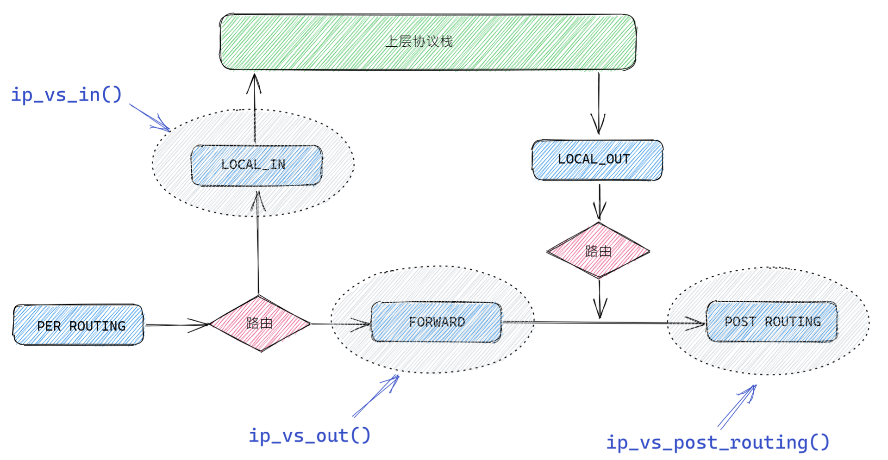
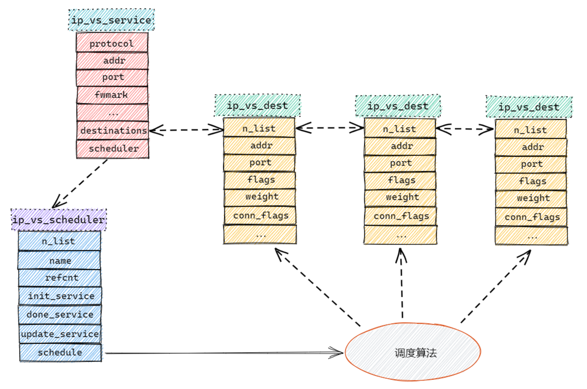

# lvs

## 钩子函数

lvs是通过向netfilter的3个阶段注册钩子函数来对数据包进行处理

- LOCAL_IN阶段注册了ip_vs_in钩子函数
- FORWARD阶段注册了ip_vs_out钩子函数
- POST_ROUTING阶段注册了ip_vs_post_routing钩子函数

## 角色

- ip_vs_service：服务配置对象，主要用于保存LVS的配置信息，如支持的传输层协议、虚拟IP、端口等。
- Ip_vs_dest：真实服务器对象，主要用于保存真实服务器的配置，如真实ip、端口、权重等。
- Ip_vs_scheduler：调度器对象，主要通过使用不同的调度算法来选择合适的真实服务器对象。
- Ip_vs_conn：链接对象，主要为了维护相同的客户端与真实服务器之间的连接关系。这是由于TCP协议是面向连接的，所以同一个的客户端每次选择真实服务器的时候必须保存一致，否则会出现连接中断的情况，而连接对象就是为了维护这种关系。

