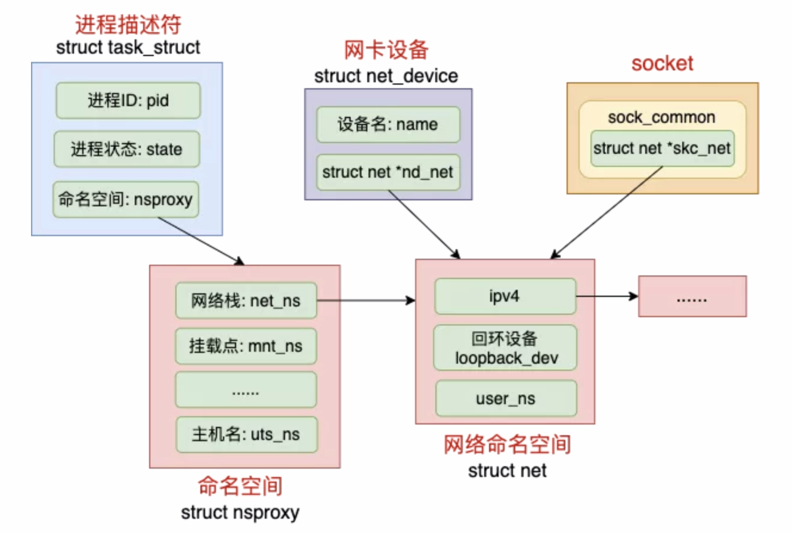
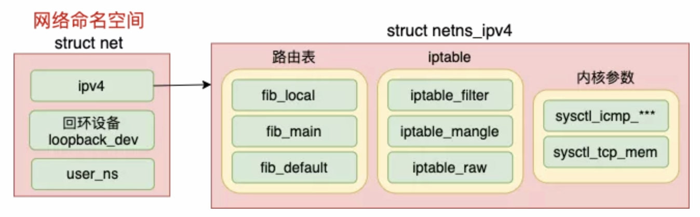
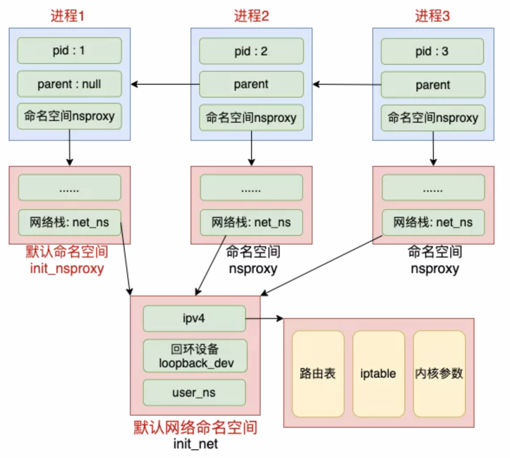
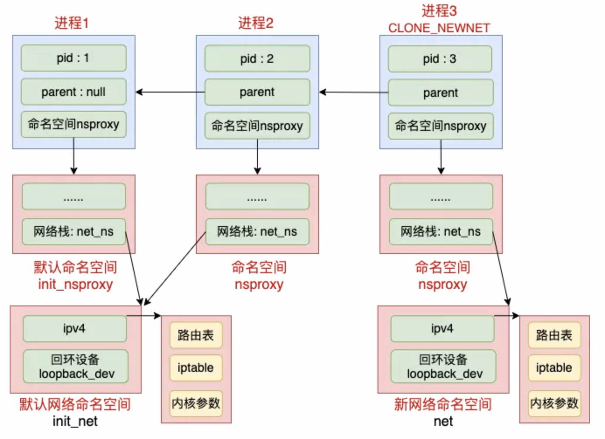
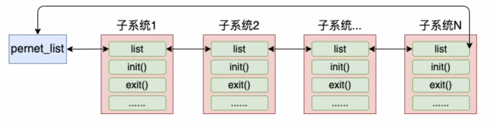
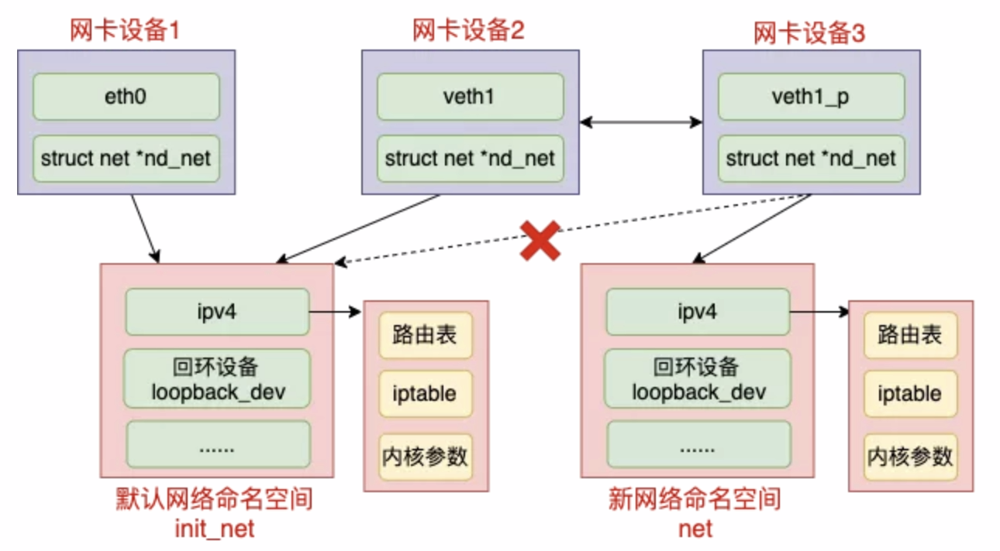
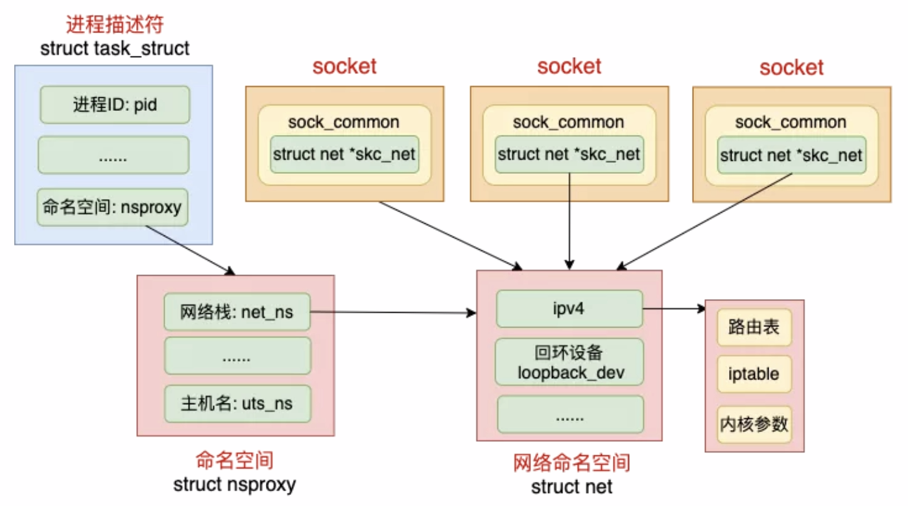
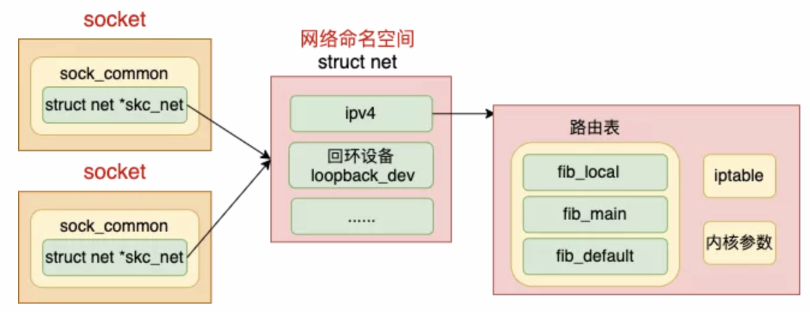

https://mp.weixin.qq.com/s/lscMpc5BWAEzjgYw6H0wBw


## 实验

```shell
# run a CentOS container
docker run -it --rm --privileged centos:7 bash

yum install -y iproute

# add ns namespace
ip netns add net1

# check netns
ip netns exec net1 ip r
ip netns exec net1 iptables -L
ip netns exec net1 ip link list

# add veth
ip link add veth1 type veth peer name veth1_p
ip link set veth1 netns net1

# check ip link
ip link list
ip netns exec net1 ip link list

# setup
ip addr add 192.168.0.100/24 dev veth1_p
ip link set dev veth1_p up
ip netns exec net1 ip addr add 192.168.0.101/24 dev veth1
ip netns exec net1 ip link set dev veth1 up

# test with ping
ping 192.168.0.101 -I veth1_p
ip netns exec net1 ping 192.168.0.100 -I veth1
```


## 内核源码分析

### 相关结构体

- namespace相关：namespace、network namespace
- 进程相关：task struct
- 设备相关：network device、socket

通过struct中定义引用来表示关联，指定进程、设备所属的namespace



```c
// --- namespace
// include/linux/nsproxy.h
struct nsproxy {
	struct uts_namespace *uts_ns;
	struct ipc_namespace *ipc_ns;
	struct mnt_namespace *mnt_ns;
	struct pid_namespace *pid_ns_for_children;
	struct net 	     *net_ns; // network namespace
	struct time_namespace *time_ns;
	struct time_namespace *time_ns_for_children;
	struct cgroup_namespace *cgroup_ns;
}

// include/net/net_namespace.h
struct net {
	struct net_device       *loopback_dev;          /* The loopback */
	struct netns_ipv4	ipv4;
#if IS_ENABLED(CONFIG_IPV6)
	struct netns_ipv6	ipv6;
#endif
}

// --- process
// include/linux/sched.h
struct task_struct {
	/* Namespaces: */
	struct nsproxy			*nsproxy;
}

// --- net device
// include/linux/netdevice.h
struct net_device {
  char			name[IFNAMSIZ];
  possible_net_t			nd_net;
}
// typedef struct {
// #ifdef CONFIG_NET_NS
// 	struct net *net;
// #endif
// } possible_net_t;

// include/net/sock.h
struct sock {
  struct sock_common	__sk_common;
}
// struct sock_common {
//   possible_net_t		skc_net;
// }
```

### network namespace



```c
// include/net/net_namespace.h
struct net {
 //每个 net 中都有一个回环设备
 struct net_device       *loopback_dev;          /* The loopback */

 //路由表、netfilter都在这里
 struct netns_ipv4 ipv4;
}
```

## network namespace的创建

### 进程与网络命名空间

linux的1号进程初始使用默认的网络命名空间，所有其他进程都是由1号进程派生出来的，在派生clone的时候如果没有特别指定，所有的进程都共享这个默认的网络命名空间。



内核对外提供了3种操作命名空间的方法：clone、setns、unshare。

在clone里可以指定创建新进程时的flag，都是CLONE_开头的，如果创建进程时指定了CLONE_NEWNET，那么该进程将会创建并使用新的netns。

ip nets add使用的是unshare。



默认网络命名空间初始化过程

```c
// init/init_task.c
struct task_struct init_task
= {
  .nsproxy	= &init_nsproxy,
}

// kernel/nsproxy.c
struct nsproxy init_nsproxy = {
  .count			= ATOMIC_INIT(1),
	.uts_ns			= &init_uts_ns,
#if defined(CONFIG_POSIX_MQUEUE) || defined(CONFIG_SYSVIPC)
	.ipc_ns			= &init_ipc_ns,
#endif
	.mnt_ns			= NULL,
	.pid_ns_for_children	= &init_pid_ns,
#ifdef CONFIG_NET
	.net_ns			= &init_net, // 网络命名空间
#endif
#ifdef CONFIG_CGROUPS
	.cgroup_ns		= &init_cgroup_ns,
#endif
#ifdef CONFIG_TIME_NS
	.time_ns		= &init_time_ns,
	.time_ns_for_children	= &init_time_ns,
#endif
}

// net/core/net_namespace.c
struct net init_net = {
	.ns.count	= REFCOUNT_INIT(1),
	.dev_base_head	= LIST_HEAD_INIT(init_net.dev_base_head),
#ifdef CONFIG_KEYS
	.key_domain	= &init_net_key_domain,
#endif
};
EXPORT_SYMBOL(init_net);

// net/core/net_namespace.c
// 初始化默认网络命名空间
static int __init net_ns_init(void)
{
 ...
 setup_net(&init_net, &init_user_ns);
 ...
 register_pernet_subsys(&net_ns_ops);
 return 0;
}
```

如果在创建进程过程中指定了CLONE_NEWNET，那么就会重新申请一个网络命名空间（调用链 do_fork => copy_process => copy_namespaces => create_new_namespaces => copy_net_ns）

```c
// net/core/net_namespace.c
struct net *copy_net_ns(unsigned long flags,
   struct user_namespace *user_ns, struct net *old_net)
{
 struct net *net;

 // 重要！！！
 // 不指定 CLONE_NEWNET 就不会创建新的网络命名空间
 if (!(flags & CLONE_NEWNET))
  return get_net(old_net);

 // 申请新网络命名空间并初始化
 net = net_alloc();
 rv = setup_net(net, user_ns);
 ...
}
```

### 命名空间下的网络子系统

命名空间下的各个组件都是在setup_net时初始化，包括路由表、tcp的proc文件系统、iptables规则读取等。

内核将网络模块划分成各个子系统，每个子系统都定义了一个结构体

```c
// include/net/net_namespace.h
struct pernet_operations {
 // 链表指针
 struct list_head list;

 // 子系统的初始化函数
 int (*init)(struct net *net);

 // 网络命名空间每个子系统的退出函数
 void (*exit)(struct net *net);
 void (*exit_batch)(struct list_head *net_exit_list);
 int *id;
 size_t size;
};
```

各个子系统通过调用register_pernet_subsys或register_pernet_device将其初始化函数注册到网络命名空间系统的全局链表pernet_list中。



#### 路由表

路由表子系统通过 register_pernet_subsys 将 fib_net_ops 注册进来了。这样每当创建一个新的命名空间的时候，**就会调用 fib_net_init 来创建一套独立的路由规则**。

```c
// net/ipv4/fib_frontend.c
static struct pernet_operations fib_net_ops = {
 .init = fib_net_init,
 .exit = fib_net_exit,
};

void __init ip_fib_init(void)
{
 register_pernet_subsys(&fib_net_ops);
 ...
}
```

#### iptables

每当创建新命名空间的时候，**就会调用 iptable_nat_net_init 创建一套新的表**。

```c
// net/ipv4/netfilter/iptable_nat.c
static struct pernet_operations iptable_nat_net_ops = {
 .init = iptable_nat_net_init,
 .exit = iptable_nat_net_exit,
};

static int __init iptable_nat_init(void)
{
 err = register_pernet_subsys(&iptable_nat_net_ops);
 ...
}
```

### 设备

在一个设备刚刚创建出来的时候，它是属于默认网络命名空间 init_net 的，包括 veth 设备。不过可以在创建完后修改设备到新的网络命名空间。



拿 veth 设备来举例，它是在创建时的源码 alloc_netdev_mqs 中设置到 init_net 上的。(执行代码路径：veth_newlink => rtnl_create_link => alloc_netdev_mqs)

```c
// core/dev.c
struct net_device *alloc_netdev_mqs(...) {
  dev_net_set(dev, &init_net);
}

// include/linux/netdevice.h
void dev_net_set(struct net_device *dev,struct net *net) {
  release_net(dev->nd_net);
  dev->nd_net = hold_net(net);
}
```

在执行 修改设备所属的 namespace 的时候，会将 dev->nd_net 再指向新的 netns。对于 veth 来说，它包含了两个设备。这两个设备可以放在不同的 namespace 中。这就是 Docker 容器和其母机或者其它容器通信的基础。

```c
// core/dev.c
int dev_change_net_namespace(struct net_device *dev, struct net *net, ...) {
  ...
  dev_net_set(dev, net)
}
```

## 在namespace下的网络转发

### socket与网络命名空间

每个socket都是归属于某一个网络命名空间，到底归属那个netns，这是由创建这个socket 的进程所属的netns来决定。当在某个进程里创建socket的时候，内核就会把当前进程的nsproxy->net_ns找出来，并把它赋值给socket上的网络命名空间成员skc_net。

**默认创建的socket是属于默认的网络命名空间init_net。**



在socket中用来保存和网络命名空间归属关系的变量是skc_net。

```c
// include/net/sock.h
struct sock_common {
  possible_net_t		skc_net;
}
```

socket创建的时候，内核中可以通过current->nsproxy->net_ns把当前进程所属的netns找出来，最终把socket中的sk_net成员和该命名空间建立好了联系。

```c
// net/socket.c
int sock_create(int family, int type, int protocol, struct socket **res)
{
	return __sock_create(current->nsproxy->net_ns, family, type, protocol, res, 0);
}
```

在socket_create中，current->nsproxy->net_ns获取到了进程的netns。再依次经过__sock_create => pf->create(inet_create) => sk_alloc，调用到sock_net_set的时候，成功设置了新socket和netns的关联关系。

```c
// net/core/sock.c
struct sock *sk_alloc(struct net *net, int family, gfp_t priority,
		      struct proto *prot, int kern)
{
   sock_net_set(sk, net);
}

// include/net/sock.h
static inline
void sock_net_set(struct sock *sk, struct net *net)
{
	 write_pnet(&sk->sk_net, net);
}
```

### 网络包的收发过程

socket上记录了其归属的网络命名空间。**需要查找路由表之前先找到该命名空间，再找到命名空间里的路由表，然后再开始执行查找**。这样，各个命名空间中的路由过程就都隔离开了。



在路由过程中是根据前面步骤中确定好的命名空间struct net *net来查找路由项的。不同的命名空间有不同的net变量，**所以不同的netns中自然也就可以配置不同的路由表了**。

网络收发过程中其它步骤也是类似的，涉及到需要隔离的地方，都是通过命名空间(struct net *)去查找的。

```c
// net/ipv4/ip_output.c
int ip_queue_xmit(struct sock *sk, struct sk_buff *skb, struct flowi *fl)
{
 	 return __ip_queue_xmit(sk, skb, fl, inet_sk(sk)->tos);
}

int __ip_queue_xmit(struct sock *sk, struct sk_buff *skb, struct flowi *fl,
		    __u8 tos)
{
   struct net *net = sock_net(sk); // 获取网络命名空间对象 struct net *
}
```


