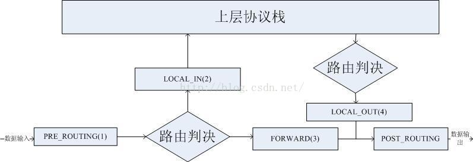
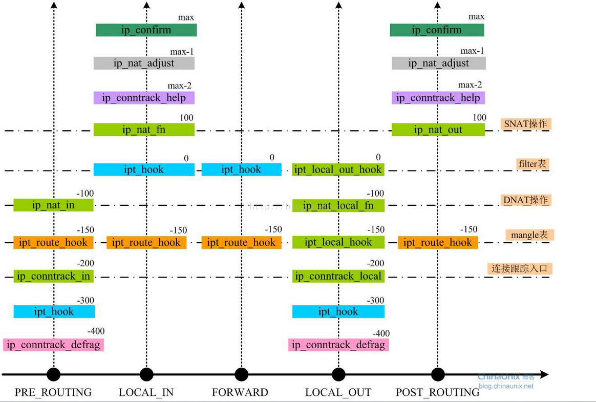

# netfilter

## netfilter框架

- netfilter hooks
- ip{6}_tables
- connection tracking
- NAT子系统

## hook点

- PRE_ROUTING
- LOCAL_IN
- FORWARD
- LOCAL_OUT
- POST_ROUTING

## 钩子函数

每个hook点有一个链表，链表上有好几个钩子函数，这些函数的执行是有优先级，优先级越高越先执行（优先级值越小，优先级越高）

netfilter主要是包含三张表，分别是filter表、NAT表、mangle表：

- Filter表：处理与本机有关的数据包，是默认表，包含有三种链：LOCAL_IN、LOCAL_OUT、FORWARD。

- NAT表：与本机无关。主要处理源与目的地址IP和端口的转换。有三种链：PRE_ROUTING、LOCAL_OUT、POST_ROUTING。

- Mangle表：用于高级路由信息包，如包头的更改。

## References

https://opengers.github.io/openstack/openstack-base-netfilter-framework-overview/